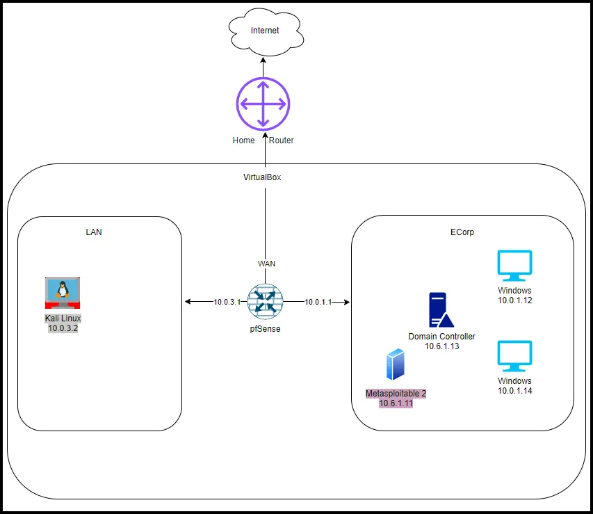

# Intro to Mr. Robot Exercise

Based on the TV Show “Mr. Robot”. In this multi-part exercise, you’ll step into the shoes of Elliot Alderson, a cybersecurity analyst working for AllSafe, a Managed Security Service Provider (MSSP) that is tasked with defending ECorp from threats posed by an infamous hacking group called FSociety. By day, Elliot protects ECorp as a blue teamer. But at night, Elliot’s alter ego, Mr. Robot, leads FSociety in a coordinated series of attacks on ECorp, challenging the very systems he is sworn to protect. This dual-role scenario will simulate both blue team (defensive) and red team (offensive) tactics.

As Elliot, you'll monitor and defend against cyberattacks, while as Mr. Robot, you’ll orchestrate and execute those very attacks, exposing vulnerabilities to teach the system about its fragility.

We will use the VirtualBox lab configuration for this exercise.

### **Part 1: Pre-Attack Phase**

**Elliot (Blue Team) Tasks:** Based on your training, you have a working knowledge of several SIEMs (Splunk, Elastic, and Wazuh) as well as different logging sources. Your assignment is to prepare a written recommendation to the AllSafe CEO (Gideon Goddard) on what SIEM and logging sources to use to defend the ECorp network. In your recommendation you must list the pros and cons for Splunk, Elastic, Wazuh, etc and then justify your recommendation. Additionally, include the logging sources (types of logs) to ingest into your SIEM. If Gideon approves your recommendation, you will then install the SIEM and deploy the agents to Windows systems in the ECorp network.    

**Mr. Robot (Red Team) Tasks:** Create the email and payloads to be used in a phishing campaign against ECorp. 

**Tools for Mr. Robot:**

- **Metasploit**: Use mfsvenom to create a reverse shell
- **PowerShell**: Use PowerShell to create a malicious .lnk file
- **Thunderbird:** To craft the phishing email.
- **netcat**: To listen for the reverse shell connection
- **python:** Set up a webserver to deliver a payload.

[Mr Robot Exercise: Pre-Attack ](2.%20Pre-Attack.md)

### **Part 2 Phishing Attack**

**Objective:**
In this part of the exercise, the Mr. Robot (Red Team) tasks are to deploy the phishing email and initial payloads created in the pre-attack phase. The payload will be delivered in an attached .iso file and will execute the downloader. The downloader will download a reverse shell that will give F-Society a reverse shell into Terry Colby’s (E-Corp CTO) system.  

The Elliot (Blue Team) tasks are to deploy agents for the SIEM, monitor for suspicious activity, and conduct email analysis, and create an alert. 

[Mr Robot Exercise: Initial Access](3.%20Initial%20Access.md) 

---

### **Part 3 Deploy/Establish Command and Control**

**Objective:**
FSociety has compromised an ECorp machine using a phishing attack. Now, as Mr. Robot, you need to establish command and control to maintain persistence. 

**Mr. Robot Tasks:**

- Use the reverse shell to deploy C2
- Set up a Command and Control (C2) infrastructure to maintain control over multiple compromised systems.

**Elliot Tasks:**
Elliot detects unusual network traffic indicating a C2 beacon. You need to block the C2 traffic and isolate compromised machines.

- Analyze outbound traffic for suspicious connections to external IPs.
- Use endpoint detection tools to find malware signatures.
- Block C2 communications and disconnect compromised endpoints.

---

### **Part 4 Rogue Access Point Deployment**

**Objective:**
FSociety wants to infiltrate ECorp’s physical headquarters by setting up a rogue wireless access point (AP) near their office. As Mr. Robot, your goal is to capture ECorp employee credentials through the rogue AP.

**Mr. Robot Task:**

- Prepare WiFi Pineapple to conduct wireless attacks including Evil Capture Portal
- Capture the credentials of employees connecting to the rogue AP.
- Use these credentials to pivot into ECorp’s internal network.

**Elliot Task:** 
Elliot must detect the rogue access point and prevent employees from connecting to it.

- Use a wireless intrusion detection system (WIDS) to scan for unauthorized APs.
- Inform employees not to connect to unfamiliar Wi-Fi networks.
- Physically locate and disable the rogue AP.

---

### **Part 5 USB Drop Attack**

**Objective:**
As Mr. Robot, you have arranged for FSociety to distribute infected USB drives near ECorp's offices. These USB drives contain malware designed to install a keylogger on any computer that connects the drive.

**Mr. Robot Tasks:**

- Configure USB to install keyloggers on compromised machines.
- Distribute infected USB drives in areas where ECorp employees are likely to pick them up. (simulated)

**Elliot Tasks:**
Elliot receives alerts about unauthorized USB devices connected to corporate machines and needs to act quickly.

- Scan the network for USB-connected devices.
- Use forensic tools to detect keylogger software.
- Deploy USB-blocking policies across ECorp’s devices.

---

### **Part 6 Data Exfiltration**

**Objective:**
FSociety’s short term goal is to steal sensitive data from ECorp’s network and release it publicly to damage their reputation. Mr. Robot directs FSociety to use social engineering tactics to manipulate an ECorp employee into granting access to secure areas of the network.

**Mr. Robot Task:**

- Use social engineering to gain an ECorp employee's trust and persuade them to share login credentials or access codes.
- Once inside the secure areas of the network, exfiltrate sensitive data to an external server.
- Cover your tracks to avoid detection.

**Elliot Tasks:**

- Monitor data for suspicious activity.
- Identify and stop data exfil

---

### **Part 7 Data Destruction**

**Objective:**
FSociety’s goal is to destroy all of ECorp’s data in order to erase the world’s debt to the multi-national conglomerate.

 **Mr. Robot Task:**

- Configure Encryption/Ransomware Tool
- Gain Access to the entire Ecorp network and systems.

**Elliot Tasks:**

- Monitor SIEM for suspicious activity.
- Stop the spread of the ransomware.

