# Mr Robot Exercise: Wireless Attack

## Summary:

In this part of the exercise the Mr. Robot (Red Team) tasks are to gain access to ECorp network wirelessly. In the first task, you will spoof your MAC address to match a MAC address allowed on the ECorp Network (ECorp uses MAC filtering as well as WPA2 PSK to gain access to the network). You will then capture a WPA2 4-way handshake and crack the password to join the ECorp Wireless Network. You will also conduct an Evil Portal attack by setting up a rogue access point and attempt trick ECorp users into providing their credentials.

## Lab Set UP

For this exercise we will use a wireless USB adaptor that is compatible with Kali Linux and allows promiscuous (monitor) mode, a wireless access point that you can configure, and a Wifi Pineapple. If you do not have these devices, you can still do the MAC spoofing and download the data generated by these devices to crack the passwords.  

Download pcap file aircrack-01.cap from the link below.

[aircrack-01.cap](https://ln5.sync.com/dl/912d8bf10#ab7nzgrs-ajdxuetq-sygsq6f8-hydhfpj4)

Alfa Card Link on Amazon

[【New Version Type-C WiFi USB】 ALFA AWUS036ACH Long-Range Dual-Band AC1200 Wireless Wi-Fi Adapter w/2x 5dBi External Antennas – 2.4GHz 300Mbps/5GHz 867Mbps – 802.11ac & A, B, G, N](https://www.amazon.com/ALFA-AWUS036ACH-%E3%80%90Type-C%E3%80%91-Long-Range-Dual-Band/dp/B08SJC78FH/ref=sr_1_fkmr0_1?crid=1ZMOD36EKP0V8&dib=eyJ2IjoiMSJ9.tBB5XjJ_0M9Qs8bcDXLUM5qjpISfdvpsRAteUZGpHRU.SZRlbtuHbpLGsS3Vj3I_Q0lRlHnGhQQTKr2w8wwb2CQ&dib_tag=se&keywords=alfa+awuso36neh&qid=1729995043&sprefix=%2Caps%2C62&sr=8-1-fkmr0)

### Set Up a Wireless Adaptor on a Kali VM in VirtualBox

1. Plug in the USB Wifi Adaptor.
2. In the settings for the Kali VM add a network adaptor in bridged mode.

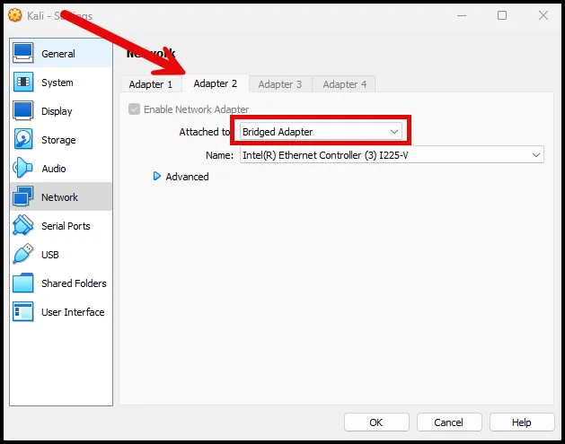

1. After starting the VM go to Devices and select the wireless adaptor. Note that the name of the adaptor may not be vendor name, it may be the vendor of the chipset used in the adaptor name.

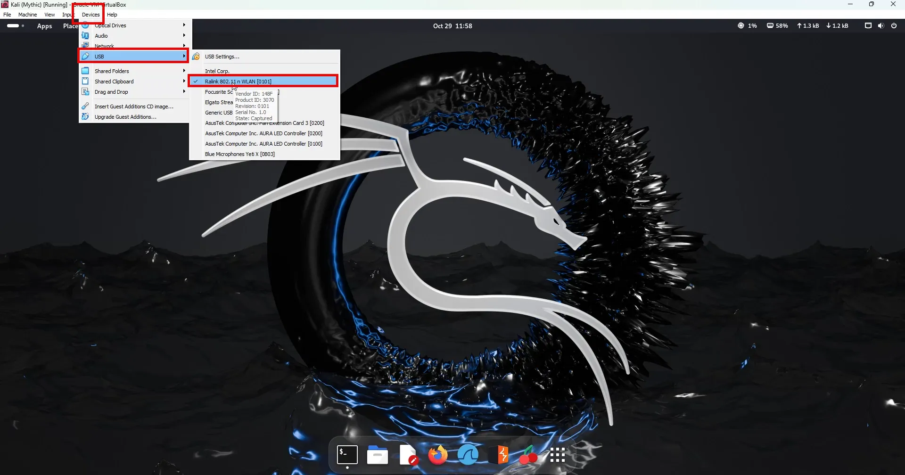

1. Confirm the adaptor is connected to Kali by running the command below:

```go
sudo airmon-ng
```

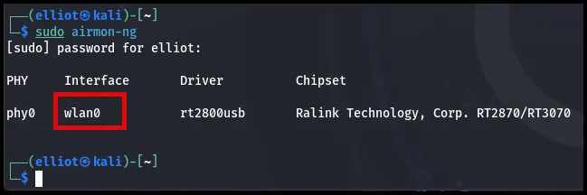

1. If it does not appear, run the command below and retry.

```go
sudo ifconfig wlan0 up
```

1. You can also run iwconfig to see the wireless adaptors.

```go
iwconfig
```

iwconfig

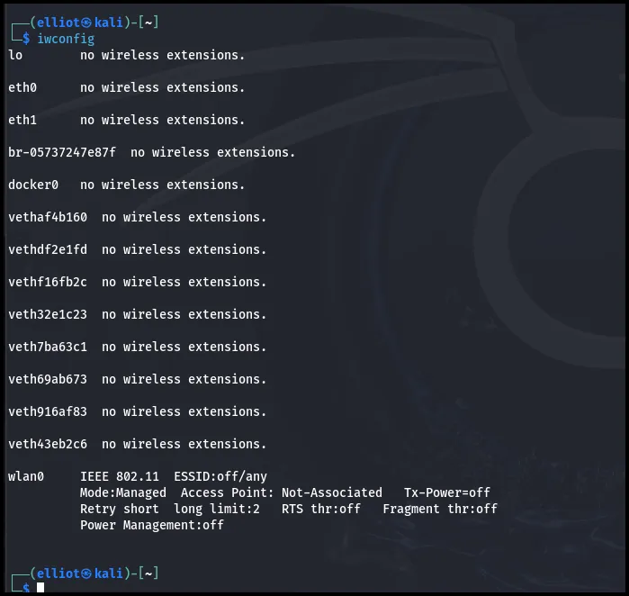

1. Change the mode of the adaptor from “Managed” to “Monitor”. Monitor mode is the same as promiscious mode. Run the command below:

```go
sudo airmon-ng start wlan0 
```

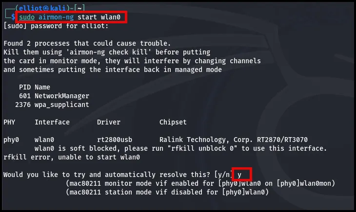

As seen above, if there is a conflict select “y” for airmon-ng to correct it.

1. Confirm it is in “Monitor” mode by running iwconfig again.

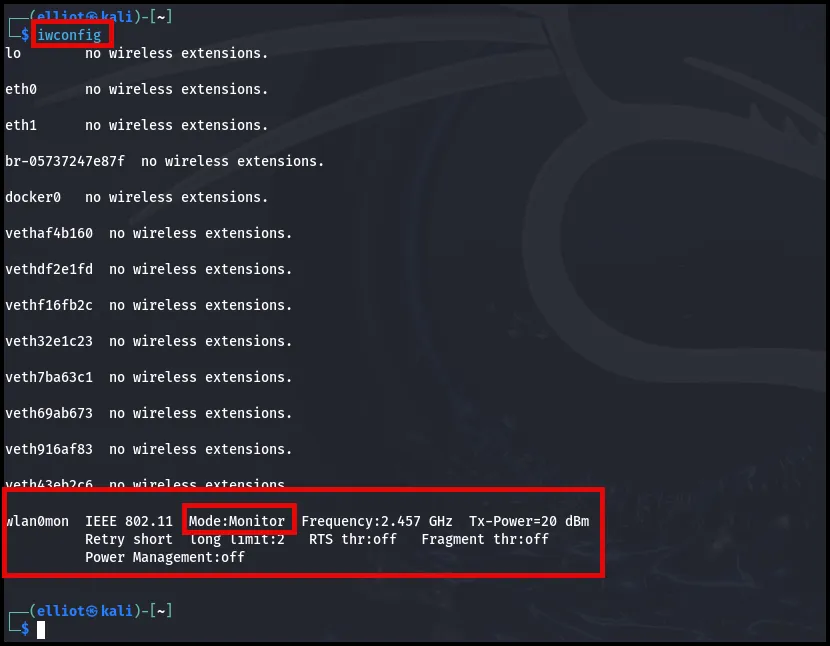

rfkill list

rfkill unblock all

### **Setting up the Access Point**

In this section, we’ll walk through the process of configuring your WPA2 access point. We’ll cover how to create a strong, secure password and set up a wireless network that we’ll use for practice in upcoming lessons, where we’ll crack WPA2 using Aircrack-ng and Wifite.

**Step 1: Access Your Router**

First, open your web browser and log into your wireless router. Navigate to the wireless settings and enable the 2.4 GHz radio. My router supports both 2.4 GHz and 5 GHz, but since my wireless hacking card operates on 2.4 GHz, I’ll configure the network on that band.

**Step 2: Configure the Network**

Name your network ECorpNet. Leave the channel selection on automatic, and scroll down to the security section where you’ll select WPA2.

**Step 3: Set a Strong Password**

Now, it’s time to choose a password. While you could use something simple like “password,” that wouldn’t be secure. Instead, I’ll choose something more complex, like “DarkArmy.”

It’s important to note that if it appears in a dictionary, it can still be cracked using a dictionary attack. For demonstration purposes, I’ll make sure it’s included in a dictionary we’ll use later to show how the attack works, so I’ll use “DarkArmy”.

**Step 4: Apply Settings**

After reviewing all the settings, hit “Apply” to save them. Once the router has finished updating, you should see the new “ECorpNet” network available.

With our network configured, we’re ready to move on to the next lesson, where we’ll use Aircrack-ng to crack WPA2.

# **Wireless Scanning**

In this section, we’ll explore how to detect available networks by using Kali Linux. We’ll see how to connect to networks if you have the correct credentials, which we’ll cover how to capture and crack in later lessons. First, let’s get familiar with the basics in Kali Linux.

### Step 1: Check Your Wireless Card Status

To begin, we need to ensure our wireless card is operational. Use the following command to check your network interfaces:

```bash
ifconfig
```

This command displays all network interfaces, including wired and loopback interfaces. 

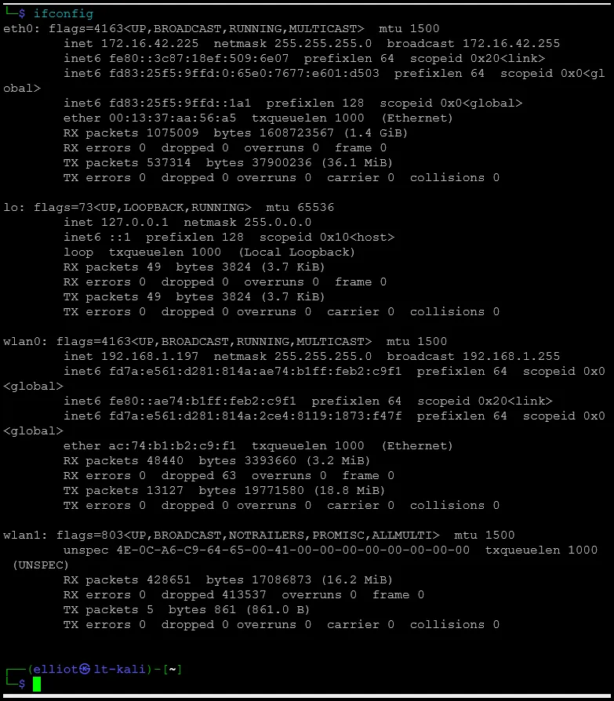

For detailed wireless information, however, use `iwconfig`:

```bash
iwconfig

```

`iwconfig` focuses solely on wireless networks, displaying details like frequency, signal power, and operating mode. This confirms whether your card is up and in monitor mode. In the screenshot below I have two wireless network cards. One built in to my laptop and the other is an Alpha card that I will use for exploitation. 

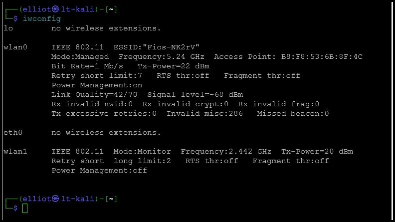

### Step 2: Use Airodump-ng to Scan for Networks

To start scanning for nearby wireless networks, we’ll use `airodump-ng`:

```bash
sudo airodump-ng wlan1
```

After about 30-45 seconds, `airodump-ng` will list all detected networks, including information on the network names (SSID), BSSIDs, power levels, channels, and encryption types. Networks with stronger signals (closer to zero) are nearby, while higher numbers indicate more distant networks.

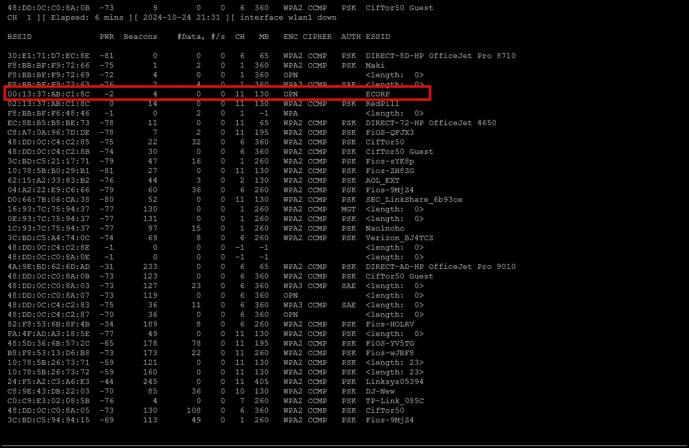

### Interpreting Airodump-ng Results

The output displays various columns:

- **BSSID**: This is the MAC address of each access point.
- **Power**: Indicates signal strength, where lower (closer to zero) is better.
- **Beacons**: Tracks beacon frames sent by each network.
- **Data**: Shows the volume of data transmitted on each network.
- **Channel**: Lists the channel each network is using, often 1, 6, or 11 on 2.4 GHz.
- **Speed**: Displays the maximum speed, with 54 Mbps or higher indicating modern standards like Wireless G or N.
- **Encryption**: Shows the type of security used, like WPA2 or WEP.
- **ESSID**: Displays the network name, such as "Wireless Hacking" or "FBI Van."

These details allow you to identify potential target networks based on proximity and security level.

### Client Connections

Below the main network list, `airodump-ng` shows clients connected to each access point. The station MAC address corresponds to the device connected to the BSSID of the access point. This is useful for targeting specific clients or networks for further analysis.

### Connecting to a Network in Kali

Once you have credentials for a network (which we’ll cover in future lessons), you can connect by selecting the Wi-Fi icon in the upper-right corner of Kali’s desktop, choosing your network, and entering the password. This approach will be useful once we learn how to capture and crack network credentials.

In the next section, we’ll discuss setting your wireless adapter to promiscuous mode, enabling it to capture all traffic on the network for further penetration testing.

# Promiscuous Mode

In this section, we're going to explore promiscuous mode, discuss its significance, and learn how to switch your wireless adapter between this mode and managed mode. Let's dive in.

First, on Kali Linux, let’s check the status of our wireless adapter using the `iwconfig` command. You’ll notice that under `wlan0`, the mode is set to "managed." There are two key modes: managed and monitor. Monitor mode is commonly referred to as promiscuous mode. But what is it, and why does it matter?

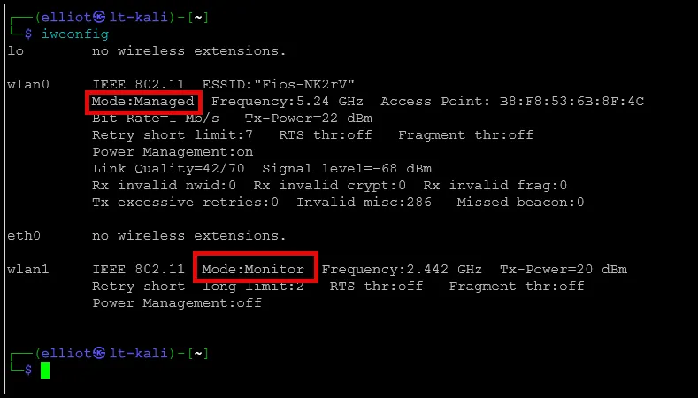

Every wireless adapter has a MAC address, and normally it only listens for traffic addressed to its own MAC. Think of it like walking into a crowded bar. If I call out "Hey Elliot," only Elliot will respond because he's listening for his name. Similarly, in managed mode, your network card listens only for traffic meant for its MAC address, ignoring everything else.

Promiscuous mode, however, allows your network card to capture all traffic, whether it’s addressed to you or not. This is crucial for penetration testing, as it lets you eavesdrop on all network traffic and gather valuable data.

Now, how do we enable promiscuous mode? One way is by shutting down the network card using `ifconfig wlan1 down`, then changing its mode to monitor with `iwconfig wlan1 mode monitor`. After verifying with `iwconfig`, you can turn the card back on with `ifconfig wlan1 up`. In monitor mode, you can capture all data from the airwaves. If you want to switch back to managed mode, simply reverse the process: shut the card down, set the mode to managed, and bring it back up.

```go
sudifconfig wlan1 down
```

```go
sudo iwconfig wlan1 mode monitor
```

```go
sudo iwconfig
```

```go
sudo ifconfig wlan1 up
```

In the next section we'll explore how to hunt for networks, even those with their station IDs hidden. 

# Hunting for Networks:

In this section, we’ll explore how to find networks, including those broadcasting openly and those hidden from view. Previously, we used `airodump-ng` to scan for networks which were openly broadcasting their names. But how do you detect hidden networks? That’s what I’ll show you in this section.

First, let's open our Kali terminal. As always, begin by checking the status of your wireless card with `iwconfig`.  If it is not in monitor mode, change it following the instructions above.

Next, run `airodump-ng wlan1` to scan for networks. You’ll see a list of visible networks, but also some hidden networks. Hidden networks won’t broadcast their names; instead, they appear with entries like "length zero," "length 22," and "length 21" in the ESSID column. These represent hidden networks, with the length indicating their encryption status. For example, "length 0" is an open network, while "length 22" and "length 21" are WPA2 networks using AES-CCMP encryption.

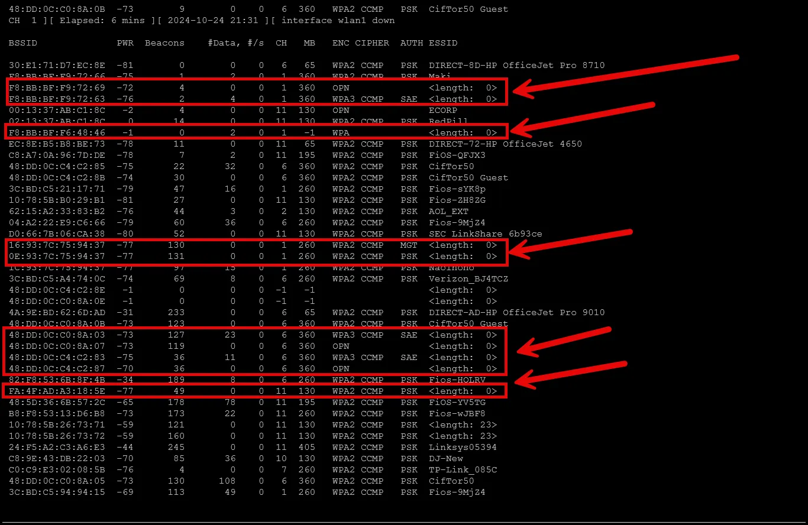

Why are these networks hidden? In penetration testing, hidden networks can be of particular interest. If someone is trying to hide their network, it’s either for security purposes or something more covert—and either way, they warrant further investigation. Before proceeding, always verify your rules of engagement and scope. Hidden networks are prime targets during penetration tests, as they are intentionally concealing themselves.

So how do we go after these hidden networks? Fortunately, we don’t need the network’s name (SSID) to proceed. We can target them using their BSSID (MAC address), which is all we need for most attacks. For example, you can target the network with "length 0" using its MAC address, such as `F8:BB:BF:F9:72:69`. In the next section, we’ll begin attacking these networks—attempting to guess passwords for WPA2 networks.

In the next section, we’ll dive deeper into information gathering with `airodump-ng`, including saving captured data to your hard drive for further analysis and exploitation.

## **Information Gathering with Airodump-ng:**

In this section, we’ll explore how to use `airodump-ng` to monitor networks, gather information, and capture traffic from a specific network to save for further analysis and attacks.

Once we’re back in Kali, the first step is to start `airodump-ng` by running `airodump-ng wlan1`, as our card is still in monitor mode. This will begin scanning networks, revealing details like the base station ID (BSSID), signal strength, network speed, channel, encryption type, and station names. You can also see which devices are connected to these networks at the bottom of the output.

```go
airodump-ng wlan1
```

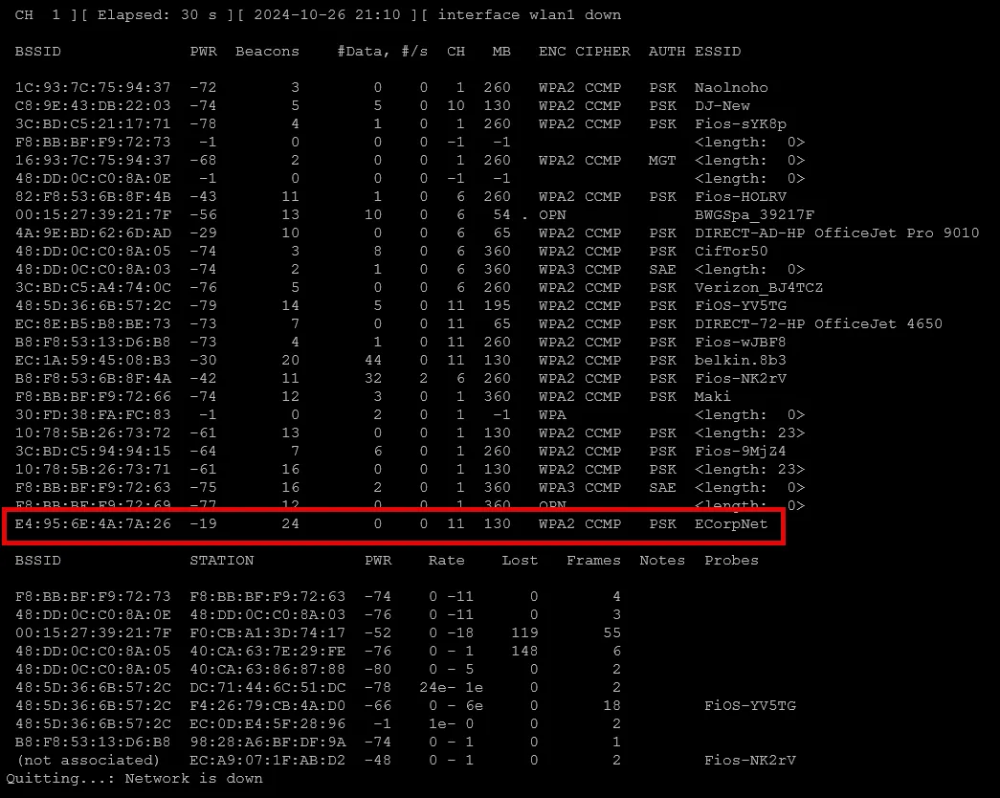

To focus on a specific network and capture its traffic, we need to target it using its MAC address. As mentioned before, MAC addresses are critical for this process. First, stop the scanning with `Ctrl + C` to return to the command prompt. To capture traffic for a single network, we’ll use a specific command:

```go
airodump-ng --channel 11 --bssid E4:95:6E:4A:7A:26 -w EcorpNet_data wlan1
```

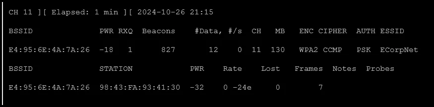

This command specifies the channel, the MAC address of the network, the output file name, and the card in use (wlan1). Once you run it, the tool will focus on the selected network, capturing its traffic and saving it to a file on your system. You’ll see the beacons and data counts increasing as it captures information.

To find where this data is stored, run ls in the home directory, you’ll see the captured files, including `.cap`, `.csv`, and `kismet` files. The `.cap` file is the key one for us—it contains the captured traffic that we’ll later analyze with tools like Wireshark or `aircrack-ng` to attempt breaking the network’s encryption.

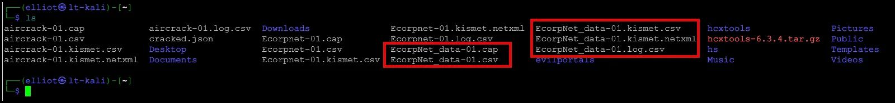

If you’re performing a real penetration test, you’ll want to capture data for an extended period, especially for WPA2 networks, which require more data for a successful attack. The length of time depends on the number of devices connected and the amount of traffic on the network.

If you forget the syntax for these commands or want to explore more options, you can always access the help file by typing:

`airodump-ng --help`

This will display all the available options, such as saving initialization vectors (which is useful for WEP cracking), recording beacons, or filtering by specific BSSIDs or channels to minimize the capture file size.

# MAC Spoofing

**Changing Your MAC Address**

We’ll explore the importance of MAC addresses, what they are, and how they’re used in network security. We’ll also look at methods to hide your MAC address and learn how to change it to impersonate another device.

### What is a MAC Address?

Every network card, whether wired or wireless, has a unique MAC (Media Access Control) address. This address, a 12-digit hexadecimal identifier, allows devices to be tracked on a network and operates at Layer 2 of the OSI model, where switches use it to identify which ports are connected to specific devices. The first six digits identify the manufacturer, and the last six are unique to the device, acting like a serial number.

For example, a MAC address might look like `AC:DE:48:11:3A:DE`, where `AC:DE:48` identifies the manufacturer (in this case, Apple), and `11:3A:DE` is the unique identifier.

### MAC Address in Kali Linux

To view the MAC address of wlan1 (my USB Wireless Adaptor) in Kali Linux, use the following command:

```bash
macchanger -s wlan1
```


The command is used to **display the current MAC address** of the network interface `wlan1`. Here’s what it’s doing step-by-step:

1. **macchanger**: This tool is specifically designed for changing and managing MAC addresses.
2. **s**: This option stands for "show." It tells `macchanger` to display the current MAC address information without making any changes.
3. **wlan1**: This specifies the network interface you want to view. `wlan1` 

In summary, `macchanger -s wlan1` will output the current MAC address of `wlan1`, including both the current and permanent (original) MAC addresses.

### Changing Your MAC Address with Macchanger

To hide or change your MAC address, use to randomize or manually set a MAC address to conceal your real one.

1. **Check Current MAC Address**:
    
    ```bash
    macchanger -s wlan1
    ```
    
2. **Bring the Interface Down**:
Before changing the MAC, bring the interface down:
    
    ```bash
    ifconfig wlan1 down
    ```
    
3. **Randomize the MAC Address**:
Use the `r` flag with macchanger to set a random MAC:
    
    ```bash
    macchanger -r wlan1
    ```
    

OR

       **Manually Set a MAC Address**:
       To impersonate another device’s MAC address, use:

```bash
macchanger -m [TARGET MAC] wlan1

```

**4. Bring the Interface Up**:
After changing the MAC, bring the interface back up:

```bash
ifconfig wlan1 up

```

This process allows you to appear as a different device on the network, which can help evade detection or access networks with MAC-based filtering.

### Mr. Robot Scenario with Airodump-ng

We will use  `airodump-ng` to scan for ECorpNet and connected devices:

```bash
airodump-ng wlan1
```

This tool shows available networks and connected clients. If you want to impersonate a device on a specific network, identify the device’s MAC address, copy it, and set it as your own using macchanger. This can allow you to bypass MAC filtering, a common security feature that restricts network access based on authorized MAC addresses.

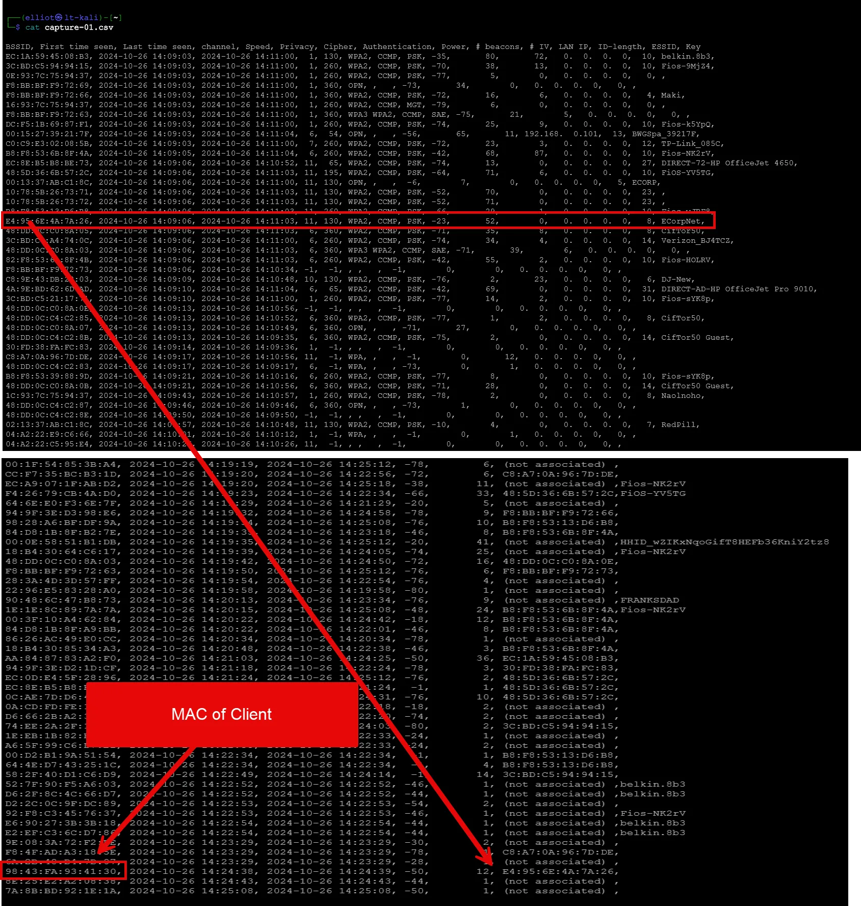

We will now change our MAC address to match the one that is connected to ECorpNet. This will allow us to by-pass MAC filtering.

```go
ifconfig wlan1 down
```

```go
macchanger -m 98:43:FA:93:41:30 wlan1
```

```go
ifconfig wlan1 up
```

### Practical Uses of MAC Address Spoofing

MAC spoofing can be useful for:

- **Accessing time-limited networks** (like those in cafes or hotels) by resetting the timer after changing your MAC.

We will cover scanning the airwaves in more detail using `airodump-ng` to identify available networks and potential targets for further penetration testing.

# **WPA and WPA2**

 In this section, we’ll explore the fundamentals of WPA and WPA2 security. We’ll set up a WPA2 access point and learn how to break into it using two different methods:

1. With `aircrack-ng` 
2. Using [`Wifite.py`](http://Wifite.py) 

### WPA 4-Way Handshake

The **WPA 4-Way Handshake** is a crucial process in Wi-Fi networks that use **WPA** or **WPA2** security with **Pre-Shared Key (PSK)** or **Enterprise** modes. It occurs when a client (e.g., a laptop or smartphone) connects to a Wi-Fi network, and its purpose is to securely authenticate the client to the access point (AP) and establish encryption keys for data transmission.

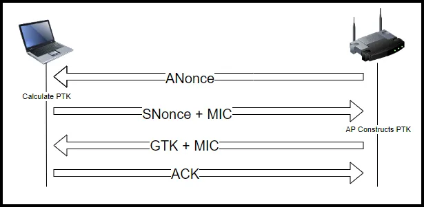

Here's a step-by-step breakdown of the WPA 4-way handshake:

### **Initialization**

- Both the client and the access point already know the **PSK (Pre-Shared Key)** or password for WPA-PSK or credentials for WPA-Enterprise.
- The handshake begins with both parties generating a **Pairwise Master Key (PMK)**, derived from the PSK or obtained through the authentication server in WPA-Enterprise.

### **Step 1: Access Point Sends an ANonce**

- The **AP** generates a random **ANonce** (Access Point Nonce) and sends it to the **client**.
- The nonce is a randomly generated number used only once, preventing replay attacks and adding randomness to the session key generation.

### **Step 2: Client Generates the PTK and Sends an SNonce**

- The **client** receives the ANonce and generates its own random **SNonce** (Supplicant Nonce).
- Using both nonces (ANonce and SNonce), the **PMK**, and the **MAC addresses** of both the client and the AP, the client calculates a **Pairwise Transient Key (PTK)**, which is used for data encryption.
- The client sends its **SNonce** to the AP along with a **Message Integrity Code (MIC)**, which is a hashed signature to ensure data integrity.

### **Step 3: Access Point Verifies the PTK and Installs Keys**

- The **AP** uses the received SNonce and its own ANonce to generate the PTK independently, allowing both the client and AP to calculate the same encryption key without directly sharing it.
- The AP verifies the MIC sent by the client to ensure integrity and correctness.
- If successful, the AP installs the encryption keys for the secure session and sends a confirmation message to the client, including a Group Temporal Key (GTK) for multicast and broadcast traffic.

### **Step 4: Client Verifies and Installs the GTK**

- The client receives the final message containing the GTK and confirmation, installs it, and completes the 4-way handshake.
- At this point, both the client and AP have derived identical keys (PTK and GTK) and are ready to encrypt data over the connection.

### Purpose and Importance of the 4-Way Handshake

- **Mutual Authentication**: Verifies that both the client and AP know the pre-shared key without transmitting it over the air.
- **Session Key Derivation**: Uses random nonces and the shared PMK to create a unique PTK for each session, making it difficult to decrypt without the correct PMK.
- **Encryption Setup**: Ensures that each session has unique encryption keys, preventing attackers from reusing keys for different sessions.

### Vulnerabilities and Attacks

- **Handshake Capture for Offline Attacks**: Attackers can capture the 4-way handshake packets to attempt an offline dictionary or brute-force attack. They need to know the PSK to calculate the PMK, so if the PSK is weak or common, they may crack it.
- **PMKID Attack**: Instead of capturing the full handshake, attackers can capture the PMKID (generated in some network configurations) to simplify offline cracking attempts.

The 4-way handshake ensures secure key exchange in WPA/WPA2 networks, using randomness and mutual authentication to make eavesdropping and session hijacking challenging for attackers.

**WPA2 and Encryption**
WPA2 relies on **AES (Advanced Encryption Standard)** for encryption. AES comes in two key sizes for WPA2 networks: 128-bit and 256-bit. AES provides robust encryption that is virtually unbreakable, so we won’t be targeting the encryption itself. Instead, we’ll focus on cracking the network password.

**Breaking WPA2 Security**
Although WPA2’s encryption (AES with CCMP) provides excellent security, the weakness lies in the password. If the user has chosen a weak or common password, we can break into the network using brute-force or dictionary attacks. This section will focus on these password-cracking techniques, including:

- **Brute-force attacks**: systematically trying all possible password combinations
- **Dictionary attacks**: using a precompiled list of possible passwords
- **Rainbow tables**: a more efficient variation of dictionary attacks that pre-compute password hashes

In the section, we’ll dive deeper into brute-force and dictionary attacks, as understanding these methods is crucial for breaking into modern WPA2 networks. Let’s get started!

# **Brute-force vs Dictionary Attacks**

In this section, we’re going to explore the differences between brute-force attacks and dictionary attacks, and determine which method we’ll focus on to crack WPA2.

### **Brute-force Attacks**

A brute-force attack is a password-cracking technique where every possible combination of a password is attempted until the correct one is found. The major advantage of a brute-force attack is that it’s guaranteed to work eventually. However, the downside is that you never know how long it will take. For a short password, it could be quick, but for longer or more complex passwords, the process can be extremely time-consuming.

Let’s take a simple example: if you have a three-character password that could consist of numbers, letters, and special characters, the brute-force attack would try every possible combination—starting with something like “aaa,” then moving to “aab,” and so on. For a three-character password like “BAD,” it might take about 680 attempts to guess it correctly. If a human were doing this, it might take around 10-15 minutes. But for a computer, 680 combinations can be cracked in no time.

To protect against brute-force attacks, you need to use long, complex passwords with a mix of uppercase, lowercase, numbers, and special characters. The more complex the password, the harder it is to guess, potentially taking billions of years with modern computing power.

### **WPA2 Security and Brute-force Attacks**

WPA2 uses a 128-bit AES encryption key, which is extremely secure. The problem lies in the password chosen by users. Attacking the 128-bit AES key directly is impractical due to the enormous number of possible combinations—about 3.4 x 10^38. So instead of attacking the encryption key, attackers target the password, especially if it’s weak or easily guessable.

While brute-force attacks will eventually crack the password, they can take a long time, which leads us to a more efficient method: **dictionary attacks**.

### **Dictionary Attacks**

A dictionary attack involves using a pre-compiled list of possible passwords (a "word list") to guess the password. It’s similar to the brute-force approach, but instead of trying every possible combination, it uses common passwords or words that people are likely to choose.

For example, if I were trying to guess someone’s favorite color, I could use a list of common colors. In the same way, a dictionary attack uses a word list that contains common passwords, making the guessing process much faster. However, the effectiveness of a dictionary attack depends entirely on the quality of the word list. If the list is outdated or weak, it may miss more complex or obscure passwords.

Password lists are often built based on previous penetration tests or password leaks, which include commonly used passwords like “password,” “love,” or “god.” Even though passwords are stored as hashes in databases, tools like Aircrack-ng can hash each password from the list and compare it against the stored hash to find a match.

### **Rainbow Tables**

To speed up dictionary attacks even more, attackers can use **rainbow tables**, which are pre-computed tables of password hashes. Instead of hashing each password in real-time, the attacker can simply look up the hash in the table, significantly reducing the time needed to crack a password.

### **Modern Passwords and Dictionary Variations**

Passwords have become more complex, often using special characters, numbers, and leetspeak (e.g., replacing "a" with "@," "e" with "3," etc.). Hackers have adapted by creating dictionaries that include these variations, so they can still crack passwords like “D@rk@rmy” by including these modifications in their word lists.

Some dictionaries include billions of password combinations, including common words with leetspeak variations, making them much more effective.

### **Conclusion**

In summary, brute-force attacks are guaranteed to crack a password, but they can take a very long time. Dictionary attacks are much faster but rely on the quality of the word list. Modern dictionaries and rainbow tables have become highly effective, especially when targeting weak or common passwords. In the next section, we’ll set up a WPA2 access point to test these methods and see how to apply them in a real-world hacking scenario.

# **Cracking WPA2 with Aircrack-ng**

In this section, we’ll demonstrate how to capture a WPA or WPA2 handshake, perform a deauthentication (deauth) attack to force a client to reconnect, and then use a dictionary attack to crack the captured handshake.

### Step 1: Prepare a Word List

Before starting the attack, we need a word list for the dictionary attack. Kali Linux comes with a few pre-installed word lists. Navigate to the directory containing the word lists:

```bash
cd /usr/share/wordlists
```

The popular `rockyou.txt` file is compressed, so we’ll need to unzip it using the following command:

```bash
gzip -d rockyou.txt.gz
```

Once uncompressed, you can open the file in a text editor to examine its contents. For example, open it using nano:

```bash
nano rockyou.txt
```

This file contains millions of common passwords, starting with the most frequent ones like “123456” and “password.” If your password isn’t in the dictionary, you won’t be able to crack it using this file. For demonstration purposes, you could add your target password (e.g., "DarkArmy") to the list by navigating to a specific line (e.g., line 15,000) and adding it there. Save and exit the text editor.

### Step 2: Set Up Monitor Mode

Next, we need to ensure our wireless card is in monitor mode. Use the following command to check the current mode:

```bash
iwconfig
```

If the adaptor is not in monitor mode, refer to earlier instructions to place it in  monitor mode.

### Step 3: Capture the Handshake

Now we need to capture traffic from the target network. Start scanning for networks with:

```bash
sudo airodump-ng wlan1

```

Once you identify the target network (e.g., "EcorpWPA2"), note the channel and BSSID (MAC address). Stop the scan with `Ctrl+C`, and begin capturing traffic from that network with:

```bash
sudo airodump-ng --channel 11 --bssid E4:95:6E:4A:7A:26 -w aircrack-01 wlan1

```

This command will start capturing data only from the specified channel and BSSID, saving the traffic to a file (e.g., "Ecorp.dump"). You’ll see the access point and any associated clients.

### Step 4: Perform a Deauth Attack

If there’s a client connected, we can force it to disconnect and reconnect, which will allow us to capture the handshake. Open a new terminal window and run the following deauth attack:

```bash
sudo aireplay-ng --deauth 0 -a E4:95:6E:4A:7A:26 -c 98:43:FA:93:41:30 wlan1
```

This attack will send deauth packets to the client, temporarily disconnecting it. Once the client reconnects, we’ll capture the handshake. After running the deauth for 10-15 seconds, stop the attack and check the capture file to see if the handshake was obtained.

### Step 5: Crack the Handshake

Now that we’ve captured the handshake, we can attempt to crack the password using the word list. Clear your screen and navigate to the directory containing the capture file. Run the following command:

```bash
aircrack-ng -w /usr/share/wordlists/rockyou.txt -b E4:95:6E:4A:7A:26  aircrack-01.cap
```

Aircrack-ng will begin trying passwords from the word list. If you placed your password (e.g., "DarkArmy") in the dictionary, it should find the correct password quickly. In our example, it found the password in a few seconds.

If the password isn’t in the dictionary, Aircrack-ng will continue to run, and it could take several hours depending on the size of the word list.

### Conclusion

By using Aircrack-ng and a dictionary attack, we were able to crack the WPA2 password. If the dictionary attack fails, you might need a more extensive word list. In the next section, we’ll demonstrate how to crack WPA2 using the Wifite.py tool, which simplifies the process even further.

# **Cracking WPA2 with Wifite.py**

In this video, we’ll explore how to crack WPA and WPA2 networks using Wifite.py. You’ll see how much easier and faster it is compared to manually using aircrack-ng. Let’s dive into our Kali Linux terminal and get started.

### Step 1: Explore Wifite's Options

Before proceeding, let’s explore Wifite’s options by typing:

```bash
wifite -h
```

### Step 2: Launch the WPA2 Attack

Now we’re ready to launch the attack. We’ll specify the wordlist we want to use for the dictionary attack (in this case, the `rockyou.txt` file). Run the following command:

```bash
wifite --dict /usr/share/wordlists/rockyou.txt
```

Wifite will start scanning for networks and display them in a list. Once you spot your target network (e.g., "EcorpWPA2"), press `Ctrl+C` to stop the scan and select the network by its number (e.g., "3"). Wifite will then attempt to capture a WPA2 handshake by listening for clients and sending a deauthentication attack if necessary.

### Step 4: Capture the Handshake

Wifite will automatically send deauth packets to the client, forcing it to reconnect and capture the WPA2 handshake. If the first attempt to deauth fails, Wifite will keep trying until it succeeds. Once the handshake is captured, Wifite will pass the captured handshake to aircrack-ng and begin cracking the password using the specified wordlist.

### Step 5: Cracking the Password

Within a couple of minutes, Wifite successfully cracks the WPA2 password by using the `rockyou.txt` dictionary. The process is quick and easy, especially if the password is in the wordlist.

### Conclusion

Using Wifite simplifies the process of cracking WPA2 networks, automating many of the steps that would otherwise need to be done manually. All you need to do is select the right options from the interface, making it a valuable tool for penetration testers. While it’s important to understand the manual process, tools like Wifite speed up the workflow and handle a lot of the heavy lifting.

# Evil Portal

The **Evil Portal attack** using a WiFi Pineapple is a form of **phishing** attack, where a malicious actor sets up a rogue access point (AP) to trick users into connecting and revealing sensitive information, such as login credentials. The WiFi Pineapple is a specialized device designed for penetration testing and network auditing, but it can be used to facilitate attacks like Evil Portal. Here’s a step-by-step explanation of how the Evil Portal attack works:

### How the Evil Portal Attack Works

1. **Rogue Access Point (AP) Setup**
The attacker sets up the WiFi Pineapple to create a rogue access point that imitates a legitimate Wi-Fi network. This AP might have the same SSID (network name) as a known public Wi-Fi (e.g., a coffee shop or hotel Wi-Fi), tricking victims into connecting to it instead of the legitimate network.

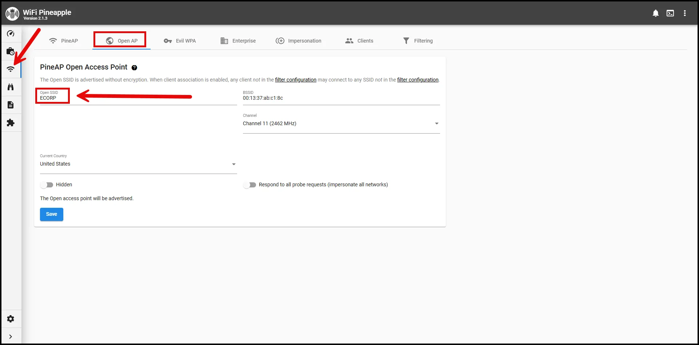

1. **Victim Connects to the Fake AP**
Once the rogue AP is running, users nearby who see the familiar SSID might connect to it, especially if the attacker disables the legitimate AP through a **deauthentication attack**, forcing users to reconnect to the stronger, rogue signal.


1. **Captive Portal Presentation**
When the victim connects to the rogue AP, they are redirected to a **captive portal**. A captive portal is a web page that users typically see when accessing public Wi-Fi networks, asking them to log in or accept terms and conditions. However, in the Evil Portal attack, this page is malicious and designed to look like a legitimate login page.


1. **Phishing for Credentials**
The captive portal appears legitimate (e.g., a login page for a social media site, corporate portal, or public Wi-Fi authentication page). The victim is prompted to enter their credentials (e.g., username, password, or other sensitive information).


1. **Data Capture**
Once the victim enters their credentials, the information is captured by the WiFi Pineapple, which logs the data for the attacker. This data can then be used for further attacks, such as account takeovers or accessing private networks.

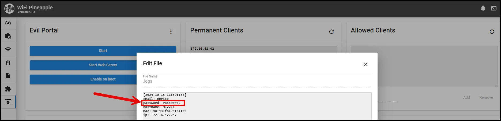

### Key Components of the Attack

- **WiFi Pineapple**: The device used by the attacker to create the rogue access point. It’s designed to be user-friendly for penetration testers, with modules and tools that can easily execute various wireless attacks, including Evil Portal.
- **Evil Portal Module**: A module or plugin available for the WiFi Pineapple that allows attackers to create and serve custom captive portals. This tool enables attackers to clone legitimate login pages or create their own phishing pages.
- **Deauthentication Attack**: To increase the chances of victims connecting to the rogue AP, attackers may perform a **deauth attack**, which sends deauthentication frames to devices connected to legitimate access points, forcing them to disconnect and attempt to reconnect. The victim’s device may then automatically connect to the stronger, rogue AP.

### Countermeasures and Prevention

1. **Avoid Connecting to Untrusted Wi-Fi Networks**: Users should be cautious when connecting to public or unfamiliar Wi-Fi networks, especially those without proper authentication methods.
2. **Use VPNs**: Using a Virtual Private Network (VPN) can encrypt your traffic, making it more difficult for attackers to intercept sensitive data, even if connected to a rogue AP.
3. **SSL/TLS Certificates**: Websites using HTTPS encrypt communication between the user and the server, which makes it harder for attackers to intercept or manipulate data. Always check for "https://" in the URL bar when logging into a site.
4. **Two-Factor Authentication (2FA)**: Even if credentials are stolen, 2FA adds an extra layer of security, making it more difficult for attackers to gain full access to accounts.
5. **Wireless Intrusion Detection Systems (WIDS)**: These systems can monitor for rogue APs and deauth attacks, alerting network administrators to potential Evil Portal attacks.

### Summary

The **Evil Portal attack** using a WiFi Pineapple is a powerful phishing method that tricks users into providing sensitive information via a fake login page. By setting up a rogue access point and displaying a convincing captive portal, attackers can steal credentials and other private data. Countermeasures include being cautious about connecting to public Wi-Fi, using VPNs, and enabling 2FA to protect accounts.